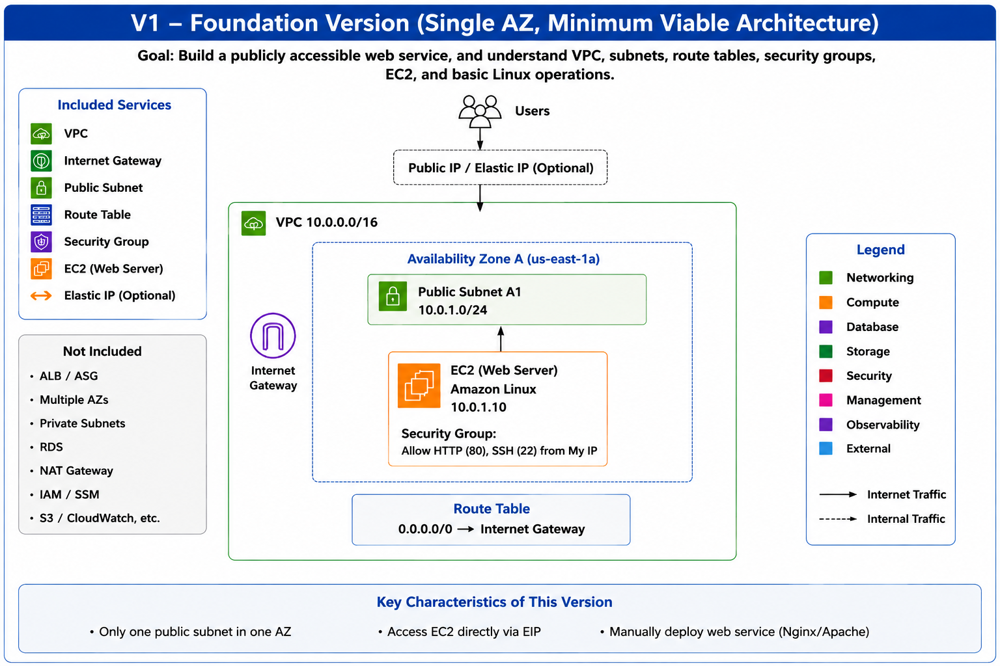
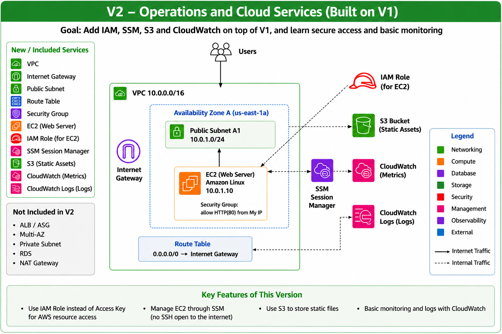
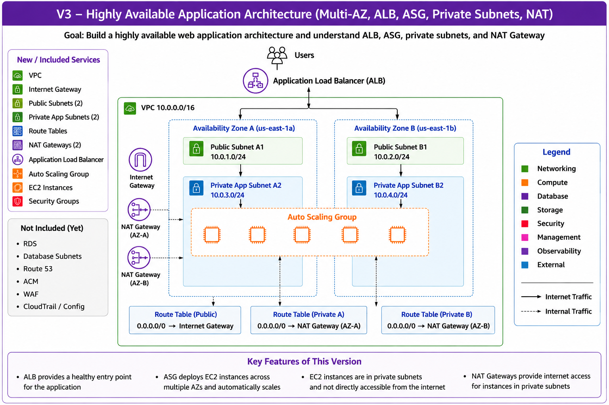
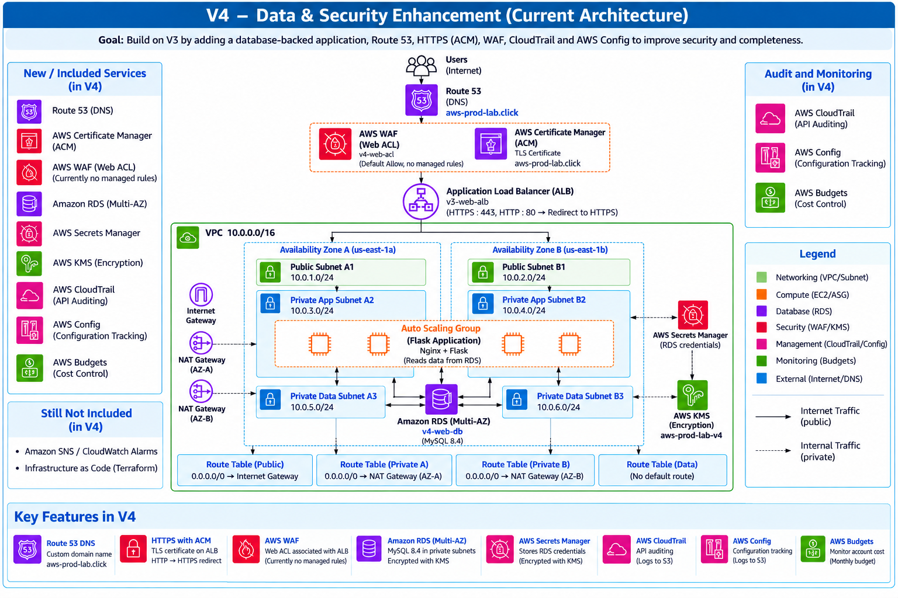
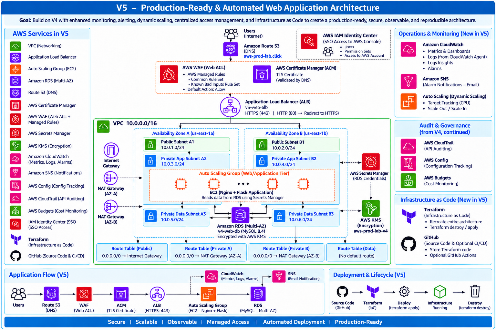

# AWS Production-Ready Web Application Infrastructure

This project demonstrates the step-by-step evolution of an AWS web application infrastructure from a simple single-instance deployment to a highly available, secure, observable, and reproducible architecture.

The project is divided into five versions. Each version builds on the previous one and introduces additional AWS services and operational capabilities.

The final architecture is also implemented with Terraform so that the complete infrastructure can be recreated from code.

---

# V1 – Foundation



V1 establishes the basic AWS networking and compute foundation.

A single EC2 web server is deployed in a public subnet and accessed directly through its public IP or Elastic IP. The VPC, subnet, route table, Internet Gateway, and Security Group are configured manually.

### Key Features

- Single VPC and Availability Zone
- Public subnet
- Internet Gateway and public routing
- EC2 web server
- Security Group
- Direct public access to EC2
- Basic Linux and web server configuration

[View V1 implementation details →](./versions/v1-foundation/README.md)

---

# V2 – Operations and Cloud Services



V2 extends the V1 environment with AWS operational and management services.

The EC2 instance uses an IAM Role for AWS service access and Systems Manager Session Manager for administration without exposing SSH to the Internet. S3 and CloudWatch are introduced for object storage, monitoring, and centralized logging.

### Key Features

- IAM Role for EC2
- AWS Systems Manager Session Manager
- S3 object storage
- CloudWatch metrics
- CloudWatch Agent and centralized logs
- Administration without Internet-facing SSH

[View V2 implementation details →](./versions/v2-operations/README.md)

---

# V3 – Highly Available Application Architecture



V3 redesigns the infrastructure for high availability and network isolation.

The application runs on EC2 instances managed by an Auto Scaling Group across two Availability Zones. An Application Load Balancer provides the public entry point, while application instances run inside private subnets. NAT Gateways provide outbound Internet connectivity for private instances.

### Key Features

- Multi-AZ architecture
- Two public subnets
- Two private application subnets
- Application Load Balancer
- Auto Scaling Group
- Private EC2 instances
- NAT Gateway per Availability Zone
- Security Group separation between ALB and application instances

[View V3 implementation details →](./versions/v3-high-availability/README.md)

---

# V4 – Data and Security Enhancement



V4 extends the architecture with database, DNS, HTTPS, security, auditing, and governance capabilities.

Amazon RDS provides a Multi-AZ MySQL database in isolated private data subnets. Route 53 and ACM provide DNS and HTTPS, while AWS WAF protects the public application endpoint. Secrets Manager and KMS protect database credentials and encryption keys. CloudTrail, AWS Config, and AWS Budgets provide auditing, configuration tracking, and cost monitoring.

### Key Features

- Amazon RDS Multi-AZ
- Private database subnets
- Route 53 DNS
- HTTPS with AWS Certificate Manager
- AWS WAF
- AWS Secrets Manager
- AWS KMS encryption
- AWS CloudTrail
- AWS Config
- AWS Budgets

[View V4 implementation details →](./versions/V4-Data-Security/README.md)

---

# V5 – Production-Ready and Automated Architecture



V5 builds on V4 by adding enhanced monitoring and alerting, dynamic scaling, centralized access management, and Infrastructure as Code.

CloudWatch provides metrics, logs, dashboards, and alarms. SNS delivers operational notifications, while Auto Scaling target tracking dynamically adjusts application capacity. IAM Identity Center provides centralized AWS access management.

The complete architecture is then recreated with Terraform, making the environment reproducible and allowing the infrastructure lifecycle to be managed as code.

### Key Enhancements

- CloudWatch dashboards and alarms
- SNS operational notifications
- Auto Scaling target tracking
- IAM Identity Center
- AWS WAF managed rules
- Infrastructure as Code with Terraform
- Reproducible infrastructure deployment

[View V5 implementation details →](./versions/V5-Production-Readiness/README.md)

---

# Terraform Infrastructure as Code

The final V5 architecture was recreated using Terraform to convert the manually built AWS environment into reproducible Infrastructure as Code.

The Terraform configuration is organized by infrastructure function rather than placing the entire environment in a single configuration file.

Example structure:

```text
terraform/
├── providers.tf
├── variables.tf
├── networking.tf
├── security.tf
├── compute.tf
├── load-balancer.tf
├── database.tf
├── dns.tf
├── monitoring.tf
├── iam.tf
├── outputs.tf
└── terraform.tfvars.example
```

[View Terraform Infrastructure as Code →](./terraform/README.md)


---

# Troubleshooting & Validation Highlights

Building the infrastructure from V1 through V5 involved more than deploying AWS resources. Several issues required troubleshooting across Linux permissions, monitoring, IAM, networking, database connectivity, and application health.

The following are selected examples from the implementation and validation process.

### 1. CloudWatch Agent Lost Access After Nginx Log Rotation

CloudWatch Agent initially failed to read the Nginx access log because the agent runs under the `cwagent` user and did not have sufficient file permissions.

Granting access to the existing log file fixed the immediate issue, but the problem returned after Nginx log rotation created a new file. I traced the behavior to permissions on newly created log files and resolved it by configuring default ACL permissions so future rotated logs remained readable by the CloudWatch Agent.

**Troubleshooting path:** Agent status → log collection → Linux file permissions → log rotation → default ACL

---

### 2. SSM Parameter Store Permission Error During CloudWatch Agent Configuration

While configuring CloudWatch Agent, the configuration wizard failed when attempting to save the generated configuration to SSM Parameter Store because the instance did not have permission to perform `ssm:PutParameter`.

Instead of treating the entire configuration as failed, I verified that the local configuration file had already been generated, separated the SSM permission issue from the CloudWatch Agent runtime configuration, and continued validating metrics and log collection independently.

**Troubleshooting path:** IAM permission → SSM operation → local configuration → Agent status → CloudWatch verification

---

### 3. Private EC2-to-RDS Connectivity Validation

After introducing RDS and private application/database subnets, I validated database connectivity from the application tier rather than assuming that successful resource creation meant the database was reachable.

The validation covered DNS resolution of the RDS endpoint, TCP connectivity on port 3306, Security Group relationships, credentials retrieved from Secrets Manager, the MySQL client, and TLS configuration.

**Validation path:** DNS → TCP 3306 → Security Groups → credentials → client → TLS

---

### 4. ALB-to-Application Health Validation

After moving EC2 instances behind an Application Load Balancer, I validated that the instances could successfully pass target group health checks before receiving application traffic.

I checked the request path from the ALB to the application, including the target group configuration, health check path and port, Security Group relationship, and the web service running on the EC2 instances.

**Validation path:** ALB listener → target group → Security Groups → application port → health endpoint

---

### 5. Auto Scaling and CloudWatch Alarm Behavior

While validating dynamic scaling, I observed that CloudWatch alarms associated with an Auto Scaling target tracking policy could enter alarm states as part of normal scaling behavior.

I reviewed the underlying metric, alarm thresholds, scaling policy, and ASG minimum capacity to distinguish scaling-control alarms from operational failure alerts.

**Validation path:** CloudWatch metric → alarm condition → scaling policy → desired/minimum capacity

---

### 6. Private-Subnet Internet Access Validation

When application instances were moved from public to private subnets, I validated that they could still reach external services without being directly reachable from the Internet.

I traced outbound connectivity through the private route table and NAT Gateway while separately verifying that inbound application traffic could only arrive through the Application Load Balancer.

**Validation path:** Private EC2 → private route table → NAT Gateway → Internet Gateway

---

### 7. Security Group Traffic-Flow Validation

As the architecture evolved, Security Groups were separated by application tier rather than allowing broad IP-based access.

I validated the traffic flow between the ALB, application instances, and RDS by checking the source Security Group relationships and required ports at each layer.

**Validation path:** Internet → ALB-SG → App-SG → DB-SG

---

### 8. Terraform Reconstruction and Lifecycle Validation

After completing the architecture manually, I rebuilt the final environment with Terraform rather than treating successful configuration generation as proof that the infrastructure was reproducible.

I used Terraform validation and planning, deployed the environment, verified the recreated AWS resources and application path, and finally destroyed the infrastructure to confirm that the lifecycle could be managed from code.

**Validation path:** validate → plan → apply → infrastructure verification → destroy
