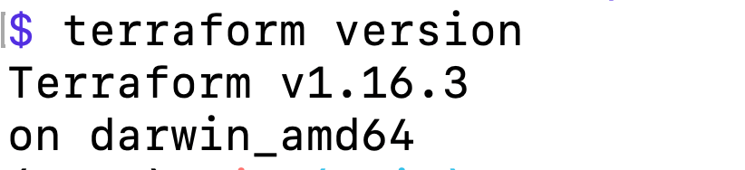
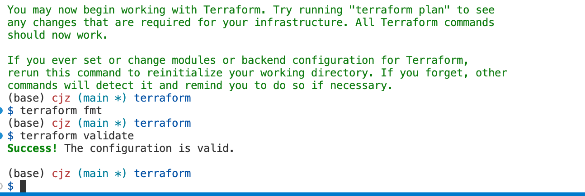
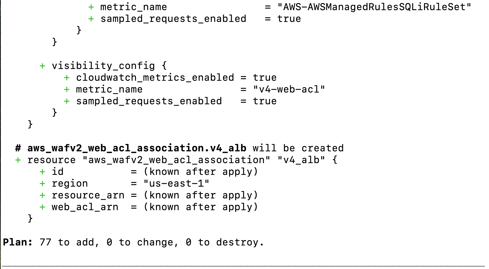
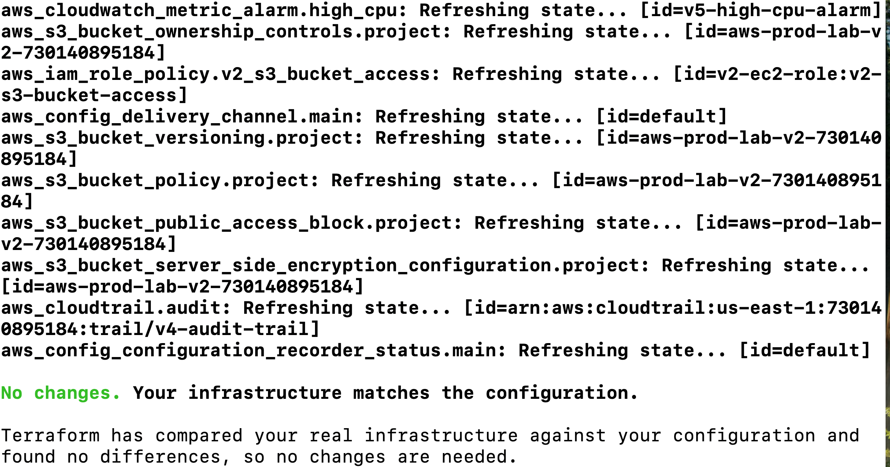

# Terraform Infrastructure as Code

# 1. Install Terraform

Terraform runs locally on the Mac and will be used to manage AWS infrastructure through the AWS Provider and AWS APIs.

Install Terraform using Homebrew.

First, verify that Homebrew is already installed.

| Purpose        | Command        |
| -------------- | -------------- |
| Check Homebrew | brew --version |


| Purpose                           | Command                              |
| --------------------------------- | ------------------------------------ |
| Add HashiCorp Homebrew repository | brew tap hashicorp/tap               |
| Install Terraform                 | brew install hashicorp/tap/terraform |

After installation, verify that Terraform is available from the terminal.

| Purpose                     | Command           |
| --------------------------- | ----------------- |
| Check Terraform version     | terraform version |
| Locate Terraform executable | which terraform   |



---

# 2. Create the Terraform Project

## 2.1 Create the Project Directory

Terraform is maintained as an independent part of the repository rather than as part of V5.

Repository structure:

```text
aws-production-infrastructure-lab/
│
├── README.md
├── versions/
│   ├── v1-foundation/
│   ├── v2-operations/
│   ├── v3-high-availability/
│   ├── v4-data-security/
│   └── v5-production-readiness/
│
└── terraform/
    ├── README.md
    └── Terraform configuration files
```

The `terraform` directory will contain both the Terraform source code and this implementation documentation.

---

## 2.2 Plan the Terraform File Structure

The final Terraform configuration will be divided into multiple files according to responsibility.

Planned structure:

```text
terraform/
│
├── README.md
├── versions.tf
├── provider.tf
├── variables.tf
├── networking.tf
├── security.tf
├── compute.tf
├── database.tf
├── storage.tf
├── monitoring.tf
├── dns.tf
├── waf.tf
├── outputs.tf
└── terraform.tfvars
```

Terraform treats the `.tf` files in the same directory as one configuration.

The files are separated primarily to improve readability and maintenance.

The exact file structure may be adjusted during implementation.

---

## 2.3 Protect Local Terraform Files

Terraform can create local files that must not be committed to GitHub.

The repository `.gitignore` will be reviewed and updated before Terraform state or local configuration is created.

Sensitive or machine-specific Terraform files must remain outside version control.

Examples include:

```text
# Terraform

.terraform/

*.tfstate

*.tfstate.*

.terraform.tfstate.lock.info

crash.log

crash.*.log

# Terraform variable files

*.tfvars

*.tfvars.json
```

Terraform configuration files such as `.tf` files should be committed.

The Terraform dependency lock file should normally be committed: **.terraform.lock.hcl**

---

# 3. Initialize the Terraform Environment

## 3.1 Configure Terraform and the AWS Provider

The first step is to create the basic Terraform configuration for the project.

At this stage, Terraform needs to know two things:

1. This project uses the AWS Provider.
2. AWS resources will be managed in `us-east-1`.

Create the following two files inside the `terraform/` directory:

```text
terraform/
├── README.md
├── versions.tf
└── provider.tf
```

`versions.tf` defines the Terraform requirements and declares the AWS Provider required by this project.

`provider.tf` configures the AWS Provider and sets the AWS Region.

The actual Terraform source code is stored directly in these `.tf` files.

No AWS infrastructure is created, modified, or deleted during this step.

After completing this section, the Terraform project has its minimum provider configuration and is ready for initialization with `terraform init`.

---

## 3.2 Initialize Terraform

Initialize the Terraform working directory.

| Purpose                | Command            |
| ---------------------- | ------------------ |
| Initialize Terraform   | terraform init     |
| Format Terraform files | terraform fmt      |
| Validate configuration | terraform validate |

`terraform init` downloads the required provider plugins and prepares the local working directory.

`terraform fmt` standardizes Terraform formatting.

`terraform validate` checks whether the Terraform configuration is syntactically and structurally valid.



---

## 3.3 Terraform Workflow

The Terraform workflow used throughout this project is:

```text
Write Configuration
        ↓
terraform fmt
        ↓
terraform validate
        ↓
terraform plan
        ↓
Review Changes
        ↓
terraform apply
        ↓
Verify AWS Resources
```


Terraform configuration describes the desired infrastructure state.

`terraform plan` must always be reviewed before infrastructure changes are applied.

---

# 4. Define the Existing V5 Network Architecture

## 4.1 Define the VPC and Subnets

Convert the existing V5 network architecture into Terraform configuration.

Target configuration:

| Resource              | Configuration          |
| --------------------- | ---------------------- |
| AWS Region            | us-east-1              |
| VPC CIDR              | 10.0.0.0/16            |
| Availability Zones    | us-east-1a, us-east-1b |
| Public Subnet A       | 10.0.1.0/24            |
| Public Subnet B       | 10.0.2.0/24            |
| Private App Subnet A  | 10.0.3.0/24            |
| Private App Subnet B  | 10.0.4.0/24            |
| Private Data Subnet A | 10.0.5.0/24            |
| Private Data Subnet B | 10.0.6.0/24            |

The Terraform configuration should describe the same logical network architecture already implemented manually in V5.

---

## 4.2 Define Internet Connectivity

Define:

- Internet Gateway
- Elastic IP addresses
- NAT Gateway A
- NAT Gateway B

Architecture:

```text
Internet
   |
   v
aws-prod-lab-igw
   |
   +--------------------+
   |                    |
public-subnet-a1    public-subnet-b1
   |                    |
EIP A                 EIP B
   |                    |
nat-gateway-a       nat-gateway-b
   |                    |
   v                    v
App Subnet A2       App Subnet B2
```

Each private application subnet uses the NAT Gateway in its corresponding Availability Zone for outbound Internet access.

Private data subnets do not require a default Internet route.

---

## 4.3 Define Route Tables

Define the existing routing architecture:

```text
public-rt
   ├── public-subnet-a1
   └── public-subnet-b1
   └── 0.0.0.0/0 → aws-prod-lab-igw

private-app-rt-a
   └── private-app-subnet-a2
   └── 0.0.0.0/0 → nat-gateway-a

private-app-rt-b
   └── private-app-subnet-b2
   └── 0.0.0.0/0 → nat-gateway-b

private-data-rt
   ├── private-data-subnet-a3
   └── private-data-subnet-b3
       only VPC local route
```

Associate each route table with the correct subnet.


## 4.4 Implement the Network Architecture in Terraform

The V5 network architecture defined in this chapter is implemented in **networking.tf**.

The Terraform configuration defines:

- `aws-prod-lab-vpc`
- Six public, private application, and private data subnets across `us-east-1a` and `us-east-1b`
- `aws-prod-lab-igw`
- Two Elastic IP addresses
- `nat-gateway-a` and `nat-gateway-b`
- `public-rt`
- `private-app-rt-a`
- `private-app-rt-b`
- `private-data-rt`
- The required subnet-to-route-table associations and Internet/NAT routing relationships

The configuration preserves the same network topology and resource relationships as the manually implemented V5 architecture.


---


# 5. Define Security Groups

Convert the existing V5 Security Groups into Terraform.

The final security path is:

```text
Internet
   ↓ TCP 80 / 443
ALB Security Group
   ↓ TCP 80
Application Security Group
   ↓ TCP 3306
Database Security Group
```

Define:

- `alb-sg`
- `app-sg`
- `db-sg`
- Required inbound rules
- Required outbound rules
- Security Group references between infrastructure layers

The intended access model is:

| Security Group | Inbound Source | Protocol / Port |
| -------------- | -------------- | --------------- |
| `alb-sg`       | Internet       | TCP 80 / 443    |
| `app-sg`       | `alb-sg`       | TCP 80          |
| `db-sg`        | `app-sg`       | TCP 3306        |

Private application instances must not accept direct HTTP traffic from the Internet.

The database must not accept direct traffic from the Internet or from the ALB Security Group.

Security Groups define whether traffic is permitted. Route Tables determine where permitted traffic is routed.

The Security Group configuration is maintained in: **security.tf**

---


# 6. Define Encryption Resources

This chapter converts the existing customer-managed AWS KMS key into Terraform.

The KMS key is a foundational security resource used by other parts of the architecture. It must therefore be defined before resources that depend on it, such as RDS and IAM policies.

The configuration includes the existing customer-managed KMS key and its alias: **alias/aws-prod-lab-v4**

The existing key policy, description, key rotation setting, and other relevant configuration will be verified against the current AWS environment before the Terraform resource is finalized.

AWS-generated Key IDs and ARNs will not be hardcoded into dependent resources. Other Terraform resources will reference the KMS resource directly.

The completed configuration is maintained in: **encryption.tf**

---

# 7. Define Storage Resources

This chapter converts the existing project S3 bucket into Terraform.

Target bucket: **aws-prod-lab-v2-730140895184**

The Terraform configuration will reproduce the final verified bucket configuration, including encryption, public access protection, versioning, bucket policy, and other relevant settings where applicable.

Because some S3 settings were not fully recorded during the manual V1–V5 build, the current AWS resource will be treated as the source of truth before the configuration is finalized.

Later IAM policies will reference this Terraform-managed bucket instead of unnecessarily hardcoding its ARN.

The completed configuration is maintained in: **storage.tf**

---

# 8. Define Database and Secrets Resources

This chapter converts the complete V4/V5 database layer into Terraform.

The database architecture consists of:

```text
private-data-subnet-a3
          \
           v4-db-subnet-group
          /
private-data-subnet-b3
               ↓
          v4-web-db
               ↓
     RDS Managed Secret
```

The Terraform configuration will define the DB Subnet Group and the existing MySQL Multi-AZ RDS database.

The final database remains private, uses the two private data subnets, uses `db-sg`, and uses the customer-managed KMS key defined in `encryption.tf`.

The existing database configuration includes MySQL 8.4, Multi-AZ deployment, `db.t4g.micro`, 20 GiB gp3 storage, the `appdb` database, private network placement, encryption, backups, and the verified V5 database settings.

Database credentials will continue to be managed through AWS Secrets Manager rather than being stored in Terraform source code, Git, EC2 configuration, or application source code.

AWS-generated RDS endpoints, resource identifiers, and Secret ARNs will not be permanently hardcoded into dependent Terraform resources.

The completed configuration is maintained in: **database.tf**

---

# 9. Define IAM Resources

This chapter converts the application EC2 IAM integration into Terraform.

The IAM configuration is limited to IAM resources required by the V5 application infrastructure. Account administration identities such as the root user and `lab-admin`, as well as unrelated AWS service-linked roles, are outside the scope of this project.

The primary application role is: **v2-ec2-role**

The role trusts the EC2 service through `sts:AssumeRole`.

It uses the existing AWS-managed policies:

- AmazonSSMManagedInstanceCore
- CloudWatchAgentServerPolicy

It also reproduces the existing project-specific permissions for:

- S3 bucket access
- RDS secret access
- KMS decryption

The S3 policy references the S3 resource defined in **storage.tf**.

The database credential policy references the RDS-managed secret defined in **database.tf** and the KMS key defined in **encryption.tf**.

The EC2 Instance Profile associated with **v2-ec2-role** is also defined here.

The resulting relationship is:

```text
S3 ───────────────┐
                  │
RDS Secret ───────┼──→ v2-ec2-role
                  │          ↓
KMS ──────────────┘    Instance Profile
                             ↓
                      Launch Template
```

No static AWS credentials are stored in Terraform or on the EC2 instances.

The completed configuration is maintained in: **iam.tf**

---

# 10. Define Certificate Resources

This chapter converts the existing ACM certificate and its validation configuration into Terraform.

The public certificate protects: **aws-prod-lab.click**

The certificate uses DNS validation.

The existing certificate, domain name, validation records, certificate status, and Route 53 relationship will be verified against the current AWS environment before the Terraform configuration is finalized.

The certificate is defined before the Application Load Balancer HTTPS listener because the listener requires the certificate ARN.

AWS-generated certificate identifiers will not be hardcoded into the later ALB configuration. The HTTPS listener will reference the Terraform ACM resource.

The completed configuration is maintained in: **certificate.tf**

---

# 11. Define Application Compute Resources

This chapter converts the complete application compute layer into Terraform.

The application architecture is:

```text
Public Subnets
      ↓
v3-web-alb
      ↓
v3-web-target-group
      ↓
v3-web-asg
      ↓
Private Application Subnets
```

The Terraform configuration includes:

- `v3-web-target-group`
- `v3-web-alb`
- HTTP listener
- HTTPS listener
- `v3-web-launch-template`
- `v3-web-asg`
- Target Tracking scaling policy

The ALB remains Internet-facing and spans both public subnets. It uses `alb-sg`.

HTTP traffic on port 80 is redirected to HTTPS on port 443. The HTTPS listener uses the ACM certificate defined in `certificate.tf` and forwards traffic to the application Target Group.

The Launch Template uses the final application AMI, `t3.micro`, `app-sg`, and the Instance Profile defined in `iam.tf`. Application instances do not receive public IPv4 addresses.

At instance launch, Terraform-generated User Data injects the current RDS endpoint and RDS-managed Secret ARN into the application configuration. This prevents AWS-generated identifiers from becoming stale after infrastructure recreation.

The ASG spans both private application subnets and maintains:

| Configuration | Setting |
| ------------- | ------- |
| Minimum       | 2       |
| Desired       | 2       |
| Maximum       | 4       |

The Target Tracking policy maintains the verified V5 scaling behavior with an average CPU target of 50%, a 300-second instance warmup, and scale-in enabled.

The completed configuration is maintained in: **compute.tf**

---

# 12. Define DNS Resources

This chapter converts the application DNS routing into Terraform.

The existing Route 53 hosted zone is:

```text
aws-prod-lab.click
```

The application root record directs traffic to the Internet-facing Application Load Balancer.

The Terraform configuration will reproduce the verified DNS relationship:

```text
aws-prod-lab.click
        ↓
Route 53 Alias A
        ↓
v3-web-alb
```

The Route 53 record will reference the Terraform-managed ALB rather than hardcoding generated ALB DNS information.

Any DNS validation records required by ACM will be handled according to the final verified certificate configuration.

The completed configuration is maintained in: **dns.tf**

---

# 13. Define WAF Resources

This chapter converts the existing regional AWS WAF configuration into Terraform.

Target Web ACL:

```text
v4-web-acl
```

The Web ACL uses the existing AWS Managed Rule Groups:

| Priority | Managed Rule Group                       |
| -------: | ---------------------------------------- |
|        0 | AWS-AWSManagedRulesCommonRuleSet         |
|        1 | AWS-AWSManagedRulesKnownBadInputsRuleSet |
|        2 | AWS-AWSManagedRulesSQLiRuleSet           |

The Web ACL is associated with the Application Load Balancer.

The logical application path is:

```text
Internet
   ↓
Route 53
   ↓
WAF-protected ALB
   ↓
HTTPS Listener
   ↓
Target Group
   ↓
Private EC2 Instances
```

WAF should be understood as protection associated with the ALB rather than as a separate physical network hop.

The completed configuration is maintained in: **waf.tf**

---

# 14. Define Notification Resources

This chapter converts the operational SNS notification infrastructure into Terraform.

Target SNS topic: **v5-operations-alerts**

The topic provides the notification destination used by CloudWatch alarms.

The SNS topic is defined before monitoring resources so that alarm actions can reference the Terraform-managed topic directly.

Email subscriptions require external confirmation and will be handled carefully rather than assuming that Terraform alone can complete the confirmation process.

The completed configuration is maintained in: **notifications.tf**

---

# 15. Define Monitoring Resources

This chapter converts the relevant V5 CloudWatch monitoring configuration into Terraform.

The configuration includes the explicitly managed monitoring resources required by the final architecture, including:

- CloudWatch Log Groups where applicable
- CloudWatch alarms
- CloudWatch Dashboard

Target dashboard: **v5-operations-dashboard**

The final alarm set includes the verified V5 operational alarms for application and infrastructure health, including ASG CPU utilization, Target 5XX errors, and unhealthy targets where present in the existing environment.

Alarm actions reference the SNS topic defined in `notifications.tf`.

Native AWS metrics do not need to be recreated as custom infrastructure when they are automatically published by their source services. CloudWatch Agent metrics and logs continue to be generated by the application instances.

Exact alarm thresholds, periods, statistics, evaluation periods, and other settings will be verified against the current V5 environment rather than reconstructed from incomplete notes.

The completed configuration is maintained in: **monitoring.tf**

---

# 16. Define Audit and Governance Resources

This chapter converts the relevant V5 audit and governance configuration into Terraform.

The operational governance layer includes:

- AWS CloudTrail
- AWS Config
- AWS Budgets

Target CloudTrail: **v4-audit-trail**

These services provide audit history, configuration tracking, and cost governance rather than application traffic handling.

Existing trails, recorders, delivery channels, destinations, policies, budget configuration, and related resource relationships will be verified against the current AWS environment before being finalized.

The completed configuration is maintained in: **governance.tf**

---

# 17. Import the Existing V5 Infrastructure

At this point, the Terraform resource configuration for the V5 architecture has been completed.

The existing infrastructure was originally created manually through the AWS Console. Writing Terraform configuration does not automatically place those resources under Terraform management.

Terraform import establishes the relationship:

```text
Terraform Resource
        ↓
Terraform State
        ↓
Existing AWS Resource
```

Resources will be imported gradually and mapped to their corresponding Terraform resource addresses.

The working process is:

```text
Complete Terraform Configuration
        ↓
Import Existing AWS Resources
        ↓
terraform plan
        ↓
Compare Terraform Configuration with AWS
        ↓
Correct Differences
        ↓
Repeat Until No Unexpected Changes
```

Import success alone does not prove that the Terraform configuration matches the existing AWS infrastructure. The imported state must be reconciled with the configuration through `terraform plan`.

Terraform state and other local Terraform-generated files may contain environment-specific or sensitive information and must not be committed to the public GitHub repository.

---

# 18. Reconcile Terraform with the Existing V5 Architecture

After the existing resources have been imported, Terraform will be used to compare the desired configuration with the manually verified V5 environment.

| Purpose                            | Command        |
| ---------------------------------- | -------------- |
| Preview infrastructure differences | terraform plan |

The existing V5 environment acts as the reference implementation.

Unexpected changes must be investigated individually. The Terraform configuration and the actual AWS resource will be compared to determine whether a difference is intentional or whether the Terraform configuration needs correction.

The objective is:

```text
Imported V5
     ↓
terraform plan
     ↓
No unintended changes
```

Before Terraform is allowed to modify or destroy the environment, all important resource mappings, dependencies, security relationships, IAM relationships, application resources, database resources, monitoring resources, DNS relationships, and WAF associations must be understood.

No destructive operation will be performed while unexplained changes remain in the Terraform plan.

---

# 19. Test the Terraform Infrastructure Lifecycle

After Terraform accurately represents the existing V5 architecture, the complete infrastructure lifecycle will be tested.

Before destructive testing, confirm that all required resources are either managed by Terraform or intentionally external, that no important data needs to be preserved, and that deletion protection or other lifecycle restrictions have been reviewed.

The destroy operation will first be previewed:

| Purpose                        | Command                 |
| ------------------------------ | ----------------------- |
| Preview destroy operation      | terraform plan -destroy |
| Destroy managed infrastructure | terraform destroy       |

After the environment has been removed, the same Terraform configuration will be used to recreate it:

| Purpose               | Command         |
| --------------------- | --------------- |
| Preview deployment    | terraform plan  |
| Deploy infrastructure | terraform apply |

AWS-generated values such as resource IDs, public addresses, ARNs, endpoints, and other generated identifiers may change after recreation.

The objective is not to reproduce the same generated IDs. The objective is to reproduce the same architecture and intended configuration.

---

# 20. Verify the Recreated Infrastructure

After `terraform apply`, verify that the recreated environment is functionally equivalent to the original V5 architecture.

Verify the network foundation:

- VPC and six subnets
- Internet Gateway
- NAT Gateways
- Route Tables and associations

Verify the application layer:

- Internet-facing ALB
- HTTPS access
- Healthy Target Group
- ASG capacity
- Private application EC2 instances
- Dynamic scaling policy

Verify the data and security layer:

- Private Multi-AZ RDS
- DB Subnet Group
- Security Group relationships
- Secrets Manager integration
- KMS encryption
- IAM permissions
- WAF association and Managed Rule Groups

Verify operations:

- CloudWatch metrics and logs
- CloudWatch Dashboard
- Operational alarms
- SNS notification path
- CloudTrail
- AWS Config
- AWS Budgets

A controlled load test may be used again if required to confirm dynamic scale-out behavior.

---

# 21. Final Terraform Project Summary

The Terraform phase converts the manually completed V5 architecture into reproducible Infrastructure as Code.

The complete lifecycle is:

```text
Manual AWS Architecture
V1 → V2 → V3 → V4 → V5
              ↓
      Terraform Configuration
              ↓
       Import Existing V5
              ↓
       Reconcile with Plan
              ↓
     Terraform-Managed V5
              ↓
       terraform destroy
              ↓
     Infrastructure Removed
              ↓
        terraform apply
              ↓
   Infrastructure Recreated
              ↓
      Functional Verification
```

The project demonstrates two complementary capabilities:

1. Designing, implementing, validating, and troubleshooting AWS infrastructure manually.
2. Managing and reproducing the completed infrastructure through Terraform Infrastructure as Code.

The Terraform configuration is maintained in Git so that infrastructure changes can be reviewed and version controlled alongside the rest of the project.

The complete environment was deployed and validated in AWS. After final deployment and testing, `terraform plan` confirmed that the deployed infrastructure matched the Terraform configuration with no drift.







