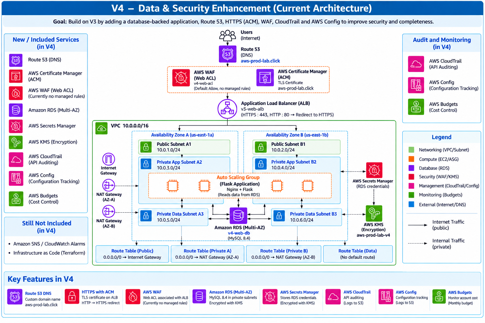

# 1. Review V3

V3 provides a Multi-AZ application architecture.

Main components:

- VPC: **aws-prod-lab-vpc**
- 2 Availability Zones:
  - **us-east-1a**
  - **us-east-1b**
- 2 Public Subnets:
  - **public-subnet-a1** - **10.0.1.0/24**
  - **public-subnet-b1** - **10.0.2.0/24**
- 2 Private Application Subnets:
  - **private-app-subnet-a2** - **10.0.3.0/24**
  - **private-app-subnet-b2** - **10.0.4.0/24**
- Internet Gateway
- 2 NAT Gateways
- Application Load Balancer
- Target Group
- Auto Scaling Group
- Private EC2 instances
- Systems Manager
- CloudWatch Agent
- CloudWatch Metrics
- CloudWatch Logs

V3 traffic path:

Internet → ALB → Target Group → Private EC2

The EC2 instances are created and managed by the Auto Scaling Group.

---

# 2. V4 Goal

V4 extends the V3 Multi-AZ application architecture by adding a database-backed application, a dedicated database layer, HTTPS, DNS, application-layer security, auditing, configuration tracking, and cost monitoring.

The main goal of V4 is to evolve the V3 infrastructure from a highly available web tier into a more complete multi-tier AWS application architecture.

## New Components and Capabilities

V4 adds:

- 2 Private Data Subnets
- Amazon RDS MySQL Multi-AZ
- RDS DB Subnet Group
- Database Security Group
- AWS Secrets Manager
- Customer-managed AWS KMS key
- Python Flask application
- Nginx reverse proxy to Flask
- Route 53
- AWS Certificate Manager (ACM)
- HTTPS on the Application Load Balancer
- HTTP-to-HTTPS redirect
- AWS WAF Web ACL
- AWS CloudTrail
- AWS Config
- AWS Budgets

## Application Upgrade

V3 uses Nginx to serve a simple static web page.

In V4, the application layer is upgraded to a database-backed application:

```text
Nginx
  ↓
Flask
  ↓
Secrets Manager
  ↓
Amazon RDS MySQL
```

---

# 3. Create Private Data Subnets

Create two private data subnets across two Availability Zones.

## Private Data Subnet A3

| Configuration           | Setting                    |
| ----------------------- | -------------------------- |
| VPC                     | **aws-prod-lab-vpc**       |
| Subnet Name             | **private-data-subnet-a3** |
| Availability Zone       | **us-east-1a**             |
| IPv4 CIDR               | **10.0.5.0/24**            |
| Auto-assign Public IPv4 | Disabled                   |

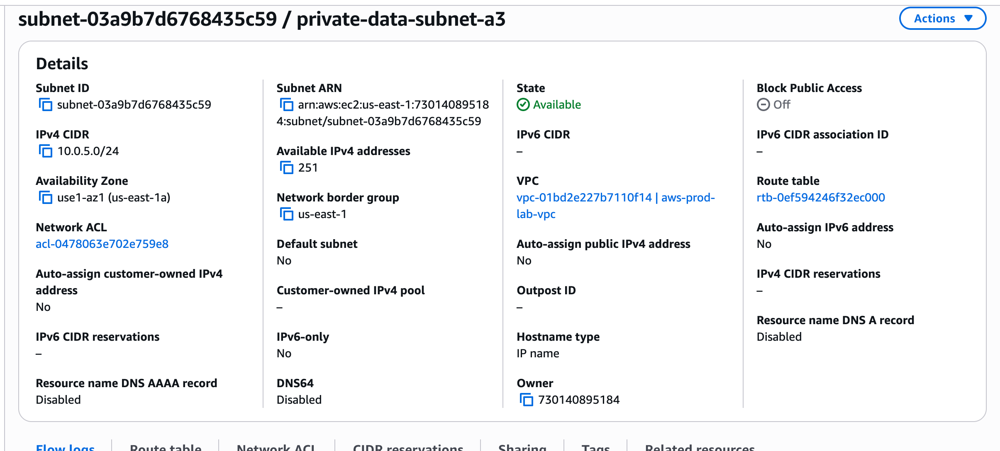

## Private Data Subnet B3

| Configuration           | Setting                    |
| ----------------------- | -------------------------- |
| VPC                     | **aws-prod-lab-vpc**       |
| Subnet Name             | **private-data-subnet-b3** |
| Availability Zone       | **us-east-1b**             |
| IPv4 CIDR               | **10.0.6.0/24**            |
| Auto-assign Public IPv4 | Disabled                   |

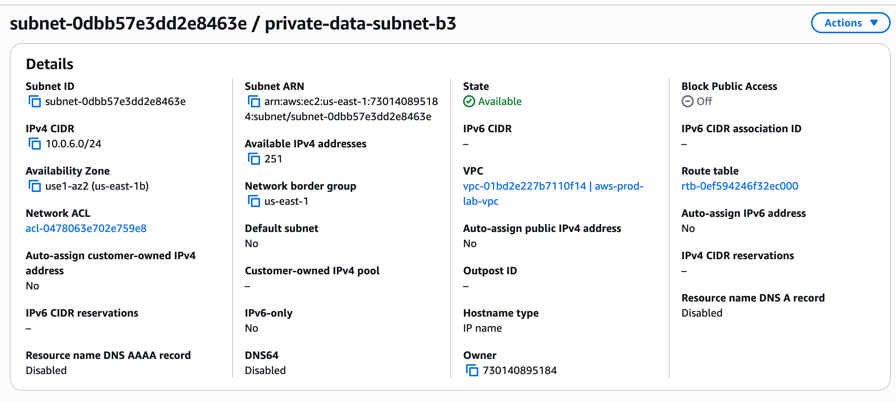


# 4. Create the Data Route Table

Create a dedicated route table for the database subnets.

| Configuration | Setting              |
| ------------- | -------------------- |
| Name          | **private-data-rt**  |
| VPC           | **aws-prod-lab-vpc** |

Keep only the VPC local route.

Expected route:

| Destination     | Target |
| --------------- | ------ |
| **10.0.0.0/16** | local  |

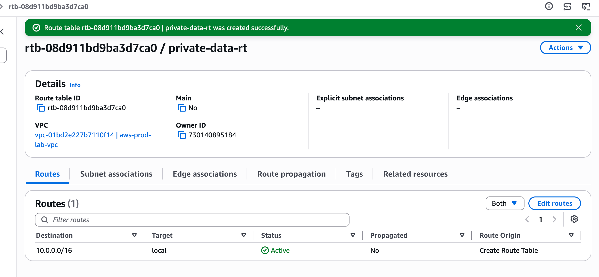

Do not add:

- Internet Gateway route
- NAT Gateway route
- **0.0.0.0/0**

Associate the route table with:

- **private-data-subnet-a3**
- **private-data-subnet-b3**

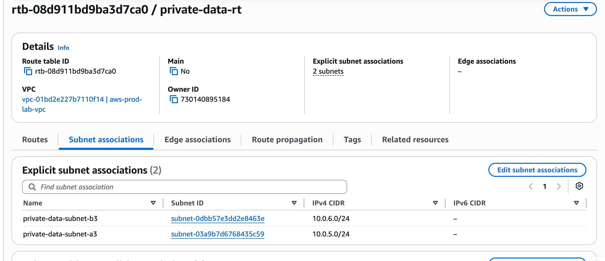


# 5. Create the Database Security Group

Create a Security Group for RDS.

| Configuration | Setting              |
| ------------- | -------------------- |
| Name          | **db-sg**            |
| VPC           | **aws-prod-lab-vpc** |

Inbound rule:

| Type         | Port     | Source     |
| ------------ | -------- | ---------- |
| MySQL/Aurora | **3306** | **app-sg** |

Do not allow database access from:

- **0.0.0.0/0**
- Public Subnets
- **alb-sg**

Only application EC2 instances using **app-sg** can connect to the database.

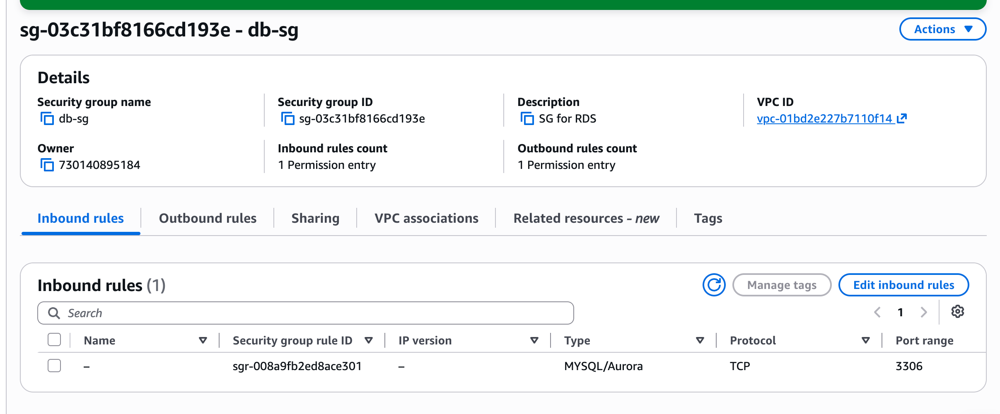

---

# 6. Create the KMS Key

Create a customer-managed KMS key for V4.

| Configuration                         | Setting                                                     |
| ------------------------------------- | ----------------------------------------------------------- |
| Key Type                              | **Symmetric**                                               |
| Key Usage                             | **Encrypt and decrypt**                                     |
| Key Material Origin                   | **KMS**                                                     |
| Regionality                           | **Single-Region key**                                       |
| Alias                                 | **aws-prod-lab-v4**                                         |
| Description                           | **V4 encryption key for AWS production infrastructure lab** |
| Key Administrator                     | **lab-admin**                                               |
| Allow Key Administrator to Delete Key | **Enabled**                                                 |
| Key Users                             | **lab-admin**, **v2-ec2-role**                              |
| Other AWS Accounts                    | **None**                                                    |
| Tags                                  | **None**                                                    |

The created alias will appear as:

**alias/aws-prod-lab-v4**

The key policy grants:

| Permission Type     | Principal                      |
| ------------------- | ------------------------------ |
| Key Administration  | **lab-admin**                  |
| Key Usage           | **lab-admin**                  |
| Key Usage           | **v2-ec2-role**                |
| AWS Resource Grants | **lab-admin**, **v2-ec2-role** |

The key can be used for V4 encrypted resources such as:

- Amazon RDS storage encryption
- Secrets Manager secret encryption

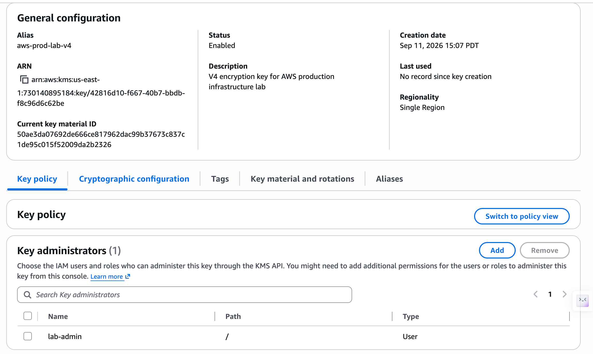

---

# 7. Create the RDS DB Subnet Group

Create a DB Subnet Group.

| **Configuration** | **Setting**                                     |
| ----------------- | ----------------------------------------------- |
| Name              | **v4-db-subnet-group**                          |
| Description       | **Private DB subnet group for V4 RDS Multi-AZ** |
| VPC               | **aws-prod-lab-vpc**                            |
| AZ                | **us-east-1a**, **us-east-1b**                  |
| Subnet 1          | **private-data-subnet-a3 (10.0.5.0/24)**        |
| Subnet 2          | **private-data-subnet-b3 (10.0.6.0/24)**        |

The DB Subnet Group must span both Availability Zones.

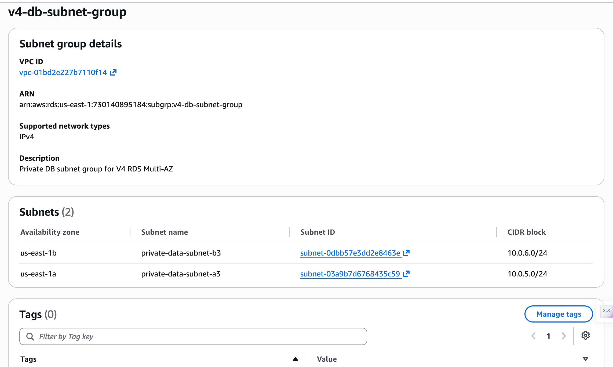

---

# 8. Create the RDS Multi-AZ Database

Create an Amazon RDS MySQL database.

| Configuration           | Setting                            |
| ----------------------- | ---------------------------------- |
| Engine                  | MySQL 8.4                          |
| Deployment              | Multi-AZ DB Instance (2 instances) |
| DB Identifier           | **v4-web-db**                      |
| Master Username         | **admin**                          |
| Credentials             | Managed in AWS Secrets Manager     |
| Database Authentication | Password authentication            |
| Instance Class          | **db.t4g.micro**                   |
| Storage Type            | **gp3**                            |
| Storage                 | **20 GiB**                         |
| Initial Database Name   | **appdb**                          |

## Network

| Configuration            | Setting                |
| ------------------------ | ---------------------- |
| VPC                      | **aws-prod-lab-vpc**   |
| DB Subnet Group          | **v4-db-subnet-group** |
| Public Access            | **No**                 |
| Security Group           | **db-sg**              |
| Automatic EC2 Connection | **No**                 |
| RDS Proxy                | **Disabled**           |
| Certificate Authority    | Default                |

The database is deployed in private DB subnets across two Availability Zones.

The **db-sg** security group allows MySQL traffic on port **3306** only from **app-sg**.

## Encryption

Enable storage encryption.

| Configuration      | Setting             |
| ------------------ | ------------------- |
| Storage Encryption | **Enabled**         |
| KMS Key            | **aws-prod-lab-v4** |

Use the customer-managed KMS key for RDS encryption.

The master database credentials are managed by AWS Secrets Manager and encrypted using the same customer-managed KMS key.

## Backup and Maintenance

| Configuration                   | Setting           |
| ------------------------------- | ----------------- |
| Automated Backup                | **Enabled**       |
| Backup Retention                | **1 day**         |
| Backup Window                   | **No preference** |
| Cross-Region Backup Replication | **Disabled**      |
| Auto Minor Version Upgrade      | **Enabled**       |
| Maintenance Window              | **No preference** |
| Deletion Protection             | **Disabled**      |

## Monitoring

| Configuration       | Setting      |
| ------------------- | ------------ |
| Database Insights   | **Standard** |
| Enhanced Monitoring | **Disabled** |
| RDS Proxy           | **Disabled** |

## Tags

| Key         | Value               |
| ----------- | ------------------- |
| Project     | **aws-prod-lab-v4** |
| Environment | **lab**             |

This configuration provides a private, encrypted, Multi-AZ RDS database while keeping the lab resource size and optional paid features minimal.

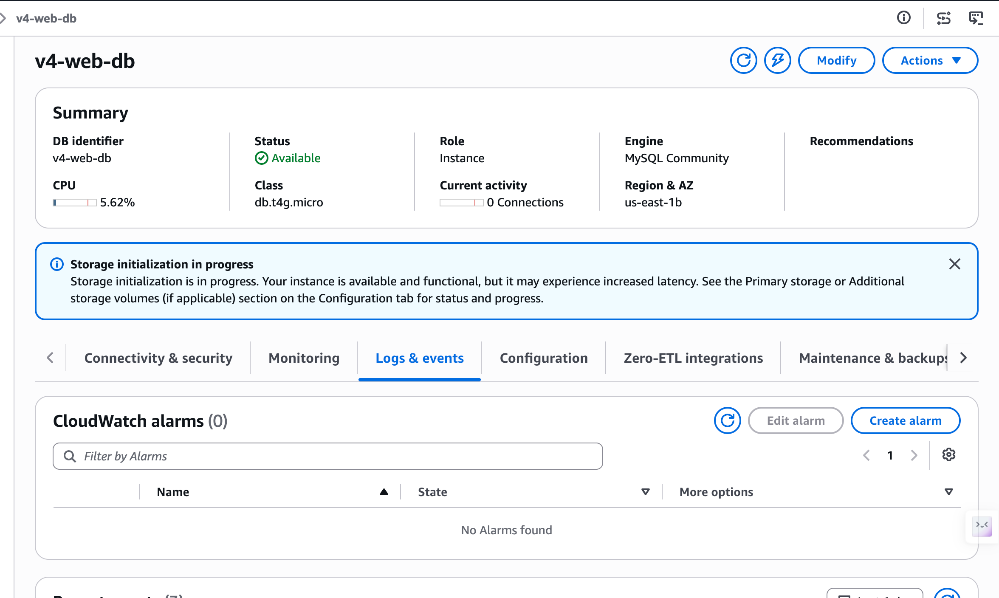

---

# 9. Confirm RDS and Secrets Manager

After RDS becomes available, confirm:

- RDS status is **Available**
- Deployment is Multi-AZ
- Public access is **No**
- DB Subnet Group is **v4-db-subnet-group**
- Security Group is **db-sg**
- Storage encryption is enabled
- KMS encryption is enabled

Open:

Secrets Manager → Secrets

Confirm that the RDS database credentials are stored in Secrets Manager.

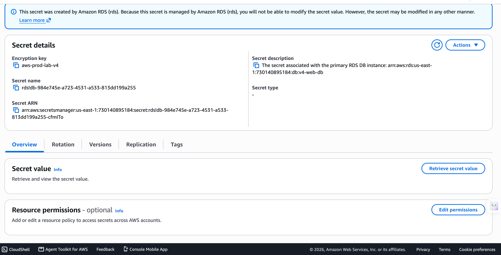

---


# 10. Verify Application-to-Database Connection

Use **Systems Manager → Session Manager** to connect to one Private App EC2.

RDS Endpoint:

v4-web-db.ce7yaociopgt.us-east-1.rds.amazonaws.com

| Test            | Purpose                                                      | Command                                                      |
| --------------- | ------------------------------------------------------------ | ------------------------------------------------------------ |
| DNS             | Verify the RDS endpoint can be resolved                      | nslookup v4-web-db.ce7yaociopgt.us-east-1.rds.amazonaws.com  |
| TCP 3306        | Verify the RDS MySQL port is reachable                       | nc -zv v4-web-db.ce7yaociopgt.us-east-1.rds.amazonaws.com 3306 |
| TLS Certificate | Download the AWS RDS CA certificate for TLS verification     | curl -o global-bundle.pem https://truststore.pki.rds.amazonaws.com/global/global-bundle.pem |
| Database Login  | Retrieve the password from Secrets Manager and connect to RDS MySQL using TLS | Copy the generated MySQL command from the RDS dashboard      |

Verification order:

DNS → TCP 3306 → TLS certificate → MySQL login

The final MySQL command verifies:

- EC2 can reach RDS.
- EC2 can retrieve the database password from Secrets Manager.
- The RDS TLS certificate can be verified.
- The application EC2 can successfully authenticate to MySQL.

---

## Troubleshooting: Secrets Manager Access Denied

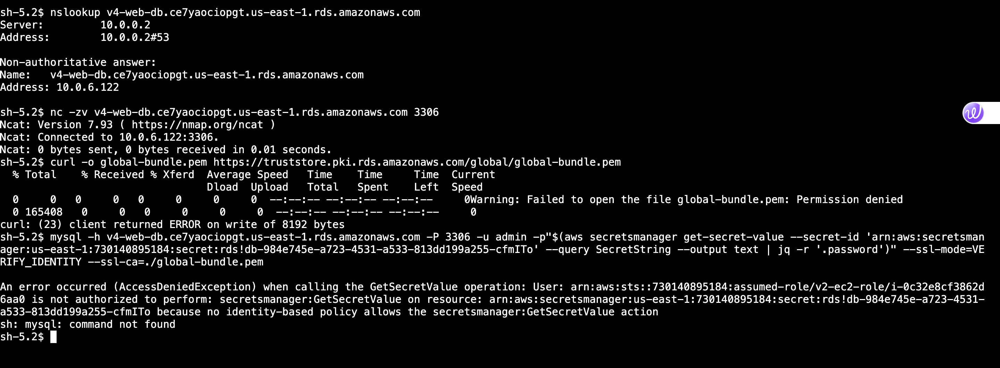

During the database login test, the EC2 instance failed to retrieve the RDS password from Secrets Manager.

Error:

AccessDeniedException: User assumed-role/v2-ec2-role/... is not authorized to perform secretsmanager:GetSecretValue because no identity-based policy allows the secretsmanager:GetSecretValue action.


### Analysis

The failure occurs later when the EC2 instance attempts to retrieve the database password from Secrets Manager.

The error explicitly shows that the EC2 IAM Role: **v2-ec2-role**

does not have permission to perform: **secretsmanager:GetSecretValue**

Therefore, this is an **IAM authorization problem**, not a network or RDS connectivity problem.

### Fix

The error shows that the EC2 instance is using the IAM role:

**v2-ec2-role**

but this role does not have permission to retrieve the RDS credentials from Secrets Manager.

The required permission is:

**secretsmanager:GetSecretValue**

However, granting this permission with:

```json
"Resource": "*"
```

would allow the role to retrieve other secrets that the permission applies to.

This does not follow the **principle of least privilege**.

Therefore, the permission should be restricted to the specific RDS secret used by **v4-web-db**.

The RDS secret is also encrypted using our customer-managed KMS key:

**aws-prod-lab-v4**

Therefore, the EC2 role also needs permission to decrypt data using this specific KMS key.

The required permissions are:

| Permission                    | Resource                             | Purpose                                   |
| ----------------------------- | ------------------------------------ | ----------------------------------------- |
| secretsmanager:GetSecretValue | Specific RDS Secret ARN              | Allow EC2 to retrieve the RDS credentials |
| kms:Decrypt                   | Specific aws-prod-lab-v4 KMS Key ARN | Allow EC2 to decrypt the secret           |

This follows the **principle of least privilege**:

EC2 Role → specific RDS Secret → specific KMS Key

---

#### Implementation

Open:

**IAM → Roles → v2-ec2-role → Permissions → Add permissions → Create inline policy**

Select **JSON** and add:

```json
{
  "Version": "2012-10-17",
  "Statement": [
    {
      "Sid": "ReadV4RDSSecret",
      "Effect": "Allow",
      "Action": "secretsmanager:GetSecretValue",
      "Resource": "arn:aws:secretsmanager:us-east-1:730140895184:secret:rds!db-984e745e-a723-4531-a533-813dd199a255-cfmITo"
    },
    {
      "Sid": "DecryptV4RDSSecret",
      "Effect": "Allow",
      "Action": "kms:Decrypt",
      "Resource": "arn:aws:kms:us-east-1:730140895184:key/42816d10-f667-40b7-bbdb-f8c96d6c62be"
    }
  ]
}
```

Policy name: **v4-rds-secret-access**

This policy gives **v2-ec2-role** only the permissions required to:

1. Retrieve the credentials for the specific **v4-web-db** RDS secret.
2. Use the specific **aws-prod-lab-v4** KMS key to decrypt the secret.

It does **not** grant access to all Secrets Manager secrets or all KMS keys.

After creating the policy, return to the App EC2 Session Manager session and retry the Secrets Manager / MySQL connection test.

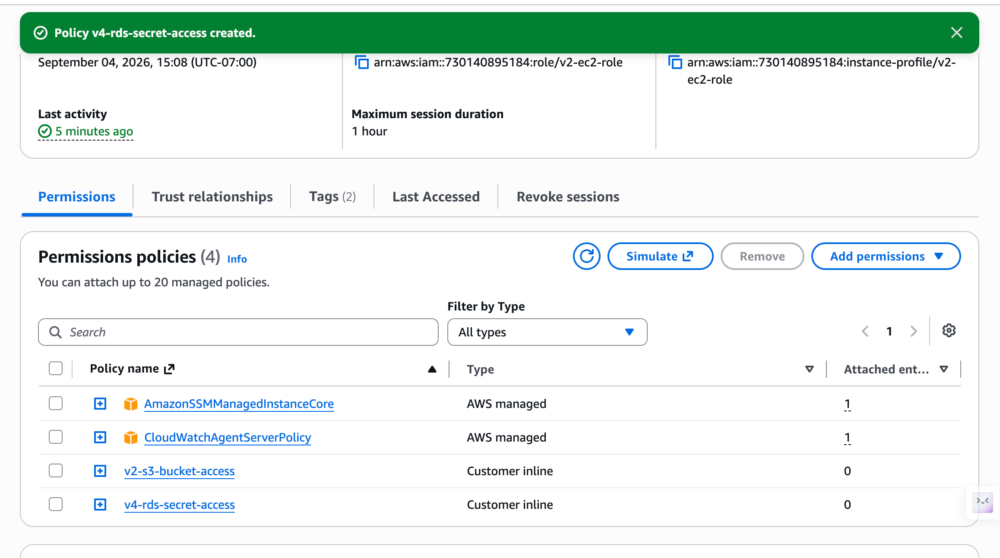

#### Additional Issue: MySQL Client

After fixing the IAM permission, the database login test returned: **mysql: command not found**

This means the App EC2 instance does not have a MySQL client installed.

The MySQL client is only required for manually testing the connection from the App EC2 instance to RDS. It is not required by the application architecture itself.

Therefore, there is no need to rebuild the V3 AMI or modify the Launch Template.

Install the official **MySQL Community Client** only on the EC2 instance used for this test.

**Install MySQL Community Client**

| Step | Purpose                                                  | Command                                                      |
| ---- | -------------------------------------------------------- | ------------------------------------------------------------ |
| 1    | Download the official MySQL Community repository package | `curl -O https://repo.mysql.com/mysql84-community-release-el9.rpm` |
| 2    | Install the MySQL repository configuration               | `sudo dnf install -y mysql84-community-release-el9.rpm`      |
| 3    | Install the official MySQL Community client              | `sudo dnf install -y mysql-community-client`                 |
| 4    | Verify the MySQL client installation                     | `mysql --version`                                            |

Expected result:

mysql Ver 8.4.x for Linux on x86_64 (MySQL Community Server - GPL)

This confirms that the official MySQL Community client is installed successfully.

After installation, rerun the RDS MySQL connection command generated by the AWS RDS console.

However, new error: **ERROR 2026 (HY000): SSL connection error: SSL_CTX_set_default_verify_paths failed**


### Additional Issue: TLS Certificate

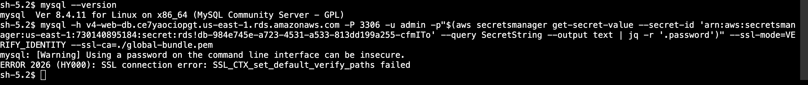

After installing the MySQL client, the connection returned:

`ERROR 2026 (HY000): SSL connection error: SSL_CTX_set_default_verify_paths failed`

#### Cause

The MySQL command uses TLS to verify the RDS server certificate:

`--ssl-mode=VERIFY_IDENTITY --ssl-ca=./global-bundle.pem`

The previous download of `global-bundle.pem` failed because the current directory was not writable, so MySQL could not find/use the required RDS CA certificate.

#### Fix

Download the RDS CA certificate to a writable directory:

| Purpose                     | Command                                                      |
| --------------------------- | ------------------------------------------------------------ |
| Move to writable directory  | `cd /tmp`                                                    |
| Download RDS CA certificate | `curl -o global-bundle.pem https://truststore.pki.rds.amazonaws.com/global/global-bundle.pem` |
| Verify the file             | `ls -lh global-bundle.pem`                                   |

Then retry the MySQL connection using:

`--ssl-ca=/tmp/global-bundle.pem`

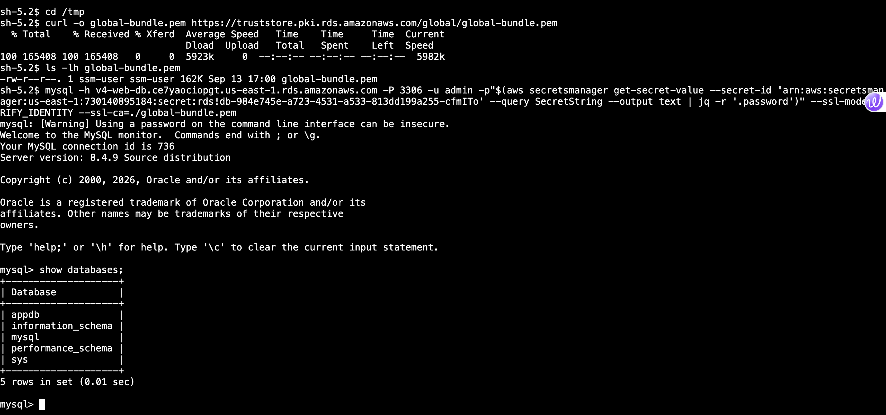

### Final Verification

After fixing the IAM permission, TLS certificate location, and MySQL client:

1. Confirm DNS resolution succeeds.
2. Confirm TCP 3306 succeeds.
3. Confirm the RDS CA certificate downloads successfully.
4. Confirm the EC2 role can retrieve the RDS secret.
5. Run the MySQL connection command again.
6. Confirm successful authentication to the RDS database.

Troubleshooting path:

DNS PASS → TCP 3306 PASS → Secrets Manager FAIL → IAM permission issue identified → Fix IAM Role → Retry database login


# 11. Design the V4 Database-Backed Application

The V3 application uses Nginx to serve a static HTML page.

This is no longer sufficient for V4 because a static page does not communicate with the new RDS database.

For V4, replace the static application with a minimal database-backed application.

**Application Design**

Use:

- Nginx as the web server / reverse proxy
- Python Flask as the application
- Amazon RDS MySQL as the database
- AWS Secrets Manager for database credentials

Application flow:

User→ ALB→ Nginx→ Flask→ RDS MySQL

The Flask application will:

1. Receive the request from Nginx.
2. Retrieve the RDS credentials from Secrets Manager.
3. Connect to the RDS MySQL database.
4. Read one record from the database.
5. Return the result as a web page.

The final page only needs to display:

V4 Application

Database Status: Connected

Message from RDS: Hello from V4 database

Keep the application intentionally simple.

The purpose is not application development. The purpose is to demonstrate a working connection between:

ALB → Private EC2 → Secrets Manager → RDS


# 12. Build the Flask Application on One EC2 Instance

Select one existing Private App EC2 instance as the **V4 Build Instance**.

Use **Systems Manager → Session Manager** to connect to the instance.

The purpose of this step is to install and verify a minimal Flask application before connecting it to RDS.

## Install Flask Environment

| Purpose                          | Command                                      |
| -------------------------------- | -------------------------------------------- |
| Install Python and pip           | `sudo dnf install -y python3 python3-pip`    |
| Install Flask, PyMySQL and boto3 | `sudo pip3 install flask pymysql boto3`      |
| Create application directory     | `sudo mkdir -p /opt/v4-app`                  |
| Change directory ownership       | `sudo chown $(whoami):$(whoami) /opt/v4-app` |
| Enter application directory      | `cd /opt/v4-app`                             |

The packages will be used for:

- **Flask** — Web application
- **PyMySQL** — Connect Flask to RDS MySQL
- **boto3** — Retrieve database credentials from Secrets Manager

## Create the Flask Application

Create:

`/opt/v4-app/app.py`

```python
from flask import Flask

app = Flask(__name__)

@app.route("/")
def home():
    return """
    <h1>V4 Application</h1>
    <p>Flask Status: Running</p>
    """

if __name__ == "__main__":
    app.run(host="127.0.0.1", port=5000)
```

Run the application:

```bash
python3 /opt/v4-app/app.py
```

Flask should listen on:

`127.0.0.1:5000`

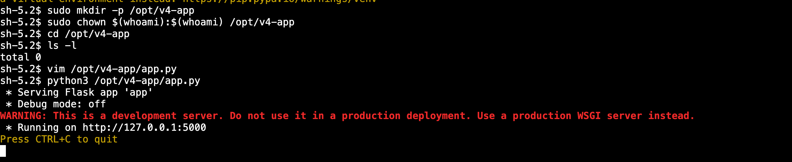

## Verify Flask

Open another Session Manager shell and run:

```bash
curl http://127.0.0.1:5000
```

Expected result:

```text
V4 Application
Flask Status: Running
```

This confirms that the Flask application is running correctly on the V4 Build Instance.

The next step is to connect Flask to **Secrets Manager and RDS MySQL**.

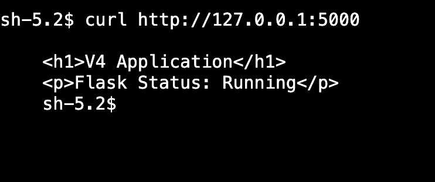


# 13. Create Test Data in RDS

The Flask application is running successfully.

Next, create a simple table in the RDS database so that Flask can read real data from MySQL.

Use **Systems Manager → Session Manager** to connect to the V4 Build EC2 instance.

## Connect to RDS

Move to the directory containing the RDS CA certificate:

```bash
cd /tmp
```

Connect to the RDS MySQL database using the connection command generated by the RDS console.

RDS Endpoint:

`v4-web-db.ce7yaociopgt.us-east-1.rds.amazonaws.com`

After the connection succeeds, the prompt should become:

```text
mysql>
```

## Select the Application Database

```sql
USE appdb;
```

## Create a Simple Table

```sql
CREATE TABLE messages (
    id INT PRIMARY KEY,
    message VARCHAR(255)
);
```

## Insert Test Data

```sql
INSERT INTO messages (id, message)
VALUES (1, 'Hello from V4 database');
```

## Verify the Data

```sql
SELECT * FROM messages;
```

Expected result:

```text
+----+------------------------+
| id | message                |
+----+------------------------+
|  1 | Hello from V4 database |
+----+------------------------+
```

Exit MySQL:

```sql
exit;
```

The RDS database now contains the test data required by the V4 Flask application.

The next step is to configure Flask to retrieve the database credentials from Secrets Manager and read this record from RDS.

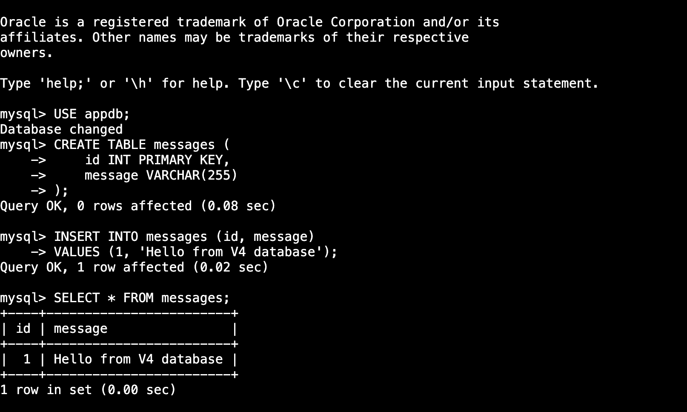


# 14. Connect Flask to Secrets Manager and RDS

Update the Flask application so that it retrieves the RDS credentials from AWS Secrets Manager and reads data from the `appdb` database.

Application path:

Flask → Secrets Manager → RDS MySQL → `messages` table

## Prepare the RDS CA Certificate

Store the RDS CA certificate with the application:

```bash
cd /opt/v4-app
curl -o global-bundle.pem https://truststore.pki.rds.amazonaws.com/global/global-bundle.pem
```

Verify:

```bash
ls -lh global-bundle.pem
```

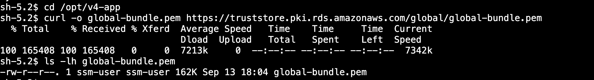

## Update the Flask Application

Edit:

```bash
vim /opt/v4-app/app.py
```

Replace the current code with:

```python
from flask import Flask
import boto3
import json
import pymysql

app = Flask(__name__)

REGION = "us-east-1"

SECRET_ARN = "arn:aws:secretsmanager:us-east-1:730140895184:secret:rds!db-984e745e-a723-4531-a533-813dd199a255-cfmITo"

RDS_ENDPOINT = "v4-web-db.ce7yaociopgt.us-east-1.rds.amazonaws.com"

def get_db_credentials():
    client = boto3.client("secretsmanager", region_name=REGION)

    response = client.get_secret_value(
        SecretId=SECRET_ARN
    )

    return json.loads(response["SecretString"])

@app.route("/")
def home():

    secret = get_db_credentials()

    connection = pymysql.connect(
        host=RDS_ENDPOINT,
        user=secret["username"],
        password=secret["password"],
        database="appdb",
        port=3306,
        ssl={
            "ca": "/opt/v4-app/global-bundle.pem"
        }
    )

    with connection.cursor() as cursor:
        cursor.execute(
            "SELECT message FROM messages WHERE id = 1"
        )
        result = cursor.fetchone()

    connection.close()

    return f"""
    <h1>V4 Application</h1>
    <p>Database Status: Connected</p>
    <p>Message from RDS: {result[0]}</p>
    """

if __name__ == "__main__":
    app.run(host="127.0.0.1", port=5000)
```

## Start Flask

```bash
python3 /opt/v4-app/app.py
```

Flask should listen on:

```text
127.0.0.1:5000
```

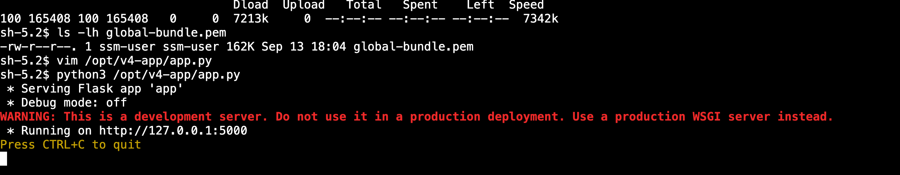

## Verify the Application

Open another Session Manager session and run:

```bash
curl http://127.0.0.1:5000
```

Expected result:

```text
V4 Application
Database Status: Connected
Message from RDS: Hello from V4 database
```

This confirms:

Flask → Secrets Manager → RDS MySQL → appdb

is working successfully.

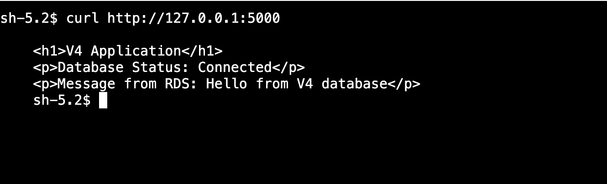


# 15. Configure Nginx to Forward Requests to Flask

The Flask application can now retrieve credentials from Secrets Manager and read data from RDS.

Next, configure Nginx as a reverse proxy.

Application path:

ALB → Nginx :80 → Flask :5000 → Secrets Manager → RDS

## Start Flask

For this test, start Flask manually:

```bash
python3 /opt/v4-app/app.py
```

Flask should listen on:

```text
127.0.0.1:5000
```

Keep this Session Manager session running.

## Configure Nginx

Open another Session Manager session.

Create the Nginx configuration:

```bash
sudo vim /etc/nginx/default.d/v4-app.conf
```

Add:

```nginx
location / {
    proxy_pass http://127.0.0.1:5000;

    proxy_set_header Host $host;
    proxy_set_header X-Real-IP $remote_addr;
    proxy_set_header X-Forwarded-For $proxy_add_x_forwarded_for;
    proxy_set_header X-Forwarded-Proto $scheme;
}
```

## Test the Nginx Configuration

```bash
sudo nginx -t
```

Expected result:

```text
syntax is ok
test is successful
```

Reload Nginx:

```bash
sudo systemctl reload nginx
```

## Verify Nginx → Flask

Run:

```bash
curl http://127.0.0.1
```

Expected result:

```text
V4 Application
Database Status: Connected
Message from RDS: Hello from V4 database
```

This confirms:

Nginx → Flask → Secrets Manager → RDS

is working successfully.

The next step is to configure the Flask application as a systemd service so that it starts automatically when the EC2 instance starts.

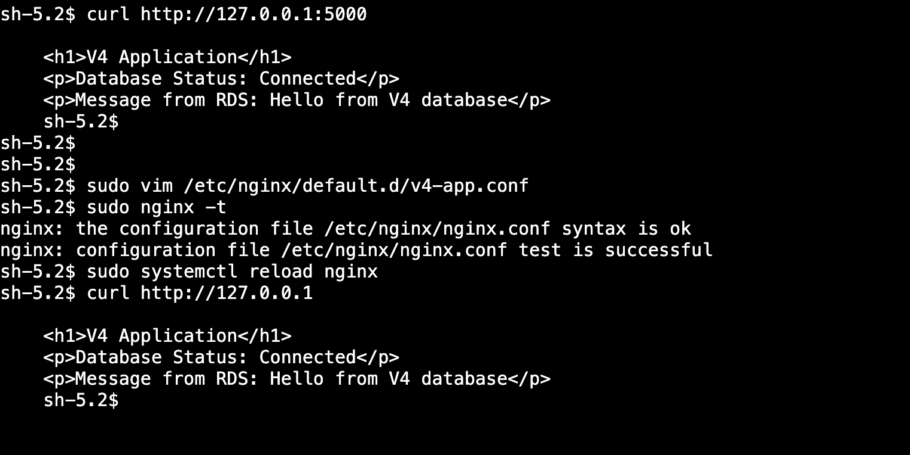


# 16. Run the Flask Application as a systemd Service

The Flask application is currently started manually.

If the EC2 instance restarts, the Flask process will stop.

Configure Flask as a **systemd service** so that it starts automatically when the EC2 instance starts.

## Stop the Manually Started Flask Process

If Flask is still running manually, stop it with:

```bash
Ctrl+C
```

## Create the systemd Service

Create:

```bash
sudo vim /etc/systemd/system/v4-app.service
```

Add:

```ini
[Unit]
Description=V4 Flask Application
After=network.target

[Service]
User=root
WorkingDirectory=/opt/v4-app
ExecStart=/usr/bin/python3 /opt/v4-app/app.py
Restart=always

[Install]
WantedBy=multi-user.target
```

## Reload systemd

```bash
sudo systemctl daemon-reload
```

## Start the Flask Service

```bash
sudo systemctl start v4-app
```

## Enable Automatic Startup

```bash
sudo systemctl enable v4-app
```

## Verify the Service

Check the service status:

```bash
sudo systemctl status v4-app
```

Expected result:

```text
Active: active (running)
```

Verify Flask directly:

```bash
curl http://127.0.0.1:5000
```

Verify through Nginx:

```bash
curl http://127.0.0.1
```

Expected result:

```text
V4 Application
Database Status: Connected
Message from RDS: Hello from V4 database
```

## Verify Automatic Startup

Reboot the EC2 instance:

```bash
sudo reboot
```

After the instance becomes available again, reconnect using Session Manager.

Check:

```bash
sudo systemctl status v4-app
```

Then test:

```bash
curl http://127.0.0.1
```

If the application works without manually starting Flask, the systemd configuration is successful.

This confirms that the V4 application can start automatically when a new EC2 instance boots.


## troubleshooting / design correction

Initially, I modified an EC2 instance that was managed by an Auto Scaling Group. During reboot testing, the instance was replaced by the ASG, which showed that configuration should not depend on mutable ASG instances. I changed the deployment process to build and validate the application on a standalone instance, create a new AMI, update the Launch Template, and then refresh the ASG.


# 17. Rebuild an Independent V4 Build Instance

The Flask application, Nginx configuration, RDS connection, and systemd service created in Chapters 12–16 were originally configured on an EC2 instance managed by the V3 Auto Scaling Group.

During the reboot test, the instance was terminated and replaced by the Auto Scaling Group.

This was a design mistake during the V4 build process, but it also provided a useful troubleshooting scenario.

To avoid modifying temporary ASG-managed instances directly, create a separate EC2 instance as the V4 build instance.

## Create the V4 Build Instance

Launch a new EC2 instance from the existing V3 AMI.

Configuration:

```text
Name: v4-build-instance
AMI: v3-web-server-ami
Instance type: t3.micro

VPC: aws-prod-lab-vpc
Subnet: private-app-subnet-a2
Public IP: Disabled

Security Group: app-sg
IAM Role: v2-ec2-role

Key Pair: None
Root Volume: 8 GiB gp3

Metadata Version: IMDSv2 only
```

This EC2 instance is created independently and is **not managed by the Auto Scaling Group**.

## Verify the Build Instance

After the instance starts, verify that:

```text
Instance State: Running
Status Check: Passed
Auto Scaling Group: None
```

Connect to the instance using AWS Systems Manager Session Manager.

Verify Internet access through the existing NAT Gateway:

```bash
curl -I https://aws.amazon.com
```

## Rebuild the V4 Application

Repeat the work from **Chapters 12–16** on `v4-build-instance`.

This includes:

1. Install and configure Flask.
2. Connect Flask to Secrets Manager and RDS.
3. Configure Nginx as the reverse proxy.
4. Configure Flask as a systemd service.
5. Verify Flask and Nginx.
6. Verify the application can retrieve data from RDS.

The detailed procedures are already documented in Chapters 12–16 and are not repeated here.

## Final Purpose

The independent `v4-build-instance` will be used to finish and test the V4 application configuration.

After the configuration is fully verified, a new V4 AMI can be created from this instance and used by the Auto Scaling Group.

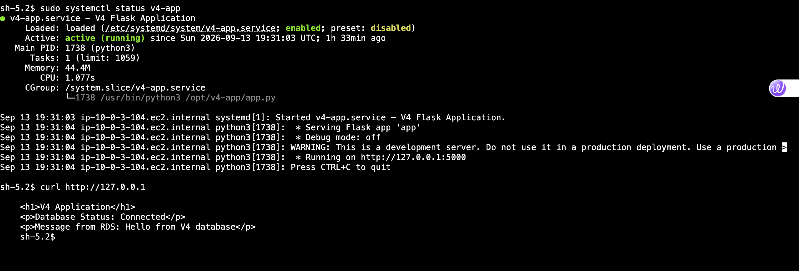


# 18 – Update ASG with V4 AMI and Launch Template

## Goal

Create a new V4 AMI from the configured application instance, update the Launch Template, and configure the existing Auto Scaling Group to use the new image.

Flow:

Configured V4 EC2
→ V4 AMI
→ New Launch Template Version
→ Update Auto Scaling Group

---

## 18.1. Stop the V4 EC2 Instance

The V4 application instance has already been verified:

- `v4-app.service` is enabled and starts automatically after reboot
- Flask application starts successfully
- Application can connect to RDS
- No manual configuration is required after reboot

Stop the instance before creating the final V4 AMI.

---

## 18.2. Create the V4 AMI

Create an AMI from the stopped V4 application instance.

AMI name: **v4-web-server-ami**

This AMI contains:

- V4 Flask application
- systemd `v4-app.service`
- Automatic application startup
- Nginx configuration
- RDS connectivity configuration
- Required application dependencies

Wait until the AMI status becomes:

Available

---

## 18.3. Create a New Launch Template Version

Use the existing Launch Template and create a new version.

Main change:

AMI: **v4-web-server-ami**

Keep the existing ASG-related configuration unchanged unless required:

- Instance type
- IAM Instance Profile
- Security Group
- Key pair / SSM configuration
- Other existing Launch Template settings

The purpose of the new version is to replace the old V3 application image with the new V4 application image.

---

## 18.4. Update the Auto Scaling Group

Open the existing Auto Scaling Group and update its Launch Template configuration.

Keep using the existing Launch Template:

**v3-web-launch-template**

Change the Launch Template version:

```text
Old version → New V4 version
```

The new version uses:

**v4-web-server-ami**

Do not create a new Auto Scaling Group.

The existing ASG architecture remains unchanged:

```text
ALB→ Target Group→ ASG→ Private EC2 instances
```

Only the Launch Template version used by the ASG is updated.

New EC2 instances launched by the ASG will use the V4 AMI.

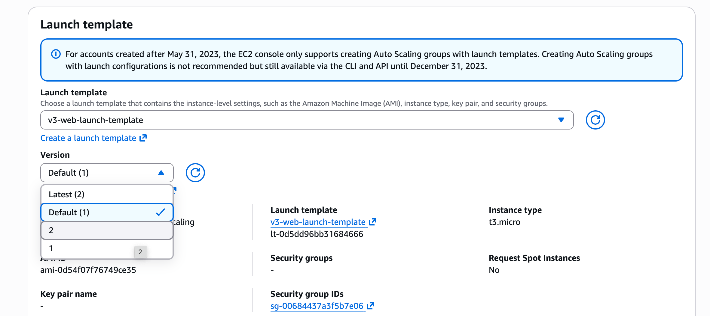

---

## 18.5. Refresh Existing ASG Instances

Updating the Launch Template version used by the Auto Scaling Group does not automatically replace the existing EC2 instances.

The existing instances may still be running the old V3 AMI.

To replace them with instances using the new V4 AMI, start an **Instance Refresh** for the Auto Scaling Group.

```text
Auto Scaling Group
→ Instance Refresh
→ Replace existing V3 instances
→ Launch new instances using Launch Template Version 2
→ New instances use v4-web-server-ami
```

The ASG will gradually terminate the old instances and launch replacement instances using the new Launch Template version.

After the Instance Refresh completes, verify that the new EC2 instances are running from:

```text
v4-web-server-ami
```

and confirm that they are healthy in the Target Group.


# 19. Verify the Refreshed V4 Auto Scaling Instances

After the Instance Refresh completes, verify that the Auto Scaling Group is now running the new V4 EC2 instances.

## Verify the Auto Scaling Group

Open:

```text
EC2 → Auto Scaling Groups → v3-web-asg
```

Confirm:

```text
Desired Capacity: 2
Instances: 2
Lifecycle: InService
Health Status: Healthy
Launch Template Version: 2
```

The old V3 instances should no longer remain in the Auto Scaling Group.

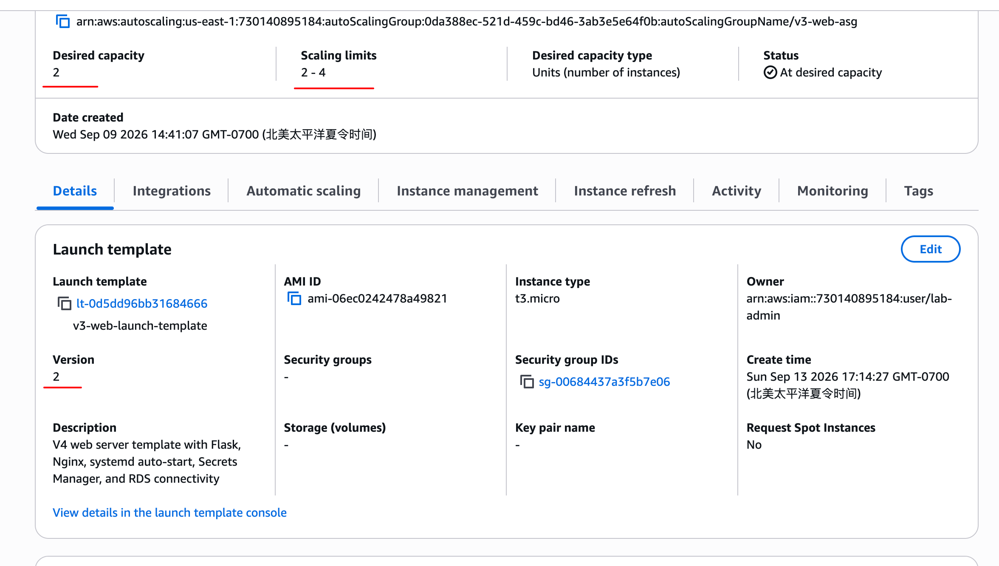

## Verify the New EC2 Instances

Open:

```text
EC2 → Instances
```

Confirm that the two ASG-managed instances are running from the new V4 configuration.

The new instances should use:

```text
Launch Template: v3-web-launch-template
Launch Template Version: 2
AMI: v4-web-server-ami
Security Group: app-sg
IAM Role: v2-ec2-role
```

## Verify the Application on One Instance

Connect to one of the new EC2 instances using:

```text
Systems Manager → Session Manager
```

Check the Flask service:

```bash
sudo systemctl status v4-app
```

Expected result:

```text
Active: active (running)
```

Verify Flask directly:

```bash
curl http://127.0.0.1:5000
```

Verify through Nginx:

```bash
curl http://127.0.0.1
```

Expected result:

```text
V4 Application
Database Status: Connected
Message from RDS: Hello from V4 database
```

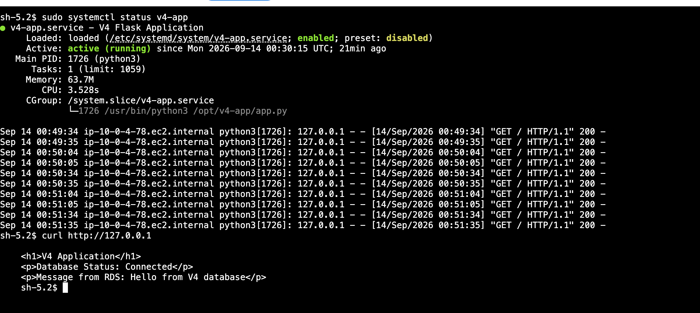

## Verify the Target Group

Open:

```text
EC2 → Target Groups → v3-web-target-group
```

Confirm that both V4 EC2 instances are:

```text
Healthy
```

This confirms the complete application path:

```text
ALB
→ Target Group
→ Auto Scaling Group
→ Nginx
→ Flask
→ Secrets Manager
→ RDS
```

At this point, the V4 application layer and database layer are fully integrated and managed by the Auto Scaling Group.

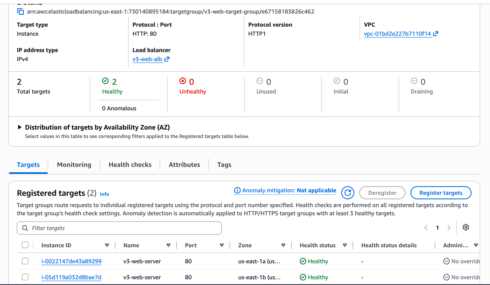

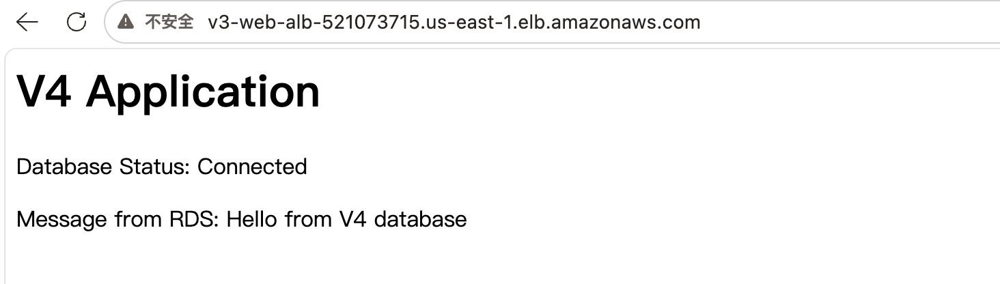


# 20. Enable AWS CloudTrail for API Auditing

## 20.1 Why We Need CloudTrail

AWS CloudTrail records AWS API activity.

It can record information such as:

- Who performed an operation
- Which AWS API was called
- When the operation occurred
- Which AWS service was involved
- Which resource was accessed or modified
- Where the request originated

Example:

```text
IAM User / Role
→ AWS API
→ Modify AWS Resource
→ CloudTrail records the operation
```

Even without creating a trail, AWS provides **CloudTrail Event History**.

Event History automatically provides recent **Management Events** for the last **90 days**.

However, Event History has several limitations:

- Events are only available through Event History for 90 days.
- Logs are not continuously delivered to our own S3 bucket.
- Long-term retention cannot be controlled through Event History.
- Additional event types are not automatically enabled.

Therefore, we create our own CloudTrail trail.

The trail continuously delivers CloudTrail logs to S3:

```text
AWS API Activity
        ↓
    CloudTrail
        ↓
   SSE-KMS Encryption
        ↓
       S3
```

Once the logs are stored in S3, retention can be controlled using S3 Lifecycle policies.

---

## 20.2 Create the CloudTrail Trail

Open: **CloudTrail → Trails → Create trail**

Create the trail with the following configuration:

| Configuration                      | Setting                        |
| ---------------------------------- | ------------------------------ |
| Trail Name                         | `v4-audit-trail`               |
| Multi-Region Trail                 | Enabled                        |
| S3 Storage                         | Use existing bucket            |
| S3 Bucket                          | `aws-prod-lab-v2-730140895184` |
| SSE-KMS Encryption                 | Enabled                        |
| KMS Key                            | `aws-prod-lab-v4`              |
| Log File Validation                | Enabled                        |
| Recursive Logging                  | Enabled                        |
| SNS Notification                   | Disabled                       |
| CloudWatch Logs                    | Disabled                       |
| Management Events                  | Enabled                        |
| Read Events                        | Enabled                        |
| Write Events                       | Enabled                        |
| Exclude AWS KMS Events             | No                             |
| Exclude Amazon RDS Data API Events | No                             |
| Data Events                        | Disabled                       |
| Insights Events                    | Disabled                       |
| Network Activity Events            | Disabled                       |

The final audit path is:

```text
AWS Management Events
        ↓
v4-audit-trail
        ↓
aws-prod-lab-v4 KMS Key
        ↓
aws-prod-lab-v2-730140895184
```

CloudWatch Logs and SNS are not required for the current V4 audit design.

They can be added later if real-time monitoring and notifications are required.

---

## 20.3 Troubleshooting: CloudTrail KMS Permission Error

During the first attempt to create the trail, CloudTrail returned:

```text
InsufficientEncryptionPolicyException
```

The error indicated that CloudTrail could not access the S3 bucket or the KMS key.

### Check the S3 Bucket Policy

The existing S3 bucket policy already allowed the CloudTrail service to:

```text
s3:GetBucketAcl
s3:PutObject
```

The S3 bucket policy was therefore not the problem.

### Check the KMS Key Policy

The customer-managed KMS key:

```text
aws-prod-lab-v4
```

allowed access for:

```text
lab-admin
v2-ec2-role
```

but did not allow:

```text
cloudtrail.amazonaws.com
```

Therefore, CloudTrail could not use the KMS key to encrypt the log files.

### Fix

Add CloudTrail to the KMS key policy.

Example:

```json
{
  "Sid": "AllowCloudTrailToEncryptLogs",
  "Effect": "Allow",
  "Principal": {
    "Service": "cloudtrail.amazonaws.com"
  },
  "Action": [
    "kms:GenerateDataKey*",
    "kms:DescribeKey"
  ],
  "Resource": "*",
  "Condition": {
    "StringEquals": {
      "AWS:SourceArn": "arn:aws:cloudtrail:us-east-1:<account-id>:trail/v4-audit-trail"
    },
    "StringLike": {
      "kms:EncryptionContext:aws:cloudtrail:arn": "arn:aws:cloudtrail:*:<account-id>:trail/*"
    }
  }
}
```

After updating the KMS key policy, create the trail again.

The trail is then created successfully.

Troubleshooting path:

```text
CloudTrail creation failed
        ↓
InsufficientEncryptionPolicyException
        ↓
Check S3 Bucket Policy
        ↓
S3 permissions correct
        ↓
Check KMS Key Policy
        ↓
CloudTrail service permission missing
        ↓
Add cloudtrail.amazonaws.com permission
        ↓
Create Trail again
        ↓
Success
```

---

## 20.4 Verify CloudTrail

Confirm:

- Trail logging is enabled
- Multi-Region trail is enabled
- SSE-KMS encryption is enabled

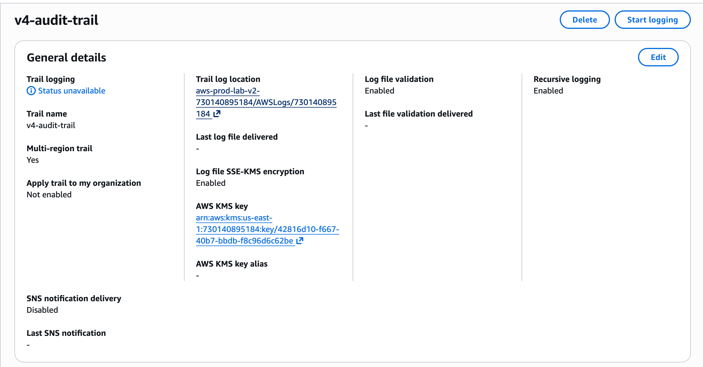

Then open the S3 bucket:

aws-prod-lab-v2-730140895184
→ AWSLogs
→ <account-id>
→ CloudTrail

Confirm that CloudTrail log files have been successfully delivered to S3.

Open one log file and verify that AWS API events are recorded.

This confirms that the CloudTrail auditing pipeline is working correctly:

AWS API Activity → CloudTrail → S3

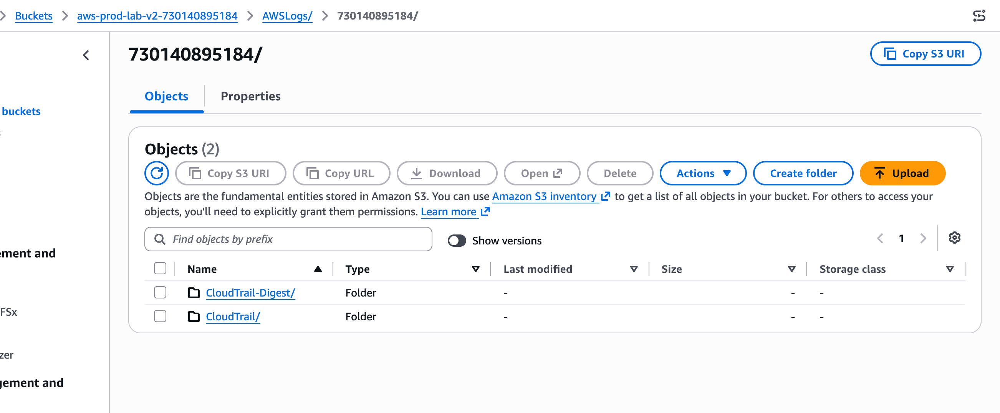


# 21. Enable AWS Config for Resource Configuration Tracking

## 21.1 Why We Need AWS Config

CloudTrail records AWS API activity and helps answer:

- Who performed an AWS operation?
- What API action was performed?
- When did it happen?

AWS Config focuses on a different problem:

- What was the configuration of an AWS resource?
- How did the configuration change over time?

For example, if a Security Group rule is changed, CloudTrail can identify the API operation and IAM identity that made the change.

AWS Config can record the configuration history of the Security Group and show how its configuration changed.

Together:

**AWS Config tells me how the resource configuration changed over time. CloudTrail tells me who performed the API action that caused the change.**

---

## 21.2 Configure AWS Config

Open:

**AWS Config → Get started**

Configure AWS Config with the following settings:

| Configuration               | Setting                                                    | Description                                                  |
| --------------------------- | ---------------------------------------------------------- | ------------------------------------------------------------ |
| Recording strategy          | All resource types with customizable overrides             | Record all supported AWS resource types, with exceptions if needed |
| Default recording frequency | Continuous                                                 | Record configuration changes whenever they occur             |
| Global IAM resource types   | Excluded from recording                                    | Do not record global IAM resources such as users, groups, roles, and policies |
| IAM Role                    | AWS Config service-linked role (`AWSServiceRoleForConfig`) | Allows AWS Config to retrieve configuration information from AWS resources |
| S3 Bucket                   | `aws-prod-lab-v2-730140895184` (created in V2)             | Existing bucket used to store AWS Config data                |
| S3 Prefix                   | None                                                       | —                                                            |
| SNS Notification            | Disabled                                                   | —                                                            |
| AWS Config Rules            | None                                                       | No compliance rules are required; V4 only uses Config for configuration tracking |

The resulting configuration tracking path is:

AWS Resources → AWS Config → Configuration History → S3

## 21.3 Troubleshooting: AWS Config Could Not Write to S3

During the final step of the initial AWS Config setup, the following error occurred:

```text
Insufficient delivery policy to s3 bucket:
aws-prod-lab-v2-730140895184,
unable to write to bucket,
provided s3 key prefix is 'null',
provided kms key is 'null'.
```

The existing S3 bucket was already being used by CloudTrail.

Its Bucket Policy allowed: **cloudtrail.amazonaws.com** to write CloudTrail logs to the bucket.

However, the Bucket Policy did not allow: **config.amazonaws.com** to deliver AWS Config data.

Therefore, AWS Config could not create the S3 delivery channel successfully.

### Fix

Update the existing S3 Bucket Policy to allow AWS Config to access the bucket and deliver Config data.

The existing CloudTrail permissions are preserved.

The bucket now supports both services:

```text
CloudTrail
     ↓
     ├────────→ S3
     ↑
AWS Config
```

After updating the Bucket Policy, return to:

```text
AWS Config
→ Settings
→ Data and delivery
→ Edit
```

Configure the delivery channel again using:

```text
S3 Bucket:
aws-prod-lab-v2-730140895184
```

Save the configuration.

Then start the Configuration Recorder.

The AWS Config Settings page should now show:

```text
Recording is on
```

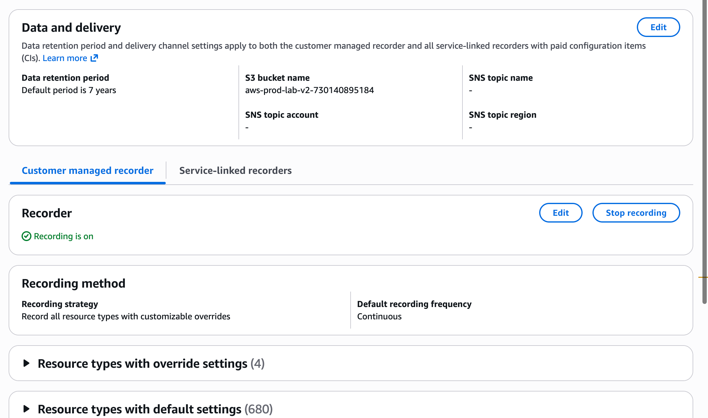


# 22. Configure AWS Budgets for Cost Control

## 22.1 Why We Need AWS Budgets

The lab environment contains AWS resources that may generate ongoing costs.

AWS Budgets is used to monitor account spending and provide early warning of unexpected AWS charges.

The purpose is to prevent lab resources from accidentally generating unnecessary costs.

---

## 22.2 AWS Budget Configuration

An existing monthly AWS Budget is used for cost monitoring.

| Configuration | Setting                | Description                                             |
| ------------- | ---------------------- | ------------------------------------------------------- |
| Budget name   | `My Zero-Spend Budget` | Budget used to monitor unexpected AWS spending          |
| Budget type   | Cost budget            | Monitor AWS account cost                                |
| Budget amount | `$1`                   | Provides an early warning when unexpected charges occur |
| Period        | Monthly                | Budget is evaluated every month                         |
| Budget scope  | AWS account            | Monitor account-level AWS spending                      |

The existing budget provides sufficient cost monitoring for the V4 lab environment.

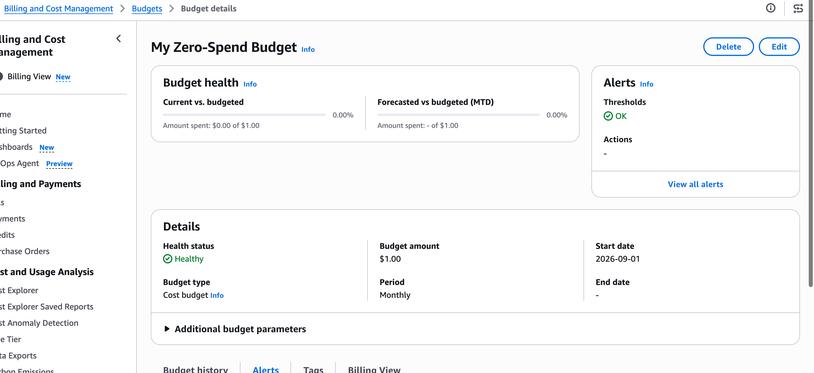


# 23. Configure Route 53 DNS

## 23.1 Why We Need Route 53

The Application Load Balancer currently provides an AWS-generated DNS name.

For example:

```text
v3-web-alb-xxxxxxxx.us-east-1.elb.amazonaws.com
```

Users can access the application through this DNS name, but this is not suitable as the public address of the application.

Amazon Route 53 provides DNS service for the application.

It allows a domain name to resolve to the existing Application Load Balancer.

The DNS path is:

```text
User
  ↓
Domain Name
  ↓
Route 53
  ↓
Application Load Balancer
```

Route 53 does not directly forward HTTP traffic to the application. Its role is DNS resolution:

```text
Domain Name → ALB
```

After Route 53 resolves the domain name, the client connects to the ALB.

Using a domain name is also required for the next V4 step because the HTTPS certificate issued by AWS Certificate Manager will be associated with a domain name rather than the AWS-generated ALB DNS name.

Therefore, Route 53 provides the DNS layer for the application and prepares the architecture for HTTPS.

---


## 23.2 Register a Domain and Configure Route 53

A public domain name is required before Route 53 can provide DNS resolution for the V4 application.

For this project, register a domain directly through Amazon Route 53.

### Register the Domain

Open:

**Route 53 → Registered domains → Register domains**

Search for an available domain name.

Choose an inexpensive domain for the V4 lab environment.

Configure the domain registration:

| Configuration       | Setting                   |
| ------------------- | ------------------------- |
| Domain Name         | `aws-prod-lab.click`      |
| Registration Period | 1 year                    |
| Auto-Renew          | Disabled                  |
| Contact Information | Account owner information |
| Privacy Protection  | Enabled when available    |

Complete the domain registration.

After registration is completed, Route 53 automatically creates a public hosted zone for the registered domain.

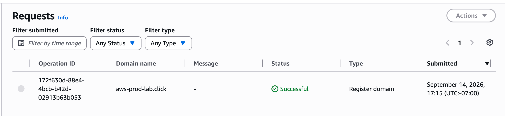


---

### Create the Route 53 DNS Record

Open:

**Route 53 → Hosted zones → `<selected-domain>` → Create record**

Create an Alias A record that points the application domain to the existing Application Load Balancer.

| Configuration          | Setting                               |
| ---------------------- | ------------------------------------- |
| Hosted Zone            | `aws-prod-lab.click`                  |
| Record Name            | Leave blank for the root domain       |
| Record Type            | A                                     |
| Alias                  | Enabled                               |
| Route Traffic To       | Alias to Application Load Balancer    |
| Region                 | us-east-1                             |
| Load Balancer          | Existing V4 Application Load Balancer |
| Routing Policy         | Simple routing                        |
| Evaluate Target Health | Enabled                               |

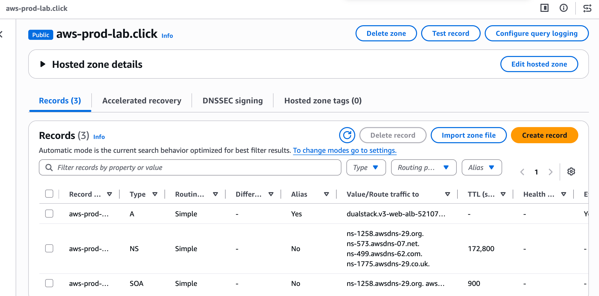

The resulting DNS path is:

```text
User
  ↓
aws-prod-lab.click
  ↓
Route 53 Public Hosted Zone
  ↓
Alias A Record
  ↓
Application Load Balancer
```

The Alias A record is used instead of manually configuring an IP address.

The Application Load Balancer does not provide a fixed public IP address that should be configured directly in DNS.

Route 53 can use the ALB directly as the Alias target.

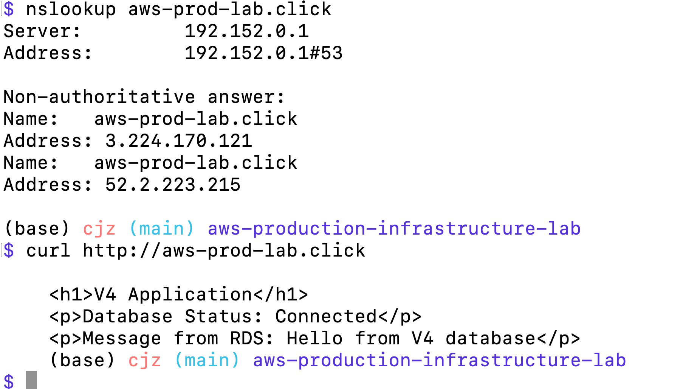


# 24. Configure AWS Certificate Manager (ACM)

## 24.1 Why We Need AWS Certificate Manager

The application currently uses HTTP.

After Route 53 configuration, the application traffic works as follows:

```text
aws-prod-lab.click
        ↓
Route 53 DNS Resolution
        ↓
Client
        │
        │ HTTPS :443
        ▼
Application Load Balancer
        │
        │ HTTP :80
        ▼
Target Group
        ↓
Private EC2
        ↓
Nginx → Flask → RDS
```

Route 53 only provides DNS resolution.

It resolves `aws-prod-lab.click` to the Application Load Balancer. After DNS resolution, the client connects directly to the ALB.

The communication path can therefore be divided into two separate connections:

1. **Client → ALB**
2. **ALB → EC2**

For the first connection, traffic travels between the client and the public-facing ALB.

We want this connection to use:

```text
HTTPS :443
```

HTTPS uses TLS to encrypt the communication between the client and the ALB.

For the second connection, the ALB forwards the request to the application EC2 instances inside the VPC.

For this V4 lab, this connection remains:

```text
HTTP :80
```

The existing EC2 application configuration does not need to change.

The EC2 instances remain in private subnets, and their Security Group only allows HTTP port 80 from the ALB Security Group.

Therefore:

```text
Client → HTTPS :443 → ALB → HTTP :80 → EC2
```

This design is called **TLS termination at the Application Load Balancer**.

The ALB terminates the TLS connection from the client, decrypts the HTTPS traffic, and then creates a separate HTTP connection to the backend EC2 instances.

To support HTTPS, the ALB needs a TLS certificate.

AWS Certificate Manager (ACM) is used to issue and manage this certificate.

For this project, ACM creates a certificate for: **aws-prod-lab.click**

The certificate is attached to the HTTPS listener on the Application Load Balancer.

The certificate has two main purposes:

- **Authentication** — proves that the server presenting the certificate is authorized to use `aws-prod-lab.click`.
- **Encryption** — enables TLS to establish an encrypted connection between the client and the ALB.

Before ACM issues the certificate, AWS must verify that we control the domain.

For this project, we use: **DNS Validation**

ACM creates a DNS validation record, and Route 53 stores this record in the hosted zone.

After ACM verifies the DNS record, the certificate status becomes: **Issued**

The certificate can then be attached to the ALB HTTPS listener.

The final design is:

**Route 53 resolves the domain, ACM provides the TLS certificate, and the ALB terminates HTTPS before forwarding HTTP traffic to the private EC2 instances.**

The existing Target Group, EC2 port 80, Nginx configuration, and Flask configuration do not need to be changed.

---

## 24.2 Request and Validate the ACM Certificate

Open:

**AWS Certificate Manager → Certificates → Request certificate**

Select:

**Request a public certificate**

Continue to the certificate configuration.

### Certificate Configuration

Use the following configuration:

| Configuration               | Setting                      |
| --------------------------- | ---------------------------- |
| Certificate Type            | Request a public certificate |
| Fully Qualified Domain Name | `aws-prod-lab.click`         |
| Additional Domain Name      | None                         |
| Validation Method           | DNS validation               |
| Key Algorithm               | RSA 2048                     |
| Tags                        | None                         |

The certificate must be created in:

```text
Region: us-east-1
```

because the existing Application Load Balancer is located in `us-east-1`.

ACM certificates used by an Application Load Balancer must exist in the same AWS Region as the ALB.

After the certificate is created, its initial status should be: **Pending validation**

This means ACM has created the certificate request but has not yet verified ownership of: **aws-prod-lab.click**

### Configure DNS Validation

After requesting the certificate, the certificate status is initially:

**Pending validation**

Before ACM issues the certificate, ACM must verify that we control the domain:

**aws-prod-lab.click**

ACM generates a unique DNS validation **CNAME record**.

Because the domain is managed by Route 53, click:

**Create records in Route 53**

AWS automatically adds the ACM-generated CNAME record to the Route 53 hosted zone.

ACM then checks the DNS record. If the record exists, ACM confirms that we control the domain and issues the certificate.

```text
ACM generates validation CNAME
        ↓
Create record in Route 53
        ↓
ACM checks the DNS record
        ↓
Domain control verified
        ↓
Certificate status: Issued
```

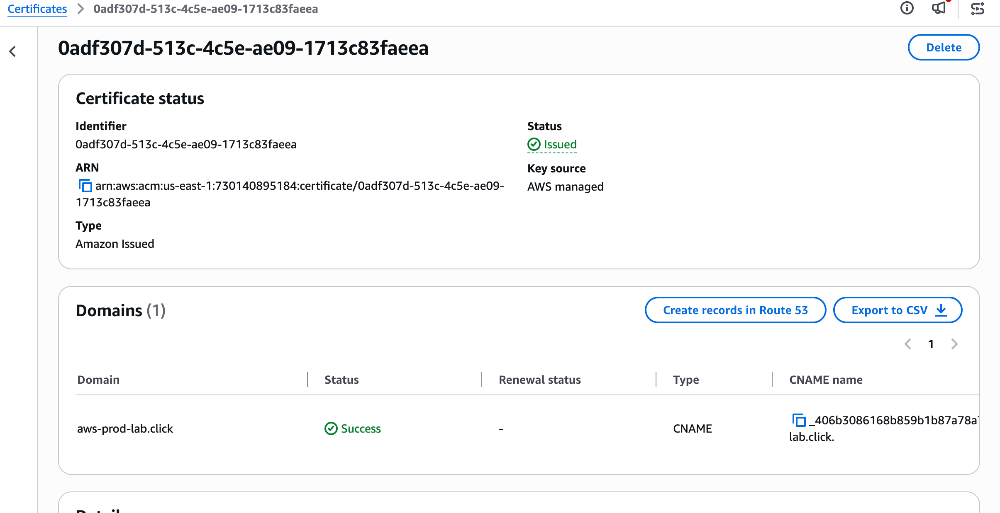


# 25. Configure HTTPS on the Application Load Balancer

## 25.1 Why We Need HTTPS on the ALB

The Route 53 domain and ACM certificate are now ready.

The application domain: **aws-prod-lab.click**

already resolves to the existing Application Load Balancer. ACM has also issued a TLS certificate for this domain.

However, the Application Load Balancer currently only accepts: HTTP :80

The ACM certificate does not provide HTTPS by itself.

To actually use HTTPS, the certificate must be attached to an HTTPS listener on the Application Load Balancer.

The ALB will terminate the TLS connection.

The final traffic path becomes:

```text
Client
  ↓
HTTPS :443
  ↓
ALB + ACM Certificate
  ↓
HTTP :80
  ↓
Target Group
  ↓
Private EC2
  ↓
Nginx → Flask → RDS
```

The client-to-ALB connection is encrypted with HTTPS.

The ALB decrypts the HTTPS traffic and forwards the request to the existing Target Group using HTTP port 80.

Therefore, the backend application configuration does not need to change.

The following components remain unchanged:

- Target Group: HTTP :80
- EC2 Security Group: Port 80 from `alb-sg`
- Nginx: HTTP :80
- Flask: `127.0.0.1:5000`

## 25.2 Configure HTTPS on the ALB

Open:**EC2 → Load Balancers → v3-web-alb → Listeners and rules**

Create a new HTTPS listener.

### HTTPS Listener

| Configuration      | Setting                                     |
| ------------------ | ------------------------------------------- |
| Protocol           | HTTPS                                       |
| Port               | 443                                         |
| Default Action     | Forward to existing Target Group            |
| Target Group       | `v3-web-target-group`                       |
| Certificate Source | AWS Certificate Manager                     |
| Certificate        | `aws-prod-lab.click`                        |
| Security Policy    | AWS recommended/default TLS security policy |

Create the HTTPS listener.

The ALB Security Group must allow inbound HTTPS traffic:

| Type  | Protocol | Port | Source      |
| ----- | -------- | ---- | ----------- |
| HTTPS | TCP      | 443  | `0.0.0.0/0` |

Keep the existing backend connection unchanged:

```text
ALB
 ↓
HTTP :80
 ↓
v3-web-target-group
 ↓
Private EC2
```

### Configure HTTP to HTTPS Redirect

Edit the existing HTTP port 80 listener.

Change its default action from:

```text
Forward to Target Group
```

to:

```text
Redirect to HTTPS
```

Use:

| Configuration        | Setting  |
| -------------------- | -------- |
| Protocol             | HTTPS    |
| Port                 | 443      |
| Host                 | Preserve |
| Path                 | Preserve |
| Query                | Preserve |
| Redirect Status Code | HTTP 301 |

The final listener configuration should be:

| Listener   | Action                           |
| ---------- | -------------------------------- |
| HTTP :80   | Redirect to HTTPS :443           |
| HTTPS :443 | Forward to `v3-web-target-group` |

After configuration, accessing:

```text
http://aws-prod-lab.click
```

should redirect automatically to:

```text
https://aws-prod-lab.click
```

The HTTPS request is terminated at the ALB using the ACM certificate and then forwarded to the existing application instances over HTTP port 80.


## 25.3 Configure HTTP Redirect and ALB Security Group

After creating the HTTPS listener on port 443, two additional changes are required.

### 1. Redirect HTTP Traffic to HTTPS

Keep the existing HTTP listener on port 80, but change its default action.

Original configuration:

HTTP :80 → Forward to Target Group

New configuration:

HTTP :80 → Redirect to HTTPS :443

Use:

| Configuration | Setting         |
| ------------- | --------------- |
| Listener      | HTTP :80        |
| Action        | Redirect to URL |
| Protocol      | HTTPS           |
| Port          | 443             |
| Status code   | 301             |

The port 80 listener is kept so that clients using HTTP can still reach the ALB.

Instead of forwarding the HTTP request to the application, the ALB returns a redirect and tells the client to send the request again using HTTPS.

The actual application traffic is then handled by the HTTPS listener on port 443.

### 2. Update the ALB Security Group

The ALB Security Group originally allowed inbound HTTP traffic on port 80.

Because the ALB now also accepts HTTPS traffic, add an inbound rule for port 443.

| Type  | Protocol | Port | Source    |
| ----- | -------- | ---- | --------- |
| HTTP  | TCP      | 80   | 0.0.0.0/0 |
| HTTPS | TCP      | 443  | 0.0.0.0/0 |

Port 80 remains open for HTTP-to-HTTPS redirection.

Port 443 accepts the actual HTTPS application traffic.

The EC2 Security Group does not need to change because traffic from the ALB to the EC2 instances still uses HTTP port 80.


# Chapter 26 - AWS WAF

## 26.1 Why We Need AWS WAF

The Application Load Balancer is publicly accessible from the Internet.

The Security Group controls network access based on protocol, port, and source IP, but it does not understand application-layer attacks contained inside HTTP/HTTPS requests.

AWS WAF protects web applications at Layer 7.

In this project, the AWS WAF Web ACL is associated with the Application Load Balancer.

The architecture is:

Internet
   ↓
Route 53
   ↓
AWS WAF
   ↓
Application Load Balancer
   ↓
Target Group
   ↓
Private EC2
   ↓
RDS

AWS WAF inspects HTTP/HTTPS requests before they reach the application.

It can block requests based on conditions such as:

- Malicious request patterns
- SQL injection
- Cross-site scripting (XSS)
- Known bad inputs
- Abnormal request rates
- IP addresses

**Security Group controls network access based on ports, protocols and sources, while WAF works at Layer 7 and inspects HTTP/HTTPS requests. WAF can protect the application against attacks such as SQL injection, XSS and excessive request rates.**


## 26.2 Create and Configure AWS WAF

Open:

AWS Console → WAF & Shield → Web ACLs → Create web ACL

### Step 1 - Configure the Web ACL

Create a Regional Web ACL for the Application Load Balancer.

| **Configuration**        | **Setting**                           |
| ------------------------ | ------------------------------------- |
| Resource type            | Regional resources                    |
| Region                   | US East (N. Virginia) / `us-east-1`   |
| Name                     | `v4-web-acl`                          |
| Description              | WAF protection for V4 web application |
| Protected resource       | `v3-web-alb`                          |
| Default action           | Allow                                 |
| CloudWatch metric        | `v4-web-acl`                          |
| Sampled requests         | Enabled                               |
| Resource-level DDoS mode | Active under DDoS                     |

The Web ACL is associated with the Application Load Balancer `v3-web-alb`.

### Step 2 - Configure WAF Rules

AWS Managed Rules were planned for the Web ACL.

During the deployment, the AWS WAF console repeatedly experienced network/loading issues and the managed rule configuration page could not load reliably. Therefore, additional managed rule groups were not configured at this stage.

The Web ACL currently uses the default `Allow` action.


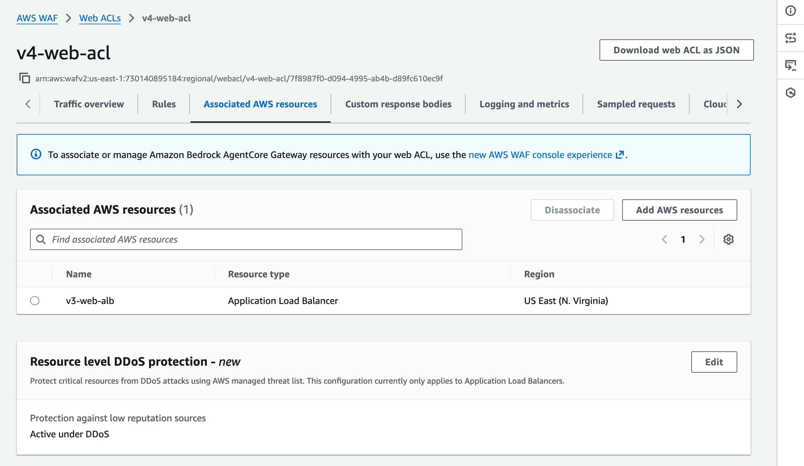

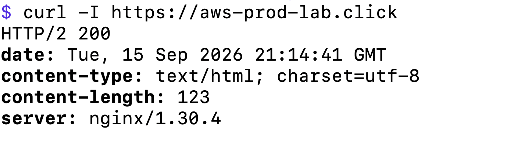

