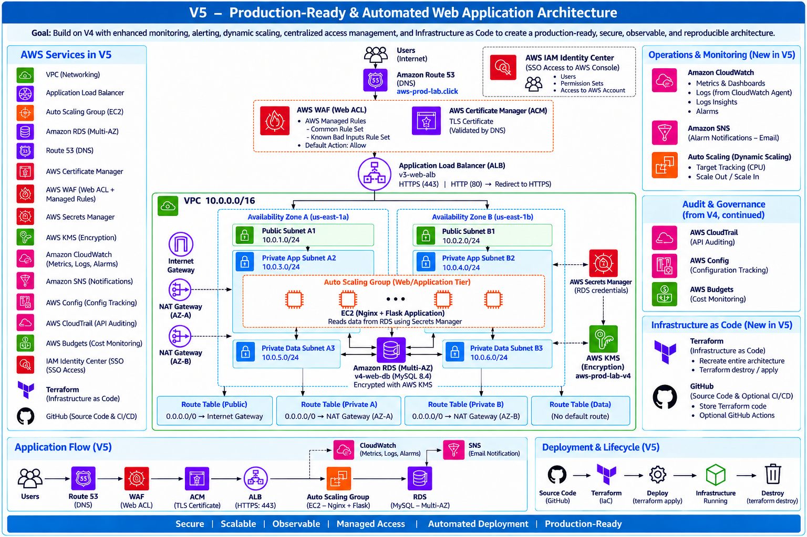


# 1. Review V4

V4 extends the V3 Multi-AZ architecture by adding a database-backed application, security controls, HTTPS, DNS, auditing, and configuration tracking.

Main components completed in V4:

- Route 53 public DNS
- ACM TLS certificate
- HTTPS listener on the Application Load Balancer
- HTTP → HTTPS redirect
- AWS WAF Web ACL associated with the ALB
- 2 Private Data Subnets
- Amazon RDS MySQL Multi-AZ
- RDS DB Subnet Group
- Database Security Group
- AWS Secrets Manager
- Customer-managed AWS KMS key
- Nginx + Flask database-backed application
- Updated AMI and Launch Template
- Auto Scaling Group Instance Refresh
- AWS CloudTrail
- AWS Config
- AWS Budgets

The V4 application path is:

```text
Internet
   ↓
Route 53
   ↓
AWS WAF
   ↓
HTTPS ALB
   ↓
Target Group
   ↓
Auto Scaling Group
   ↓
Nginx + Flask
   ↓
Secrets Manager
   ↓
RDS Multi-AZ
```

The application EC2 instances run in private application subnets.

The RDS database runs in dedicated private data subnets with no default Internet route.

CloudTrail records AWS API activity, AWS Config tracks resource configuration changes, and AWS Budgets provides account-level cost monitoring.

AWS WAF is already associated with the ALB, but additional AWS Managed Rules were not completed in V4 because the WAF rule configuration page could not load reliably.

---

# 2. V5 Goal

V5 builds on the completed V4 architecture and focuses on **production readiness and reproducibility**.

The main goals are:

- Improve application observability with Amazon CloudWatch
- Create operational alarms
- Send alarm notifications through Amazon SNS
- Add dynamic scaling to the existing Auto Scaling Group
- Add centralized AWS account access through IAM Identity Center
- Complete AWS WAF Managed Rules
- Convert the architecture to Infrastructure as Code using Terraform
- Make the infrastructure reproducible and removable

New or enhanced components in V5:

- CloudWatch Metrics
- CloudWatch Dashboard
- CloudWatch Logs
- CloudWatch Logs Insights
- CloudWatch Alarms
- Amazon SNS
- Auto Scaling dynamic scaling
- IAM Identity Center
- AWS WAF Managed Rules
- Terraform Infrastructure as Code

The final infrastructure lifecycle becomes:

```text
Terraform Code
      ↓
terraform apply
      ↓
AWS Infrastructure
      ↓
Application Verification
      ↓
terraform destroy
      ↓
Infrastructure Removed
```

---


# 3. Improve CloudWatch Operations

## 3.1 Current Monitoring and V5 Improvements

CloudWatch monitoring was already introduced in earlier versions.

| Monitoring         | Source                             |
| ------------------ | ---------------------------------- |
| EC2 CPU            | Native EC2 metrics                 |
| EC2 Memory / Disk  | CloudWatch Agent                   |
| Nginx Logs         | CloudWatch Agent → CloudWatch Logs |
| ALB / Target Group | Native ApplicationELB metrics      |
| Auto Scaling       | Native Auto Scaling metrics        |

V5 does not rebuild the monitoring infrastructure. Instead, it improves how the existing monitoring data is used:

1. Create a **CloudWatch Dashboard** to centralize important operational metrics.
2. Use **CloudWatch Logs Insights** to query existing Nginx logs during troubleshooting.

The operational workflow becomes:

Metrics → Dashboard → Detect Problem → Logs Insights → Investigate


## 3.2 Create the CloudWatch Dashboard

Create:

`CloudWatch → Dashboards → v5-operations-dashboard`

The dashboard contains:

| Metric                      | Source         | Statistic |
| --------------------------- | -------------- | --------- |
| `mem_used_percent`          | CWAgent        | Average   |
| `CPUUtilization`            | EC2            | Average   |
| `StatusCheckFailed`         | EC2            | Average   |
| `GroupInServiceInstances`   | Auto Scaling   | Average   |
| `RequestCount`              | ApplicationELB | Sum       |
| `HTTPCode_Target_5XX_Count` | ApplicationELB | Sum       |
| `TargetResponseTime`        | ApplicationELB | Average   |
| `HealthyHostCount`          | ApplicationELB | Minimum   |

These metrics provide one centralized view of **resource usage, EC2 health, ASG capacity, traffic, application errors, response time, and target health**.

### Dynamic EC2 Monitoring

The EC2 instances are managed by `v3-web-asg`. Their Instance IDs are not permanent because ASG can create, terminate, or replace instances.

Therefore, the dashboard should not depend on static Instance IDs.

For native EC2 metrics, use:

`AWS/EC2 → By Auto Scaling Group → AutoScalingGroupName = v3-web-asg`

For CloudWatch Agent metrics such as `mem_used_percent`, filter the available CWAgent metrics by:

`AutoScalingGroupName = v3-web-asg`

This allows the dashboard to follow the EC2 instances dynamically as the Auto Scaling Group changes.

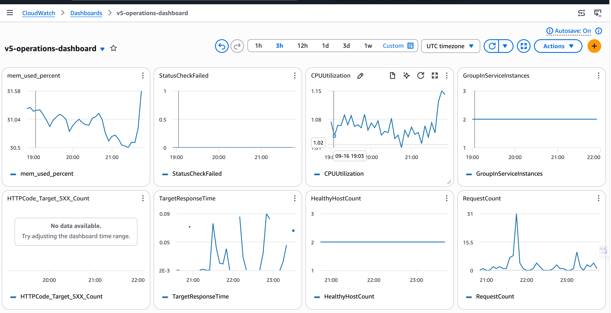


## 3.3 Use CloudWatch Logs Insights

Metrics show **what is happening**, while logs help investigate **why it is happening**.

The existing Nginx logs are already stored in:

`/aws-prod-lab/v2/nginx/access`

`/aws-prod-lab/v2/nginx/error`

CloudWatch Logs Insights, now integrated into the new **Log Analytics** interface, can query these logs directly.

Example:

    SOURCE "/aws-prod-lab/v2/nginx/access" START=-3600s END=0s
    | fields @timestamp, @message
    | sort @timestamp desc
    | limit 10000

This query displays recent Nginx access logs with the newest entries first.

V5 therefore connects the existing CloudWatch metrics and logs into a practical monitoring and troubleshooting workflow.

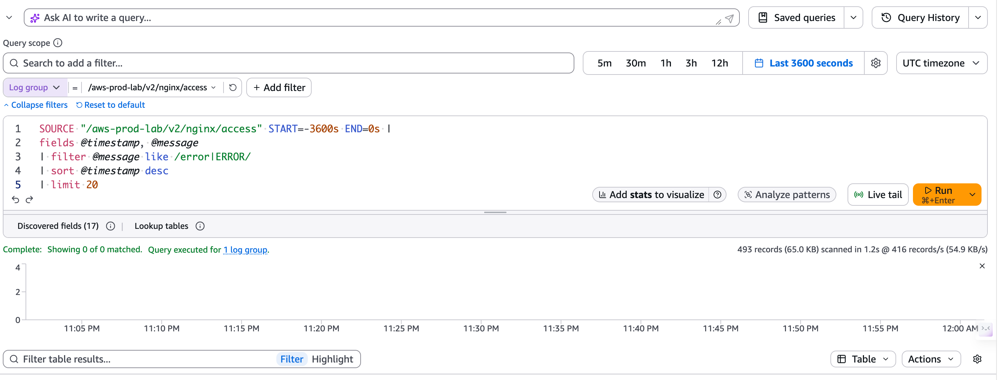


# 4. Configure CloudWatch Alarms and SNS Notifications

## 4.1 Why We Need Alarms and SNS

CloudWatch metrics provide visibility, but operators should not need to continuously watch the dashboard.

CloudWatch Alarms automatically detect abnormal conditions.

Amazon SNS sends notifications when an alarm changes state.

This provides proactive monitoring of the application.

---

## 4.2 Configure SNS and CloudWatch Alarms

Create an SNS topic.

| Configuration         | Setting                    |
| --------------------- | -------------------------- |
| Topic Type            | Standard                   |
| Topic Name            | `v5-operations-alerts`     |
| Subscription Protocol | Email                      |
| Endpoint              | Project notification email |

Confirm the email subscription.

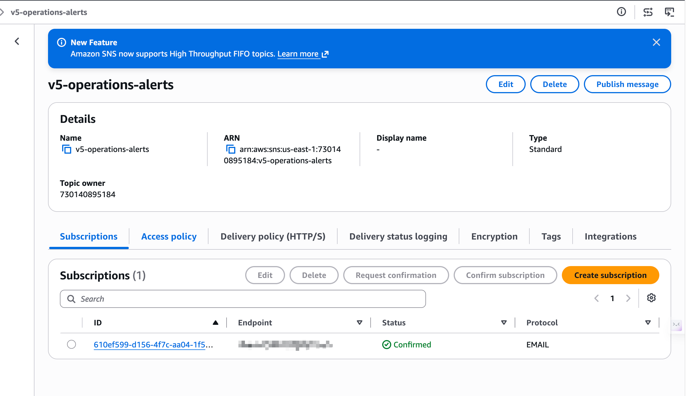

Configured an SNS topic with an email subscription and verified successful message delivery.

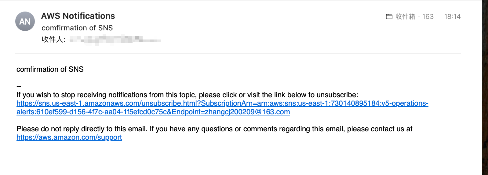

Create the following CloudWatch alarms:

| Alarm            | Metric                 | Condition              | Action |
| ---------------- | ---------------------- | ---------------------- | ------ |
| High CPU         | ASG Average CPU        | CPU > 80%              | SNS    |
| ALB 5XX          | HTTPCode_ELB_5XX_Count | Abnormal 5XX responses | SNS    |
| Unhealthy Target | UnHealthyHostCount     | ≥ 1                    | SNS    |

The exact thresholds can be adjusted during testing.

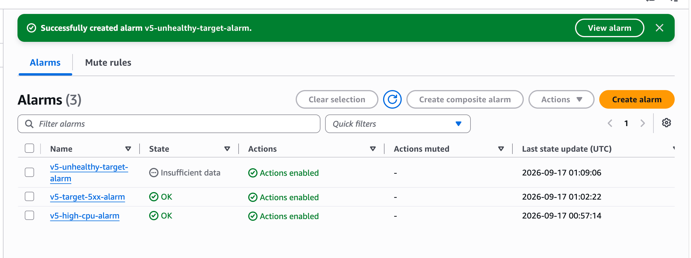

---


# 5. Configure Auto Scaling Dynamic Scaling

## 5.1 Why We Need Dynamic Scaling

Without a dynamic scaling policy, the Auto Scaling Group mainly maintains the configured desired capacity and replaces unhealthy instances based on its health checks. It does not automatically change the number of EC2 instances according to application load. To automatically scale out or scale in based on metrics such as CPU utilization, V5 adds a dynamic scaling policy.

## 5.2 Configure Dynamic Scaling

Use the existing Auto Scaling Group `v3-web-asg` and create a Target Tracking scaling policy.

| Configuration       | Setting                 |
| ------------------- | ----------------------- |
| Auto Scaling Group  | v3-web-asg              |
| Minimum Capacity    | 2                       |
| Desired Capacity    | 2                       |
| Maximum Capacity    | 4                       |
| Scaling Policy Type | Target Tracking         |
| Metric              | Average CPU Utilization |
| Target Value        | 50%                     |
| Instance Warmup     | 300 seconds             |
| Scale In            | Enabled                 |

The Target Tracking policy attempts to keep the average CPU utilization near 50%. When CPU utilization remains above the target, the ASG can launch additional instances up to the maximum capacity. When the load decreases, it can terminate unnecessary instances while maintaining the minimum capacity.

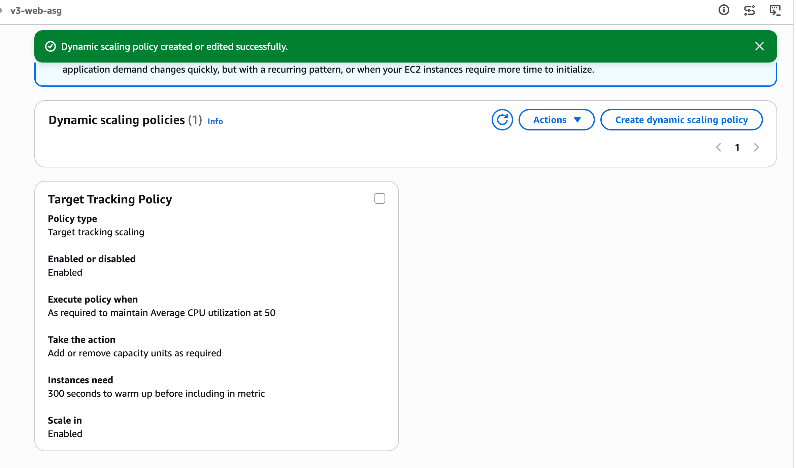

## 5.3 Verify Scale-Out

A controlled CPU load test was used to verify that the Target Tracking policy could automatically increase ASG capacity.

The test was performed on both existing EC2 instances so that the average CPU utilization of the Auto Scaling Group exceeded the 50% target.

| Purpose           | Command                             |
| ----------------- | ----------------------------------- |
| Generate CPU load | yes > /dev/null & yes > /dev/null & |
| Stop CPU load     | pkill yes                           |

After the CPU utilization remained above the target, the Auto Scaling Group increased its capacity from 2 to 3 instances and launched a new EC2 instance.

This verified the complete scale-out path:

CPU load increases → Average ASG CPU exceeds target → Target Tracking policy reacts → ASG increases capacity → New EC2 instance launches

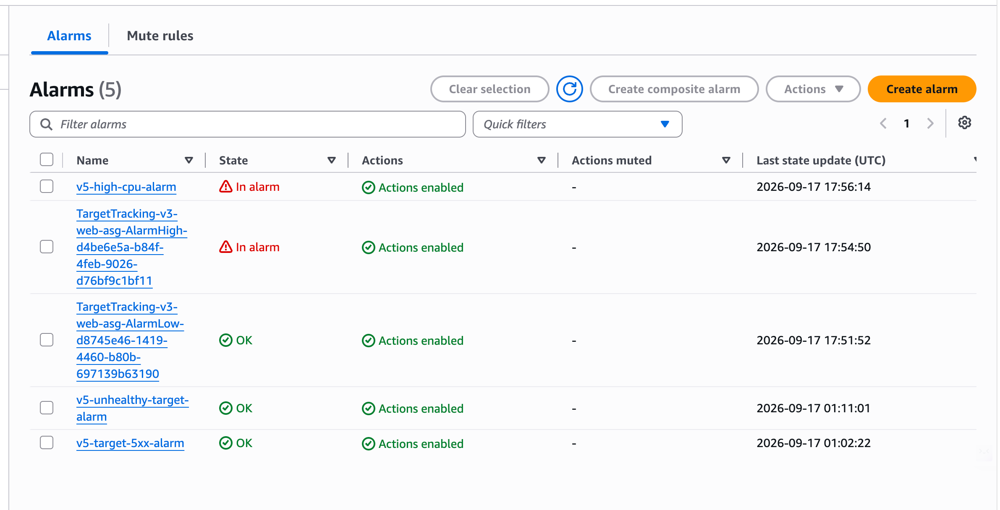

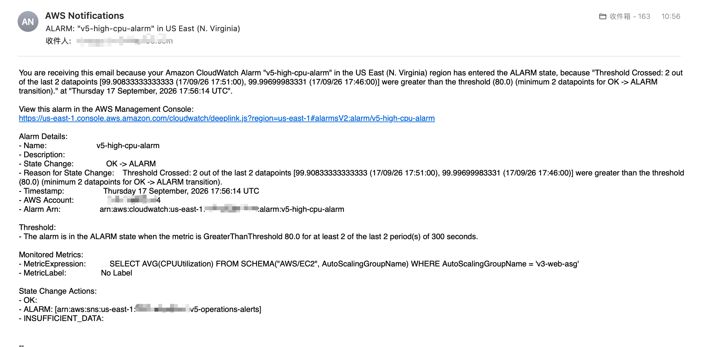


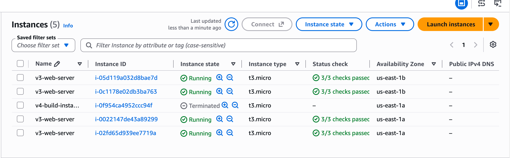


---

# 6. Complete AWS WAF Managed Rules

## 6.1 Why We Need WAF Managed Rules

The existing Web ACL:

```text
v4-web-acl
```

is already associated with:

```text
v3-web-alb
```

However, it currently mainly relies on:

```text
Default Action: Allow
```

AWS Managed Rules add actual Layer 7 request filtering against common malicious request patterns.

---

## 6.2 Configure AWS Managed Rules

The existing Web ACL: **v4-web-acl**

protects the Application Load Balancer: **v3-web-alb**

Three AWS Managed Rule Groups were enabled to provide Layer 7 request filtering.

| Priority | Managed Rule Group                       |
| -------: | ---------------------------------------- |
|        0 | AWS-AWSManagedRulesCommonRuleSet         |
|        1 | AWS-AWSManagedRulesKnownBadInputsRuleSet |
|        2 | AWS-AWSManagedRulesSQLiRuleSet           |

The Web ACL uses the rule actions defined by the AWS Managed Rule Groups.

Final configuration:

| Configuration       | Setting    |
| ------------------- | ---------- |
| Web ACL             | v4-web-acl |
| Scope               | Regional   |
| Protected Resource  | v3-web-alb |
| Default Action      | Allow      |
| Managed Rule Groups | 3 Enabled  |

This completes the WAF managed-rule configuration for the project.

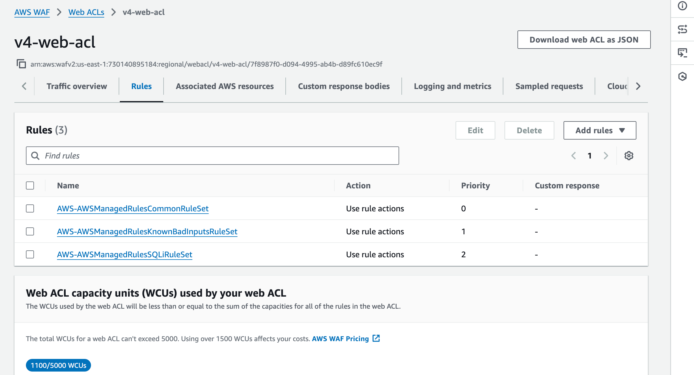


# 7. V5 Final Summary

V5 completes the production-style AWS architecture developed incrementally from V1 through V5.

The final architecture now includes:

- Multi-AZ VPC architecture with public, private application, and private data subnets
- Internet Gateway and NAT Gateways for controlled Internet connectivity
- Application Load Balancer with HTTPS
- Auto Scaling Group across multiple Availability Zones
- Dynamic scaling based on average CPU utilization
- Private EC2 application instances managed through AWS Systems Manager
- Amazon RDS MySQL Multi-AZ in dedicated private data subnets
- AWS Secrets Manager and KMS for credential and encryption management
- Route 53 DNS and ACM TLS certificate
- AWS WAF with AWS Managed Rule Groups
- CloudWatch metrics, dashboards, logs, Logs Insights, and alarms
- Amazon SNS operational notifications
- CloudTrail for AWS API auditing
- AWS Config for resource configuration tracking
- AWS Budgets for cost monitoring
- IAM roles and security groups for access control

The final application architecture is:

```text
Internet
   ↓
Route 53
   ↓
AWS WAF
   ↓
HTTPS Application Load Balancer
   ↓
Target Group
   ↓
Auto Scaling Group
   ↓
Private EC2 Instances
   ↓
Nginx + Flask
   ↓
Secrets Manager
   ↓
RDS MySQL Multi-AZ
```

V5 also adds operational monitoring and automatic scaling:

```text
CloudWatch Metrics / Logs
          ↓
Dashboard / Logs Insights
          ↓
CloudWatch Alarms
          ↓
SNS Notifications

ASG Average CPU
      ↓
Target Tracking
      ↓
Automatic Scale Out / Scale In
```

At this point, the AWS infrastructure implementation from V1 through V5 is complete.

The next phase of the project will be implemented separately using **Terraform**. The completed V5 architecture will be converted to Infrastructure as Code so that the infrastructure can be managed, reproduced, and deployed through Terraform rather than manual AWS Console configuration.


