# V2 - Operations and Cloud Services

# 1. Project Overview

V2 upgrades the V1 Single-AZ Public Web Server with AWS operational and management services.

V1 already provides:

- One VPC
- One Public Subnet
- One Internet Gateway
- One Public Route Table
- One Security Group
- Default Network ACL
- One EC2 instance
- Public IPv4 access
- SSH access
- Nginx Web Server

V2 adds:

- IAM Role for EC2
- SSM Session Manager
- S3
- CloudWatch Metrics
- CloudWatch Logs

The V2 environment is:

```text
                         AWS Services
                              |
              +---------------+---------------+
              |               |               |
              v               v               v
          IAM Role           S3          CloudWatch
              |                               |
              |                         Metrics / Logs
              |                               |
              +---------------+---------------+
                              |
                              v
User                     EC2 Web Server
 |                       Amazon Linux 2023
 |                             |
 |                             |
 +---- SSM Session Manager ----+
                               |
                               v
                         Public Subnet
                          10.0.1.0/24
                               |
                               v
                         Internet Gateway
```

The main V2 configuration is:

| Component        | Configuration       |
| ---------------- | ------------------- |
| Region           | us-east-1           |
| VPC              | aws-prod-lab-vpc    |
| VPC CIDR         | 10.0.0.0/16         |
| Public Subnet    | public-subnet-a1    |
| Subnet CIDR      | 10.0.1.0/24         |
| EC2              | v1-web-server       |
| Operating System | Amazon Linux 2023   |
| IAM              | EC2 IAM Role        |
| EC2 Management   | SSM Session Manager |
| Object Storage   | S3                  |
| Monitoring       | CloudWatch Metrics  |
| Logging          | CloudWatch Logs     |
| Architecture     | Single-AZ           |

---

# 2. Review the Existing V1 Environment

Before starting V2, confirm that the V1 environment is still available.

## 2.1 Verify the V1 Network

Confirm the existing network resources.

| Resource          | Configuration                |
| ----------------- | ---------------------------- |
| VPC               | aws-prod-lab-vpc             |
| VPC CIDR          | 10.0.0.0/16                  |
| Public Subnet     | public-subnet-a1             |
| Subnet CIDR       | 10.0.1.0/24                  |
| Availability Zone | us-east-1a                   |
| Internet Gateway  | aws-prod-lab-igw             |
| Route Table       | public-rt                    |
| Internet Route    | 0.0.0.0/0 → Internet Gateway |
| Security Group    | web-sg                       |
| Network ACL       | Default Network ACL          |

---

## 2.2 Verify the Existing EC2 Instance

Confirm the V1 EC2 instance.

| Configuration  | Setting           |
| -------------- | ----------------- |
| Name           | v1-web-server     |
| AMI            | Amazon Linux 2023 |
| Instance Type  | t3.micro          |
| VPC            | aws-prod-lab-vpc  |
| Subnet         | public-subnet-a1  |
| Private IPv4   | 10.0.1.213        |
| Public IPv4    | Auto-assigned     |
| Security Group | web-sg            |
| Web Server     | Nginx             |

Start the EC2 instance if it is currently stopped.

Confirm that the Instance State becomes Running and the Status Checks pass.

---

## 2.3 Verify the Existing Web Server

Connect to the EC2 instance and check Nginx.

sudo systemctl status nginx

Check the listening ports.

sudo ss -lntp

Test Nginx locally.

curl http://localhost

Open the current EC2 Public IPv4 address in a browser.

Confirm that the Nginx page is accessible.

The V1 environment is now ready for the V2 upgrade.

---

# 3. Create the IAM Role for EC2

V2 gives the EC2 instance an IAM Role so that it can access the required AWS services.

## 3.1 Create the IAM Role

Open IAM and create a new Role.

| Configuration       | Setting     |
| ------------------- | ----------- |
| Trusted Entity Type | AWS Service |
| Service             | EC2         |
| Role Name           | v2-ec2-role |

Attach the required AWS managed policies.

| Policy                       | Purpose                 | Status        |
| ---------------------------- | ----------------------- | ------------- |
| AmazonSSMManagedInstanceCore | SSM management          | Added         |
| CloudWatchAgentServerPolicy  | CloudWatch Agent        | Added         |
| S3 Access Policy             | Access the V2 S3 bucket | Not added yet |

The S3 Access Policy is not configured at this stage because the V2 S3 bucket has not been created yet.

After the S3 bucket is created, a separate least-privilege policy will be created for that specific bucket and attached to v2-ec2-role.

| **Key** | **Value**    |
| ------- | ------------ |
| Project | aws-prod-lab |
| Version | V2           |

```text
                     Who can use this Role?
                              |
                              v
                         EC2 Service
                              |
                              | Assume
                              v
                       v2-ec2-role
                              |
              What can this Role do now?
                              |
                     +--------+--------+
                     |                 |
                     v                 v
                    SSM           CloudWatch


              What will be added later?
                              |
                              v
                             S3
                 after the bucket is created
```

---


## 3.2 Attach the IAM Role to EC2

Open:

**EC2 Console → Instances → `v1-web-server` → Actions → Security → Modify IAM role**

| Configuration | Setting       |
| ------------- | ------------- |
| EC2           | v1-web-server |
| IAM Role      | v2-ec2-role   |

Attach v2-ec2-role to the existing EC2 instance.

---

# 4. Configure SSM Session Manager

V2 uses AWS Systems Manager Session Manager to manage the EC2 instance.

## 4.1 Verify the SSM Agent

Amazon Linux 2023 normally includes the SSM Agent.

Check the service.

sudo systemctl status amazon-ssm-agent

If necessary, start the service.

sudo systemctl start amazon-ssm-agent

Enable the service at boot.

sudo systemctl enable amazon-ssm-agent

Confirm that the SSM Agent is Running.

---

## 4.2 Verify the EC2 IAM Permission

Confirm that the EC2 IAM Role contains:

AmazonSSMManagedInstanceCore

Confirm that the Role is attached to:

v1-web-server

---

## 4.3 Verify SSM Connectivity

Open AWS Systems Manager.

Locate the EC2 instance under managed nodes.  **Node Tools - fleet manager**

Confirm that v1-web-server appears as a managed instance.

The EC2 instance must also have network connectivity to the required Systems Manager service endpoints.

---

## 4.4 Connect with Session Manager

**EC2 Console → Instances →** **`v1-web-server`** **→ Connect → Session Manager → Connect**

Confirm that a shell session opens successfully.

Run:

whoami

hostname

pwd

Confirm that the EC2 instance can be managed without using the SSH private key.

---

# 5. Update SSH Access

After Session Manager works successfully, SSH is no longer required as the primary management method.

Open the Security Group:

web-sg

The HTTP rule remains unchanged.

| Type | Protocol | Port | Source    |
| ---- | -------- | ---- | --------- |
| HTTP | TCP      | 80   | 0.0.0.0/0 |

Remove the SSH inbound rule after confirming that Session Manager works correctly.

The final V2 inbound configuration becomes:

| Type | Protocol | Port | Source    |
| ---- | -------- | ---- | --------- |
| HTTP | TCP      | 80   | 0.0.0.0/0 |

Confirm that TCP 22 is no longer exposed through the Security Group.

The sshd service may still exist inside the operating system, but Internet access to TCP 22 is blocked by the Security Group.

---

# 6. Create the S3 Bucket

Create an S3 bucket for the V2 environment.

## 6.1 Create the Bucket

| Configuration       | Setting                               |
| ------------------- | ------------------------------------- |
| AWS Region          | us-east-1                             |
| Bucket Type         | General purpose                       |
| Bucket Namespace    | Global namespace                      |
| Bucket Name         | aws-prod-lab-v2-730140895184          |
| Object Ownership    | Bucket owner enforced (ACLs disabled) |
| Block Public Access | Enabled                               |
| Bucket Versioning   | Enabled                               |
| Project Tag         | Project = aws-prod-lab                |
| Version Tag         | Version = V2                          |
| Default Encryption  | SSE-S3 (Amazon S3 managed keys)       |

The S3 bucket is not publicly accessible.

---

## 6.2 Upload a Test Object

Upload a test file to the S3 bucket.

For example:

test.txt

Confirm that the object appears in the bucket.

---

# 7. Configure EC2 Access to S3

The EC2 instance accesses S3 through its IAM Role.

## 7.1 Configure S3 Permission

Configure the EC2 IAM Role with permission to access the V2 S3 bucket.

The permission should cover the operations required by this project.

Typical operations include:

- List the bucket
- Read objects
- Upload objects

Confirm that the S3 permission is attached to:

v2-ec2-role


**AWS Console → IAM → Roles →** **`v2-ec2-role`** **→ Add permissions → Create inline policy**

Policy name: v2-s3-bucket-access

```json
{
  "Version": "2012-10-17",
  "Statement": [
    {
      "Effect": "Allow",
      "Action": [
        "s3:ListBucket"
      ],
      "Resource": [
        "arn:aws:s3:::aws-prod-lab-v2-730140895184"
      ]
    },
    {
      "Effect": "Allow",
      "Action": [
        "s3:GetObject",
        "s3:PutObject"
      ],
      "Resource": [
        "arn:aws:s3:::aws-prod-lab-v2-730140895184/*"
      ]
    }
  ]
}
```


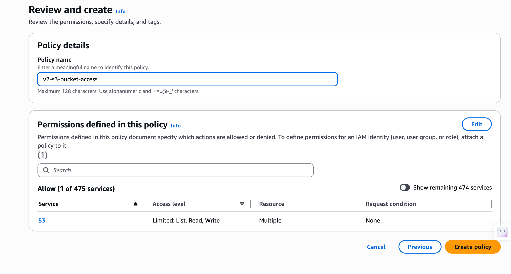

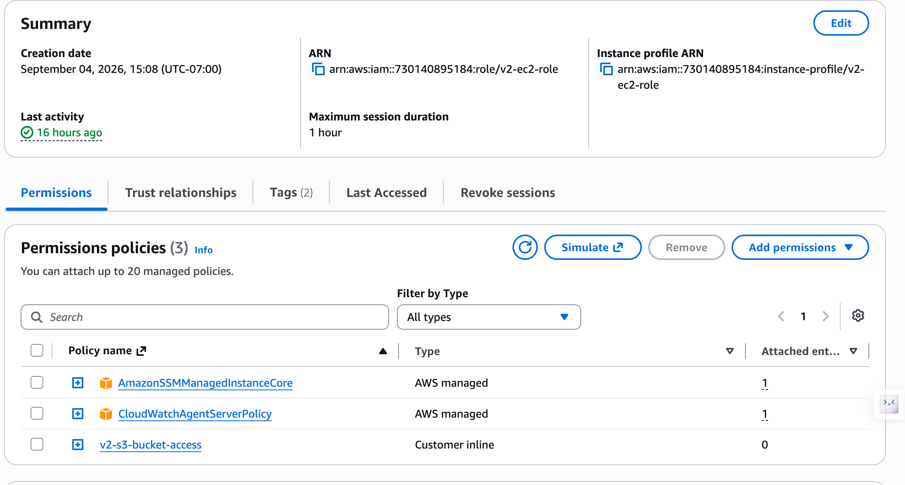


---

## 7.2 Verify AWS CLI

Connect to the EC2 instance through Session Manager.

Check the AWS CLI.

Confirm that the AWS CLI is available.

```shell
aws --version
aws sts get-caller-identity
```

This command shows the AWS identity currently used by the EC2 instance when calling AWS APIs.

The result shows that the EC2 instance is using an STS assumed-role session for: v2-ec2-role


This confirms that the EC2 instance is successfully using the IAM Role through its Instance Profile and receiving temporary AWS credentials.

The result is shown below:


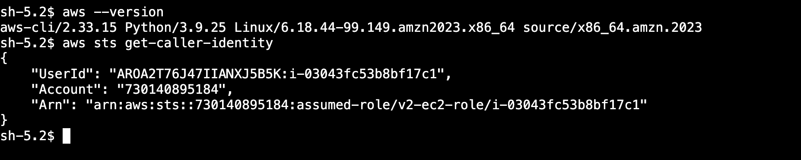

---

## 7.3 Test S3 Access from EC2

Connect to `v1-web-server` through Session Manager.

The following tests verify that the EC2 instance can access the V2 S3 bucket using the permissions provided by `v2-ec2-role`.

### List Objects in the S3 Bucket

Run:

```bash
aws s3 ls s3://aws-prod-lab-v2-730140895184
```

Expected result:

The command should successfully list the objects currently stored in the bucket.

This confirms that the EC2 instance has `s3:ListBucket` permission.

### Upload an Object to S3

Create a test file on the EC2 instance:

```bash
echo "test s3 file" > /tmp/ec2-test.txt
```

Check the file:

```bash
cat /tmp/ec2-test.txt
```

Expected result:

```text
test s3 file
```

Upload the file to the S3 bucket:

```bash
aws s3 cp /tmp/ec2-test.txt s3://aws-prod-lab-v2-730140895184/
```

Expected result:

```text
upload: ../../tmp/ec2-test.txt to s3://aws-prod-lab-v2-730140895184/ec2-test.txt
```

Confirm that the uploaded object appears in the bucket:

```bash
aws s3 ls s3://aws-prod-lab-v2-730140895184
```

The output should include:

```text
ec2-test.txt
```

This confirms that the EC2 instance has `s3:PutObject` permission.

### Download an Object from S3

Download an existing test object from the bucket:

```bash
aws s3 cp s3://aws-prod-lab-v2-730140895184/ec2-test.txt /tmp/test.txt
```

Expected result:

```text
download: s3://aws-prod-lab-v2-730140895184/test.txt to ../../tmp/test.txt
```

Check the downloaded file:

```bash
cat /tmp/test.txt
```

The content of the test file should be displayed.

This confirms that the EC2 instance has `s3:GetObject` permission.

### Verification Result

The successful List, Download, and Upload tests verify the following access path:

```text
EC2
 |
 v
Instance Profile
 |
 v
v2-ec2-role
 |
 v
v2-s3-bucket-access
 |
 v
aws-prod-lab-v2-730140895184
```

The EC2 instance accesses S3 using temporary credentials provided through its IAM Role.

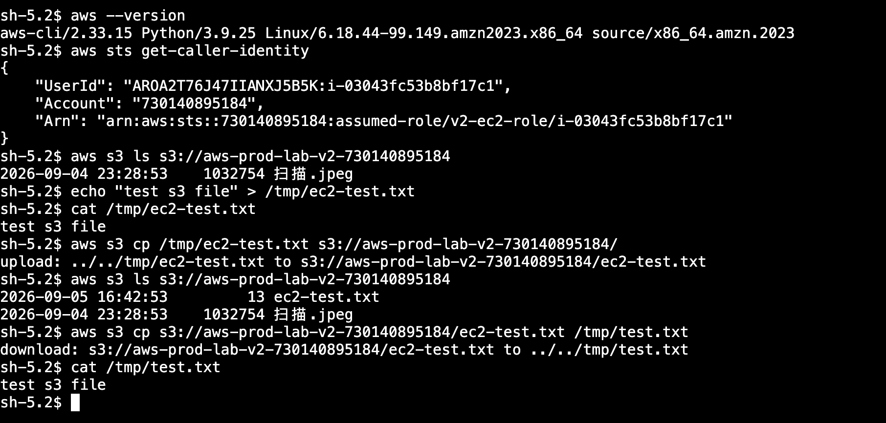

---

# 8. Verify CloudWatch EC2 Metrics

EC2 automatically publishes basic infrastructure metrics to CloudWatch.

Open CloudWatch.

Open Metrics.

Locate the metrics for:

v1-web-server

Confirm that EC2 metrics are available.

Typical metrics include:

| Metric            | Description               |
| ----------------- | ------------------------- |
| CPUUtilization    | EC2 CPU utilization       |
| NetworkIn         | Incoming network traffic  |
| NetworkOut        | Outgoing network traffic  |
| DiskReadBytes     | EBS read activity         |
| DiskWriteBytes    | EBS write activity        |
| StatusCheckFailed | EC2 status check failures |

Open CPUUtilization and confirm that metric data is displayed.

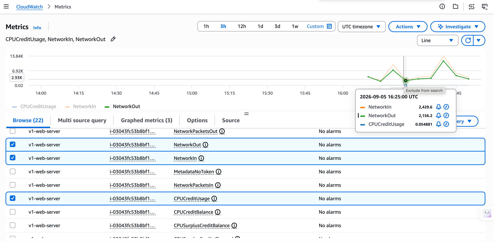

---

# 9. Install and Prepare the CloudWatch Agent

The CloudWatch Agent is used to collect operating system-level metrics and logs that are not included in the default EC2 CloudWatch metrics.

For example, the CloudWatch Agent can collect:

- Memory utilization
- Filesystem utilization
- Additional disk metrics
- Operating system logs
- Application logs

The CloudWatch Agent should not be assumed to be installed by default. Check whether it is already installed before installing it.

## 9.1 Check the CloudWatch Agent

Connect to `v1-web-server` through Session Manager.

Check whether the CloudWatch Agent package is installed:

```bash
rpm -q amazon-cloudwatch-agent
```

If the Agent is installed, the command should return the installed package version.

The installation directory can also be checked:

```bash
ls /opt/aws/amazon-cloudwatch-agent/
```

If the CloudWatch Agent is already installed, no installation is required.

## 9.2 Install the CloudWatch Agent

If the Agent is not installed, install it from the Amazon Linux repository:

```bash
sudo dnf install amazon-cloudwatch-agent -y
```

Verify the installation:

```bash
rpm -q amazon-cloudwatch-agent
```

Check the installation directory:

```bash
ls /opt/aws/amazon-cloudwatch-agent/
```

At this stage, the CloudWatch Agent software is installed on the EC2 instance, but it still needs to be configured before it can collect and publish the required metrics and logs.

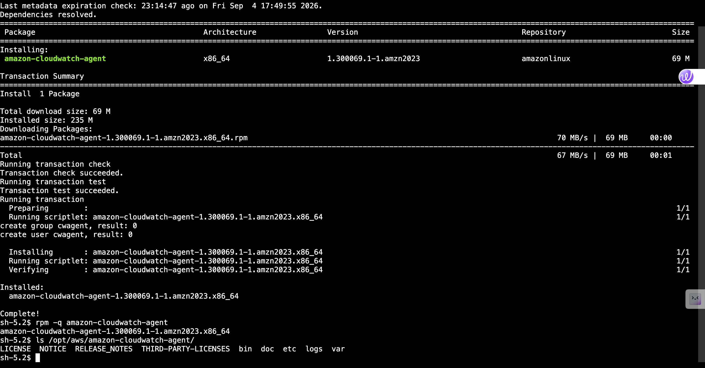

## 9.3 Verify IAM Permission

The CloudWatch Agent needs AWS permissions to publish metrics and logs to CloudWatch.

The EC2 instance uses the IAM Role:

`v2-ec2-role`

The following AWS managed policy is attached to this Role:

`CloudWatchAgentServerPolicy`

This policy provides the permissions required by the CloudWatch Agent to send monitoring data to AWS services such as CloudWatch and CloudWatch Logs.

The permission path is:

```text
v1-web-server
      |
      v
Instance Profile
      |
      v
v2-ec2-role
      |
      v
CloudWatchAgentServerPolicy
      |
      v
CloudWatch / CloudWatch Logs
```

No Access Key or Secret Access Key needs to be manually configured on the EC2 instance.

After the Agent installation and IAM permissions are verified, the next step is to configure which operating system metrics and logs the CloudWatch Agent should collect.

---


# 10. Configure CloudWatch Agent Metrics

## 10.1 Purpose and Architecture

EC2 automatically sends basic infrastructure-level metrics to CloudWatch, such as CPU utilization, network traffic, and status checks.

However, EC2 does not send operating system-level metrics such as memory utilization and filesystem usage by default.

The CloudWatch Agent has already been installed on `v1-web-server`, and the EC2 IAM Role `v2-ec2-role` already contains `CloudWatchAgentServerPolicy`.

In this chapter, the CloudWatch Agent will be configured to collect two additional operating system metrics:

- Memory utilization
- Disk/filesystem utilization

The monitoring path is:

```text
Amazon Linux 2023
       |
       | OS-level metrics
       v
CloudWatch Agent
       |
       | IAM permission
       v
v2-ec2-role
       |
       | CloudWatchAgentServerPolicy
       v
Amazon CloudWatch
       |
       +-- Memory Usage
       |
       +-- Disk Usage
```

The implementation consists of three steps:

1. Create the CloudWatch Agent configuration.
2. Start the CloudWatch Agent using the configuration.
3. Verify that the new metrics are successfully published to CloudWatch.

---

## 10.2 Configure and Start the CloudWatch Agent

Connect to `v1-web-server` through Session Manager.

### Step 1 - Create the Agent Configuration

Use the CloudWatch Agent configuration wizard to create the configuration file.

| Purpose                                         | Command                                                      |
| ----------------------------------------------- | ------------------------------------------------------------ |
| Start the CloudWatch Agent configuration wizard | sudo /opt/aws/amazon-cloudwatch-agent/bin/amazon-cloudwatch-agent-config-wizard |

For V2, configure the Agent with the following settings:

- Collect host metrics
- Collect metrics every 60 seconds
- Use the Basic metrics configuration
- Collect memory utilization
- Collect disk/filesystem utilization
- Do not enable per-core CPU metrics
- Do not enable StatsD or collectd
- Run the Agent as the `cwagent` user
- Collect the Nginx access log from `/var/log/nginx/access.log`
- Send the log to `/aws-prod-lab/v2/nginx/access`
- Use the EC2 instance ID as the log stream name
- Retain CloudWatch Logs for 7 days

The generated configuration was saved locally at:

`/opt/aws/amazon-cloudwatch-agent/bin/config.json`

#### Troubleshooting - Nginx Log Permission

After starting the CloudWatch Agent, the Agent could not read the Nginx access log:

`Failed to tail file /var/log/nginx/access.log: permission denied`

The Agent runs as the dedicated `cwagent` Linux user, which did not have permission to read the Nginx access log.

The issue was confirmed by testing file access directly as `cwagent`.

| Purpose                                             | Command                                                      |
| --------------------------------------------------- | ------------------------------------------------------------ |
| Test log access as the CloudWatch Agent user        | sudo -u cwagent head -n 1 /var/log/nginx/access.log          |
| Grant `cwagent` read access to the Nginx access log | sudo setfacl -m u:cwagent:r /var/log/nginx/access.log        |
| Restart the CloudWatch Agent                        | sudo systemctl restart amazon-cloudwatch-agent               |
| Check the Agent log                                 | sudo tail -n 20 /opt/aws/amazon-cloudwatch-agent/logs/amazon-cloudwatch-agent.log |

After the permission change, the Agent successfully started collecting `/var/log/nginx/access.log` and forwarding it to CloudWatch Logs.


### Step 2 - Review the Configuration

After the configuration has been created, review the generated configuration file before starting the Agent.

Confirm that the configuration contains the required memory and disk metrics.

| **Purpose**                                   | **Command**                                                 |
| --------------------------------------------- | ----------------------------------------------------------- |
| Verify the generated Agent configuration file | sudo ls -l /opt/aws/amazon-cloudwatch-agent/bin/config.json |
| Display the generated Agent configuration     | sudo cat /opt/aws/amazon-cloudwatch-agent/bin/config.json   |

### Step 3 - Start the CloudWatch Agent

Load the local configuration and start the CloudWatch Agent.

| Purpose                                          | Command                                                      |
| ------------------------------------------------ | ------------------------------------------------------------ |
| Load the local configuration and start the Agent | sudo /opt/aws/amazon-cloudwatch-agent/bin/amazon-cloudwatch-agent-ctl -a fetch-config -m ec2 -s -c file:/opt/aws/amazon-cloudwatch-agent/bin/config.json |

The options used in this command are:

| **Option**      | **Meaning**                                     |
| --------------- | ----------------------------------------------- |
| -a fetch-config | Load an Agent configuration                     |
| -m ec2          | Run the Agent in EC2 mode                       |
| -s              | Start the Agent after loading the configuration |
| -c file:…       | Load the configuration from a local file        |

---

## 10.3 Verify the CloudWatch Agent

Verify the Agent service, CloudWatch metrics, and CloudWatch Logs.

### Step 1 - Verify the Agent

| Purpose                 | Command                                                      |
| ----------------------- | ------------------------------------------------------------ |
| Check the Agent service | sudo systemctl status amazon-cloudwatch-agent                |
| Check the Agent status  | sudo /opt/aws/amazon-cloudwatch-agent/bin/amazon-cloudwatch-agent-ctl -a status |
| Check recent Agent logs | sudo tail -n 20 /opt/aws/amazon-cloudwatch-agent/logs/amazon-cloudwatch-agent.log |

Confirm that the Agent reports:

- status: running
- configstatus: configured
- active (running)

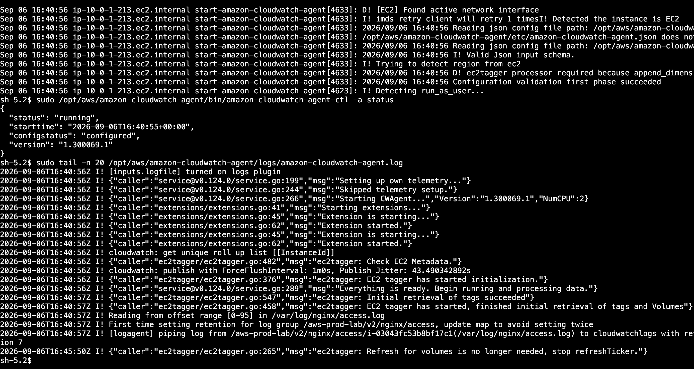

### Step 2 - Verify Metrics

Open:

CloudWatch → Metrics → All metrics → CWAgent

Verify that the following metrics are available:

- mem_used_percent
- disk_used_percent

These metrics are collected every 60 seconds.

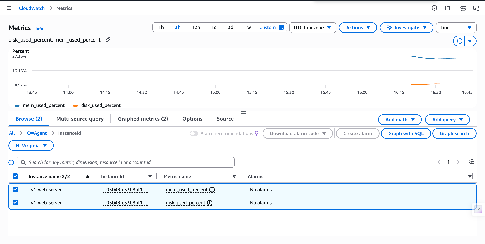

### Step 3 - Verify CloudWatch Logs

Generate an HTTP request by opening the EC2 public IP in a browser.

Verify the local Nginx access log:

| Purpose                        | Command                                   |
| ------------------------------ | ----------------------------------------- |
| Check recent Nginx access logs | sudo tail -n 10 /var/log/nginx/access.log |

Then open:

CloudWatch → Log groups → /aws-prod-lab/v2/nginx/access

Verify:

- Log Stream: i-03043fc53b8bf17c1
- Nginx access log events are available
- Log retention: 7 days

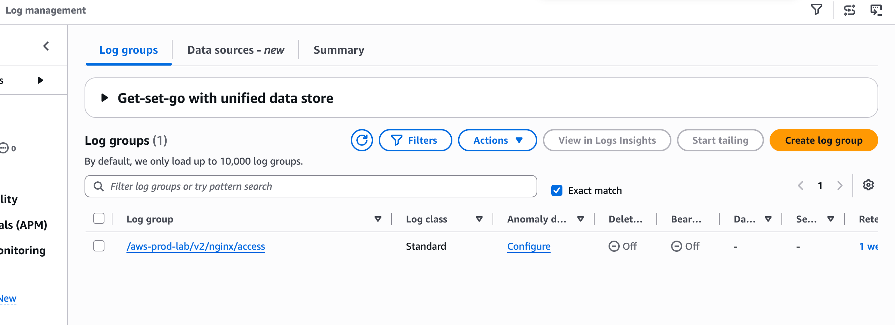

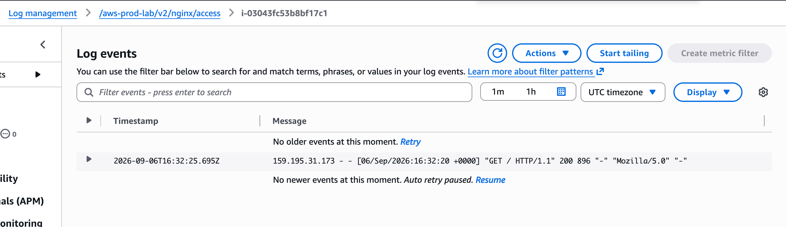

### Verification Result

The CloudWatch Agent configuration is successful when:

- The Agent is running and configured.
- mem_used_percent and disk_used_percent are available in CWAgent.
- Nginx access logs are available in CloudWatch Logs.


## 10.4 Issues Encountered

Two permission-related issues were encountered while configuring the CloudWatch Agent.

### Issue 1 - Nginx Log Permission Denied

The CloudWatch Agent runs as the **cwagent** Linux user. Initially, this user did not have permission to read the Nginx access log:

/var/log/nginx/access.log

The Agent therefore reported a permission denied error.

The issue was resolved by granting cwagent read permission to the log file and restarting the Agent.

| Purpose                       | Command                                                      |
| ----------------------------- | ------------------------------------------------------------ |
| Grant cwagent read permission | sudo setfacl -m u:cwagent:r /var/log/nginx/access.log        |
| Verify access                 | sudo -u cwagent head -n 1 /var/log/nginx/access.log          |
| Restart the Agent             | sudo systemctl restart amazon-cloudwatch-agent               |
| Verify the Agent log          | sudo tail -n 20 /opt/aws/amazon-cloudwatch-agent/logs/amazon-cloudwatch-agent.log |

After the change, the Nginx access log was successfully delivered to CloudWatch Logs.

### Issue 2 - SSM Parameter Store Access Denied

The configuration wizard attempted to store the CloudWatch Agent configuration in SSM Parameter Store:

/aws-prod-lab/v2/cloudwatch-agent/config

The operation failed with **AccessDeniedException** because v2-ec2-role did not have the **ssm:PutParameter** permission.

The local configuration file had already been generated successfully, so Parameter Store was not required for V2. The local configuration was used to start the Agent instead.

This issue was therefore documented but not resolved by adding additional IAM permissions.


---


# 11. Add the Nginx Error Log to CloudWatch Logs

The CloudWatch Agent is already running and collecting the **Nginx access log**.

This chapter adds one more log source to the existing configuration: the Nginx error log.

## 11.1 Locate the Application Log

When configuring log collection for an application, first check the application's configuration to determine where its logs are written instead of assuming the log path.

For Nginx, inspect the active configuration and search for the error_log directive.

| Purpose                           | Command                               |
| --------------------------------- | ------------------------------------- |
| Find the Nginx error log location | sudo nginx -T 2>&1 \|  grep error_log |

The configured error log path is: /var/log/nginx/error.log

## 11.2 Verify Read Permission

The CloudWatch Agent runs as the cwagent Linux user, so this user must be able to read the log file.

| Purpose                               | Command                                       |
| ------------------------------------- | --------------------------------------------- |
| Test whether cwagent can read the log | sudo -u cwagent head /var/log/nginx/error.log |

If Permission denied appears, grant read permission:

| Purpose               | Command                                              |
| --------------------- | ---------------------------------------------------- |
| Grant read permission | sudo setfacl -m u:cwagent:r /var/log/nginx/error.log |

## 11.3 Update the Existing Agent Configuration

The existing CloudWatch Agent configuration is:

/opt/aws/amazon-cloudwatch-agent/bin/config.json

Open the configuration:

| Purpose                      | Command                                                  |
| ---------------------------- | -------------------------------------------------------- |
| Edit the Agent configuration | sudo vi /opt/aws/amazon-cloudwatch-agent/bin/config.json |

Add the Nginx error log to collect_list:

```json
{
    "file_path": "/var/log/nginx/error.log",
    "log_group_class": "STANDARD",
    "log_group_name": "/aws-prod-lab/v2/nginx/error",
    "log_stream_name": "{instance_id}",
    "retention_in_days": 7
}
```

This adds another log source without changing the existing metrics or Nginx access log configuration.

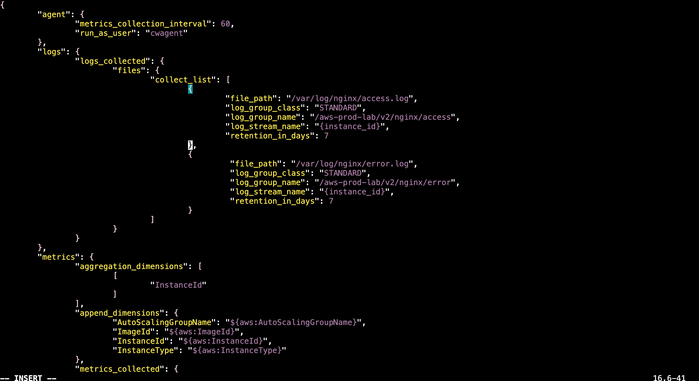

## 11.4 Load and Verify the Updated Configuration

Load the modified configuration:

| Purpose                        | Command                                                      |
| ------------------------------ | ------------------------------------------------------------ |
| Load the updated configuration | sudo /opt/aws/amazon-cloudwatch-agent/bin/amazon-cloudwatch-agent-ctl -a fetch-config -m ec2 -s -c file:/opt/aws/amazon-cloudwatch-agent/bin/config.json |
| Verify Agent status            | sudo /opt/aws/amazon-cloudwatch-agent/bin/amazon-cloudwatch-agent-ctl -a status |
| Check recent Agent logs        | sudo tail -n 20 /opt/aws/amazon-cloudwatch-agent/logs/amazon-cloudwatch-agent.log |

Finally, open:

CloudWatch → Logs → Log Management

Verify that the following Log Group exists:

/aws-prod-lab/v2/nginx/error

The complete log flow is:

```text
Nginx
  ↓
/var/log/nginx/error.log
  ↓
CloudWatch Agent
  ↓
CloudWatch Logs
```

The configuration is complete when the Agent remains running and the Nginx error log is available in CloudWatch Logs.

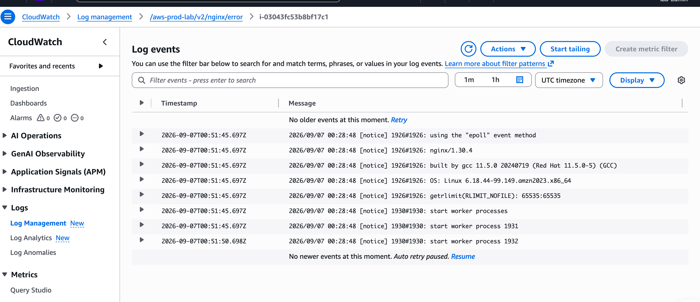


## 11.5 Handle Log Permission After Log Rotation

### Problem

The CloudWatch Agent runs as the cwagent Linux user and requires read permission for the Nginx log files.

Initially, read permission was manually granted to:

/var/log/nginx/access.log

and:

/var/log/nginx/error.log

However, this only changes the permissions of the current files.

Nginx logs are periodically rotated. After log rotation, a new access.log or error.log can be created with the same filename but without the ACL previously added to the old file.

As a result, the CloudWatch Agent may report:

Permission denied

even though the same log path worked before.

### Solution

The permanent solution is to make the required permission apply automatically to newly created Nginx log files instead of manually modifying each individual file.

Configure a default ACL on the Nginx log directory so that new files created inside the directory automatically grant cwagent read permission.

| Purpose                                          | Command                                                      |
| ------------------------------------------------ | ------------------------------------------------------------ |
| Grant cwagent read access to current Nginx logs  | sudo setfacl -m u:cwagent:r /var/log/nginx/access.log /var/log/nginx/error.log |
| Set default read permission for future log files | sudo setfacl -m d:u:cwagent:r /var/log/nginx                 |
| Verify the directory ACL                         | sudo getfacl /var/log/nginx                                  |

This creates two levels of permission:

```text
Current log files
    → cwagent has read permission

Future log files created after rotation
    → inherit cwagent read permission from the directory default ACL
```

This prevents CloudWatch Agent log collection from failing again simply because Nginx log files were rotated.

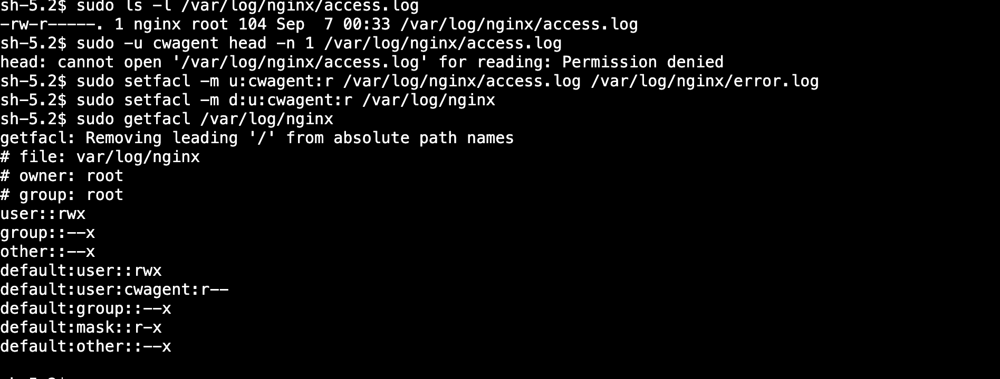

---

# 12. Verify IAM Role Credentials

The EC2 instance has the IAM Role **v2-ec2-role** attached.

This step verifies that the EC2 instance is actually using temporary AWS credentials provided through the IAM Role instead of manually configured Access Keys.

## 12.1 Connect to the EC2 Instance

Open:

**EC2 → Instances → v1-web-server → Connect → Session Manager → Connect**

No SSH connection or SSH key is required.

## 12.2 Verify the AWS Identity

Run the following command from the EC2 instance:

| Purpose                                                   | Command                     |
| --------------------------------------------------------- | --------------------------- |
| Check the AWS identity currently used by the EC2 instance | aws sts get-caller-identity |

The output should contain an assumed-role ARN similar to:

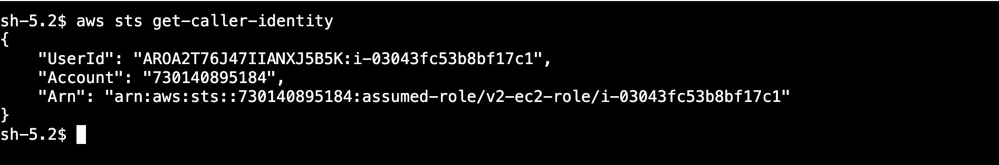

The important part is:

assumed-role/v2-ec2-role

This confirms that:

- The EC2 instance is using v2-ec2-role.
- AWS STS has provided temporary credentials for the Role.
- No manually configured Access Key is required.

The credential flow is:

```text
EC2
 ↓
Instance Profile
 ↓
v2-ec2-role
 ↓
STS Temporary Credentials
 ↓
AWS API
```

If aws sts get-caller-identity returns v2-ec2-role as an assumed role, the IAM Role configuration is working correctly.


---

# 13. Verify S3 Access

The EC2 instance uses v2-ec2-role to access the V2 S3 bucket.

Use the AWS CLI from the EC2 instance to verify that the Role can access the bucket and perform the required S3 operations.

## 13.1 Test S3 Access

| Purpose                        | Command                                                      |
| ------------------------------ | ------------------------------------------------------------ |
| List objects in the S3 bucket  | aws s3 ls s3://aws-prod-lab-v2-730140895184                  |
| Create a local test file       | echo "S3 access test from EC2" > /tmp/s3-test.txt            |
| Upload the test file to S3     | aws s3 cp /tmp/s3-test.txt s3://aws-prod-lab-v2-730140895184/s3-test.txt |
| Verify the object exists in S3 | aws s3 ls s3://aws-prod-lab-v2-730140895184                  |
| Download the object from S3    | aws s3 cp s3://aws-prod-lab-v2-730140895184/s3-test.txt /tmp/s3-download.txt |
| Verify the downloaded content  | cat /tmp/s3-download.txt                                     |

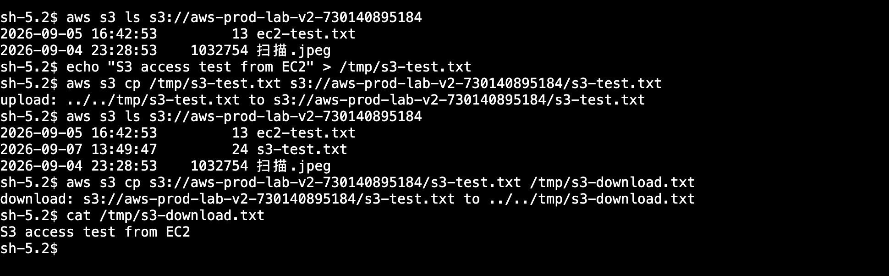

## 13.2 Verification Result

The test verifies three permissions configured for v2-ec2-role:

| Test                 | IAM Permission |
| -------------------- | -------------- |
| List bucket contents | s3:ListBucket  |
| Upload an object     | s3:PutObject   |
| Download an object   | s3:GetObject   |


---

# 14. Verify CloudWatch Metrics

Open CloudWatch Metrics.

Confirm the standard EC2 metrics.

| Check             | Result    |
| ----------------- | --------- |
| CPUUtilization    | Available |
| NetworkIn         | Available |
| NetworkOut        | Available |
| StatusCheckFailed | Available |

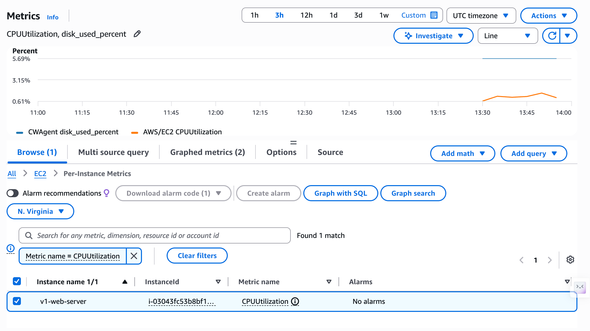

Confirm the CloudWatch Agent metrics.

| Check        | Result    |
| ------------ | --------- |
| Memory Usage | Available |
| Disk Usage   | Available |

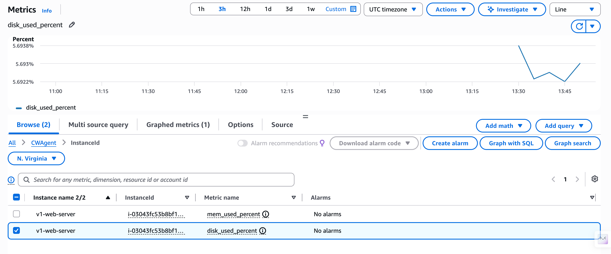

---

# 16. Verify CloudWatch Logs

Open CloudWatch Logs.

Confirm the configured Log Groups.

| Check            | Result    |
| ---------------- | --------- |
| Nginx Access Log | Available |
| Nginx Error Log  | Available |

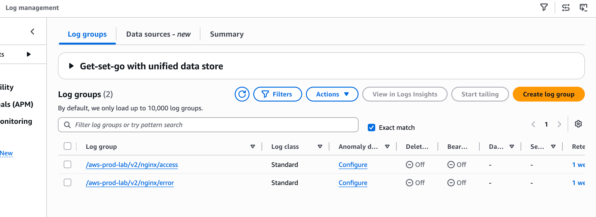

Generate another HTTP request from the browser.

Confirm that a new Nginx access log entry appears in CloudWatch Logs.

---


# 17. Final V2 Architecture

```text
                               AWS
                                |
        +-----------------------+-----------------------+
        |                       |                       |
        v                       v                       v
   IAM Role                    S3                 CloudWatch
 v2-ec2-role               V2 Bucket          Metrics / Logs
        |                                               ^
        |                                               |
        +-------------------+---------------------------+
                            |
                            v
                    EC2 v1-web-server
                    Amazon Linux 2023
                    Private IP 10.0.1.213
                            |
             +--------------+--------------+
             |                             |
             v                             v
         SSM Agent                       Nginx
             |                           TCP 80
             |                             ^
             v                             |
     SSM Session Manager                  |
                                           |
                                      Internet
                                           |
                                           v
                                  Internet Gateway
                                           |
                                           v
                                  aws-prod-lab-vpc
                                     10.0.0.0/16
                                           |
                                           v
                                  public-subnet-a1
                                     10.0.1.0/24
                                           |
                                           +-- public-rt
                                           |
                                           +-- Default NACL
                                           |
                                           +-- web-sg
                                               |
                                               +-- HTTP TCP 80
                                                   0.0.0.0/0
```

V2 Operations and Cloud Services deployment is complete.


