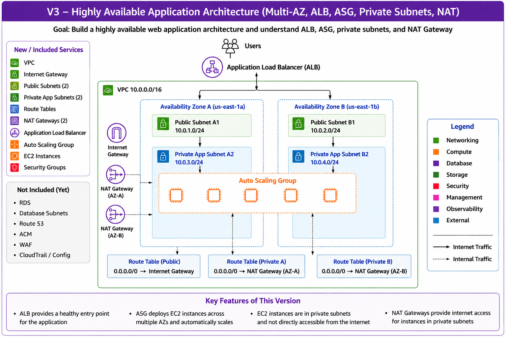


# V3 - High Availability Application Architecture

# 1. Review the Existing V2 Environment

V2 upgraded the original public EC2 web server with AWS operational and management services.

The current V2 architecture contains:

- One VPC
- One Availability Zone
- One Public Subnet
- One Internet Gateway
- One Public Route Table
- One EC2 Web Server
- Nginx
- IAM Role for EC2
- SSM Session Manager
- S3 access through the EC2 IAM Role
- CloudWatch EC2 metrics
- CloudWatch Agent
- Memory and filesystem metrics
- Nginx access and error logs in CloudWatch Logs
- No inbound SSH rule

The current network is:

```text
Internet
   |
   v
Internet Gateway
   |
   v
VPC 10.0.0.0/16
   |
   v
Public Subnet A1
10.0.1.0/24
us-east-1a
   |
   v
v1-web-server
Nginx TCP 80
```

The EC2 instance is directly located in the Public Subnet and has a public IPv4 address.

Management is performed through SSM Session Manager instead of SSH.

---

# 2. V3 Architecture Changes

V3 converts the single-instance V2 architecture into a Multi-AZ highly available application architecture.

The major changes are:

| V2                            | V3                                            |
| ----------------------------- | --------------------------------------------- |
| One Availability Zone         | Two Availability Zones                        |
| One Public Subnet             | Two Public Subnets                            |
| EC2 in Public Subnet          | EC2 instances in Private App Subnets          |
| One EC2 instance              | Auto Scaling Group                            |
| Direct Internet access to EC2 | Application Load Balancer                     |
| EC2 has public IPv4           | Application EC2 instances have no public IPv4 |
| No NAT Gateway                | One NAT Gateway per AZ                        |
| One application instance      | Multiple replaceable application instances    |


The main V3 resource plan is:

| Component               | Configuration             |
| ----------------------- | ------------------------- |
| Region                  | us-east-1                 |
| VPC                     | aws-prod-lab-vpc          |
| VPC CIDR                | 10.0.0.0/16               |
| Availability Zone A     | us-east-1a                |
| Availability Zone B     | us-east-1b                |
| Public Subnet A1        | 10.0.1.0/24               |
| Public Subnet B1        | 10.0.2.0/24               |
| Private App Subnet A2   | 10.0.3.0/24               |
| Private App Subnet B2   | 10.0.4.0/24               |
| Load Balancer           | Application Load Balancer |
| Compute                 | Auto Scaling Group        |
| Private Internet Access | NAT Gateways              |
| EC2 Management          | SSM Session Manager       |

---

# 3. Expand the VPC to Two Availability Zones

V2 already contains Public Subnet A1 in us-east-1a.

V3 keeps this subnet and adds one additional public subnet and two private application subnets.

## 3.1 Create Public Subnet B1

Create the second public subnet in us-east-1b.

| Configuration     | Setting          |
| ----------------- | ---------------- |
| VPC               | aws-prod-lab-vpc |
| Subnet Name       | public-subnet-b1 |
| Availability Zone | us-east-1b       |
| IPv4 CIDR         | 10.0.2.0/24      |

The two public subnets are now:

```text
us-east-1a
Public Subnet A1
10.0.1.0/24

us-east-1b
Public Subnet B1
10.0.2.0/24
```

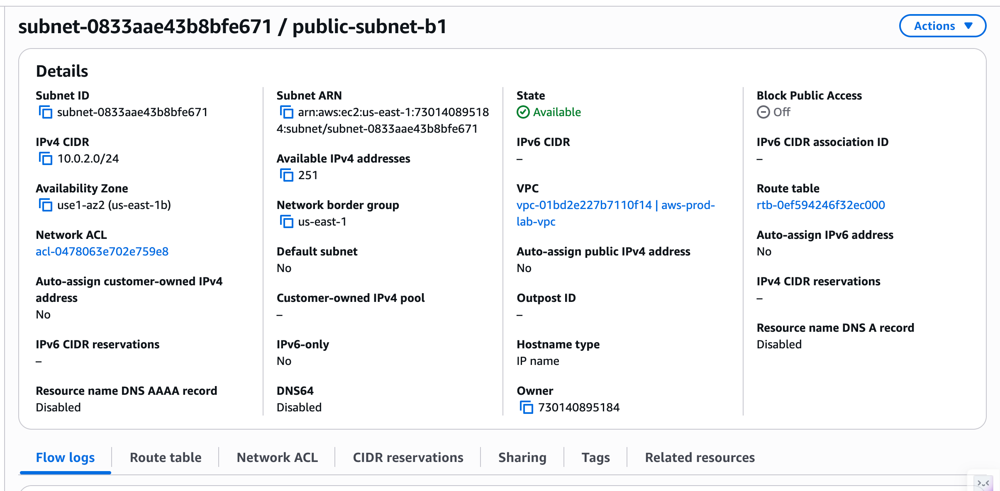


## 3.2 Create Private App Subnet A2

Create the first private application subnet.

| Configuration     | Setting               |
| ----------------- | --------------------- |
| VPC               | aws-prod-lab-vpc      |
| Subnet Name       | private-app-subnet-a2 |
| Availability Zone | us-east-1a            |
| IPv4 CIDR         | 10.0.3.0/24           |

After creating the subnet, confirm that automatic public IPv4 assignment is disabled.

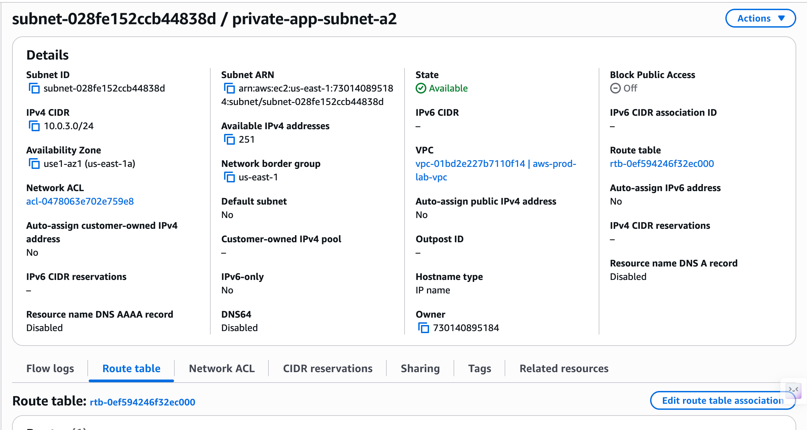

## 3.3 Create Private App Subnet B2

Create the second private application subnet.

| Configuration     | Setting               |
| ----------------- | --------------------- |
| VPC               | aws-prod-lab-vpc      |
| Subnet Name       | private-app-subnet-b2 |
| Availability Zone | us-east-1b            |
| IPv4 CIDR         | 10.0.4.0/24           |

After creating the subnet, confirm that automatic public IPv4 assignment is disabled.


The VPC now contains:

```text
VPC 10.0.0.0/16

us-east-1a
├── public-subnet-a1
│   10.0.1.0/24
│
└── private-app-subnet-a2
    10.0.3.0/24


us-east-1b
├── public-subnet-b1
│   10.0.2.0/24
│
└── private-app-subnet-b2
    10.0.4.0/24
```

---

# 4. Configure the Public Subnets

Both public subnets must use the existing public route table.

The existing route table is: **public-rt**

It already contains:

| Destination | Target           |
| ----------- | ---------------- |
| 10.0.0.0/16 | local            |
| 0.0.0.0/0   | Internet Gateway |

Public Subnet A1 is already associated with public-rt.

Associate **public-subnet-b1** with the same route table.

The public routing becomes:

```text
public-subnet-a1 ──┐
                   ├── public-rt
public-subnet-b1 ──┘
                        |
                        +-- 10.0.0.0/16 → local
                        |
                        +-- 0.0.0.0/0 → Internet Gateway
```

This makes both subnets public subnets.

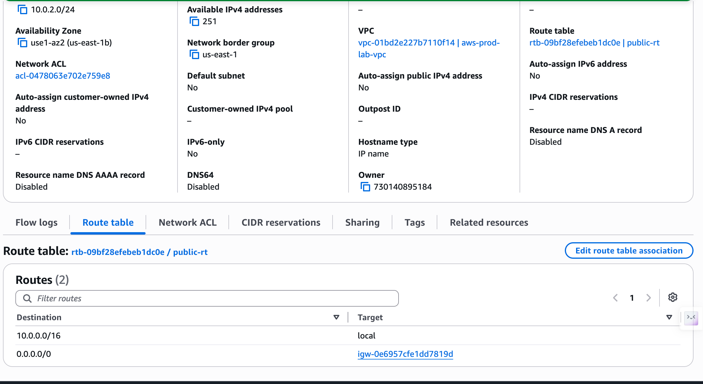

---

# 5. Create NAT Gateways

The application EC2 instances will move into private subnets and will not have public IPv4 addresses.

They still require outbound connectivity for services such as:

- Systems Manager
- AWS APIs
- Package repositories
- Software updates
- CloudWatch
- S3

V3 therefore deploys one NAT Gateway in each Availability Zone.

## 5.1 Create NAT Gateway A

Allocate an Elastic IP and create the first NAT Gateway.

| Configuration     | Setting          |
| ----------------- | ---------------- |
| Name              | nat-gateway-a    |
| Subnet            | public-subnet-a1 |
| Connectivity Type | Public           |
| Elastic IP        | New Elastic IP   |

Wait until the NAT Gateway status becomes Available.

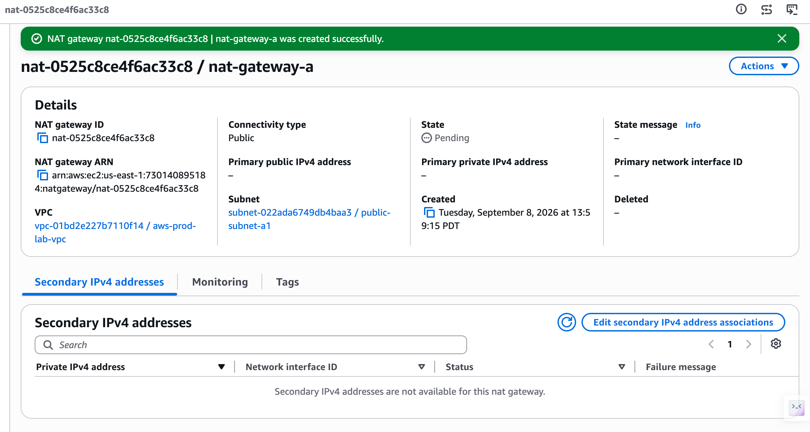

## 5.2 Create NAT Gateway B

Allocate another Elastic IP and create the second NAT Gateway.

| Configuration     | Setting          |
| ----------------- | ---------------- |
| Name              | nat-gateway-b    |
| Subnet            | public-subnet-b1 |
| Connectivity Type | Public           |
| Elastic IP        | New Elastic IP   |

Wait until the NAT Gateway status becomes Available.

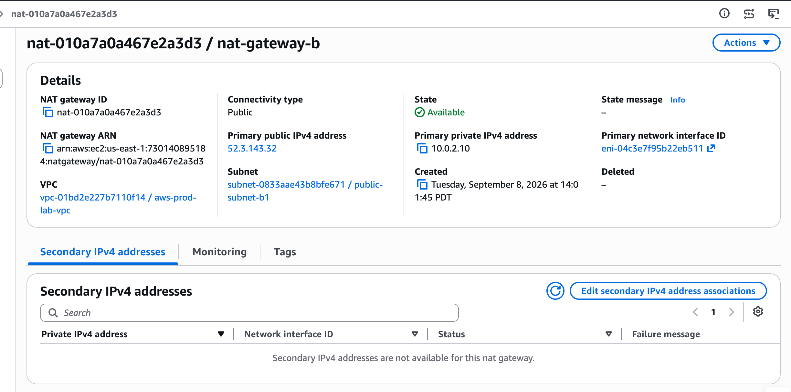

The NAT architecture is:

```text
                 Internet Gateway
                    /        \
                   /          \
             Public A1      Public B1
                 |              |
               NAT-A          NAT-B
                 |              |
                 v              v
            Private A2     Private B2
```

Each private application subnet uses the NAT Gateway in the same Availability Zone.

---


# 6. Create Private Route Tables

The application EC2 instances will run in private subnets without public IPv4 addresses.

Each private application subnet uses its own route table.

Each route table sends outbound Internet traffic to the NAT Gateway located in the same Availability Zone.

## 6.1 Create Private Route Table A

Go to:

VPC → Route Tables → Create route table

Configure:

| Configuration | Setting          |
| ------------- | ---------------- |
| Name          | private-app-rt-a |
| VPC           | aws-prod-lab-vpc |

Create the route table.

AWS automatically creates the local VPC route:

| Destination | Target |
| ----------- | ------ |
| 10.0.0.0/16 | local  |

## 6.2 Create Private Route Table B

Go to:

VPC → Route Tables → Create route table

Configure:

| Configuration | Setting          |
| ------------- | ---------------- |
| Name          | private-app-rt-b |
| VPC           | aws-prod-lab-vpc |

Create the route table.

AWS automatically creates the local VPC route:

| Destination | Target |
| ----------- | ------ |
| 10.0.0.0/16 | local  |

## 6.3 Add NAT Routes

### Private Route Table A

Select:

private-app-rt-a

Go to:

Routes → Edit routes → Add route

Add:

| Destination | Target        |
| ----------- | ------------- |
| 0.0.0.0/0   | nat-gateway-a |

The final routes are:

| Destination | Target        |
| ----------- | ------------- |
| 10.0.0.0/16 | local         |
| 0.0.0.0/0   | nat-gateway-a |

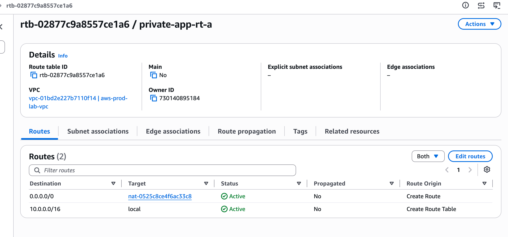

### Private Route Table B

Select:

private-app-rt-b

Go to:

Routes → Edit routes → Add route

Add:

| Destination | Target        |
| ----------- | ------------- |
| 0.0.0.0/0   | nat-gateway-b |

The final routes are:

| Destination | Target        |
| ----------- | ------------- |
| 10.0.0.0/16 | local         |
| 0.0.0.0/0   | nat-gateway-b |

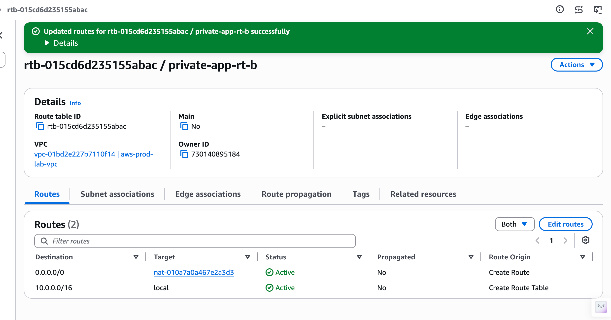


## 6.4 Associate Route Table A with Private Subnet A2

Select: private-app-rt-a

Go to:

Subnet associations → Edit subnet associations

Associate:

private-app-subnet-a2

The relationship is:

```text
private-app-subnet-a2
        |
        v
private-app-rt-a
        |
        +-- 10.0.0.0/16 → local
        |
        +-- 0.0.0.0/0 → nat-gateway-a
```

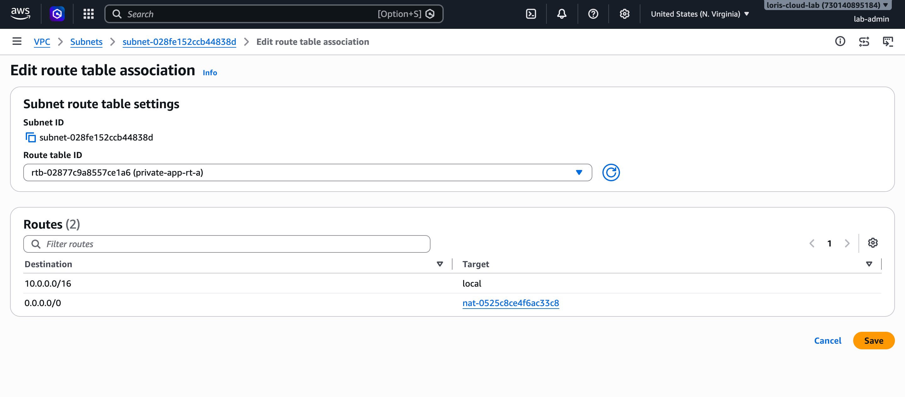

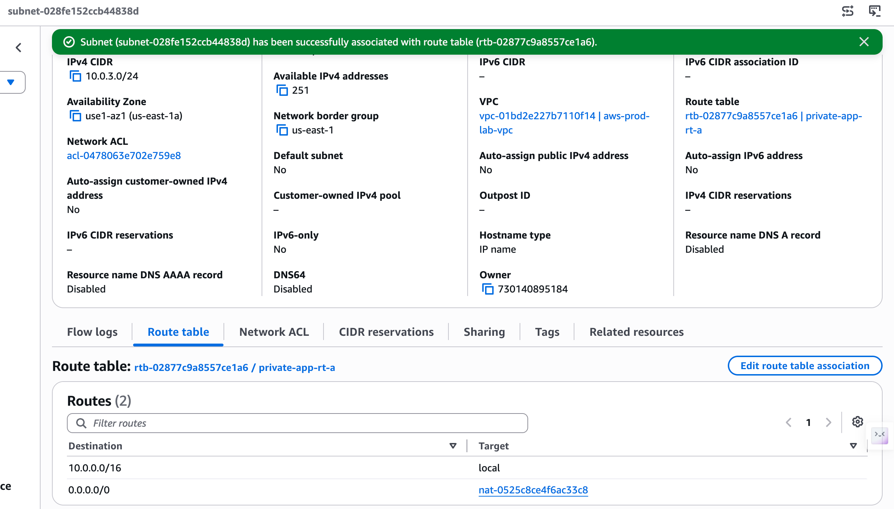

## 6.5 Associate Route Table B with Private Subnet B2

Select:

private-app-rt-b

Go to:

Subnet associations → Edit subnet associations

Associate:

private-app-subnet-b2

The relationship is:

```text
private-app-subnet-b2
        |
        v
private-app-rt-b
        |
        +-- 10.0.0.0/16 → local
        |
        +-- 0.0.0.0/0 → nat-gateway-b
```

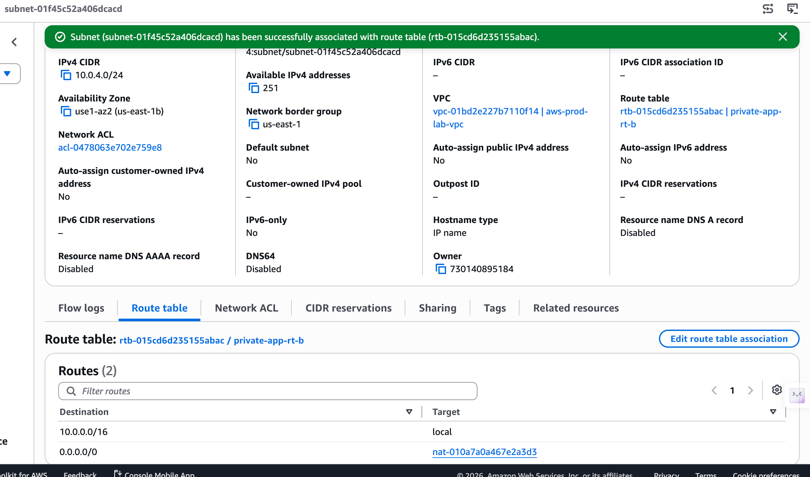


## 6.6 Verify the Private Routing Architecture

The final routing architecture is:

```text
                         Internet
                            |
                            v
                    Internet Gateway
                     /              \
                    /                \
             Public A1            Public B1
                 |                    |
             NAT Gateway A        NAT Gateway B
                 ^                    ^
                 |                    |
             0.0.0.0/0            0.0.0.0/0
                 |                    |
        private-app-rt-a      private-app-rt-b
                 ^                    ^
                 |                    |
     private-app-subnet-a2  private-app-subnet-b2
```

Each private application subnet uses the NAT Gateway in the same Availability Zone.

The EC2 instances in the private application subnets can now initiate outbound Internet connections without requiring public IPv4 addresses.


---

# 7. Create V3 Security Groups

V3 separates Internet-facing access from application-instance access.

Two Security Groups are used:

- ALB Security Group
- Application EC2 Security Group

## 7.1 Create the ALB Security Group

Create: alb-sg

Description: **Security group for the Application Load Balancer**

Inbound rule:

| Type | Protocol | Port | Source    |
| ---- | -------- | ---- | --------- |
| HTTP | TCP      | 80   | 0.0.0.0/0 |

Outbound access can remain at the default configuration.

This Security Group allows users on the Internet to reach the Application Load Balancer.

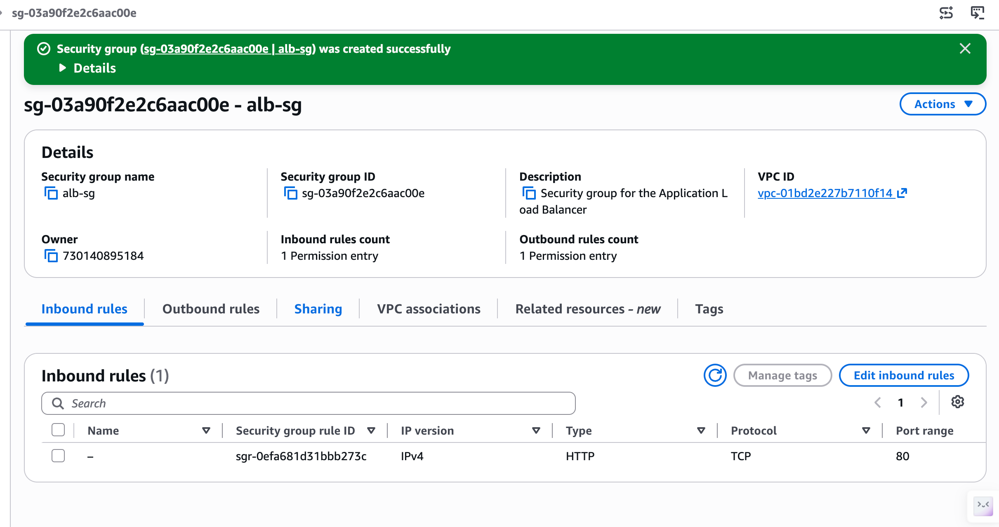

## 7.2 Create the Application Security Group

Create: app-sg

Description: **Security group for application EC2 instances**

Inbound rule:

| Type | Protocol | Port | Source |
| ---- | -------- | ---- | ------ |
| HTTP | TCP      | 80   | alb-sg |

Do not add:

- SSH TCP 22
- Public HTTP source 0.0.0.0/0

The application instances therefore accept HTTP traffic only when the traffic originates from the ALB Security Group.

The access model becomes:

```text
Internet
   |
   | TCP 80
   v
alb-sg
   |
   | TCP 80
   v
app-sg
   |
   v
EC2
```

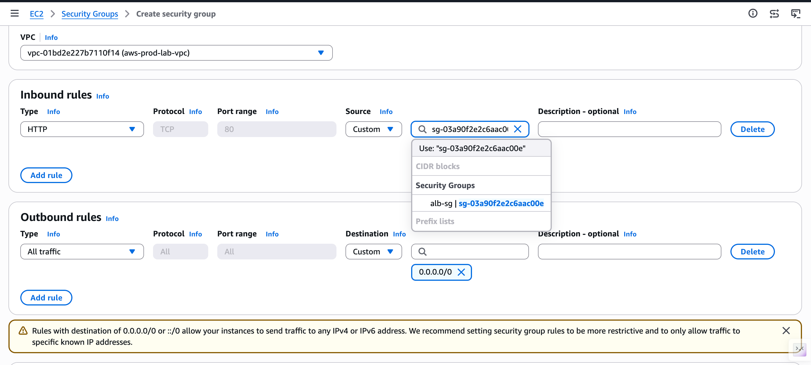

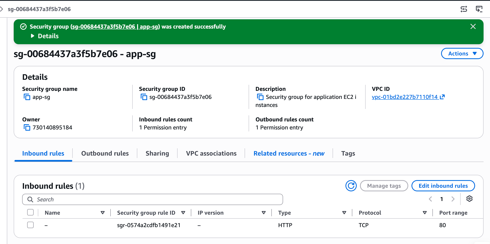


# 8. Create a V3 AMI from the Existing V2 EC2 Instance

The existing V2 EC2 instance already contains:

- Amazon Linux 2023
- Nginx
- SSM Agent
- CloudWatch Agent
- CloudWatch Agent configuration
- Nginx log configuration
- Log permission configuration

Instead of rebuilding each V3 instance manually, create an AMI from the existing configured EC2 instance.

Open:

EC2 → Instances → v1-web-server → Actions → Image and templates → Create image

Use:

| Configuration   | Setting           |
| --------------- | ----------------- |
| Image Name      | v3-web-server-ami |
| Source Instance | v1-web-server     |
| Reboot          | Allow reboot      |

Create the AMI.

Wait until the AMI status becomes Available.

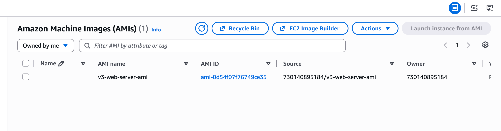

# 9. Create the Application Target Group

The Application Load Balancer requires a Target Group that represents the application EC2 instances.

Create a Target Group.

| Configuration         | Setting             |
| --------------------- | ------------------- |
| Target Type           | Instances           |
| Target Group Name     | v3-web-target-group |
| Protocol              | HTTP                |
| Port                  | 80                  |
| VPC                   | aws-prod-lab-vpc    |
| IP Version            | IPv4                |
| Health Check Protocol | HTTP                |
| Health Check Path     | /                   |

Do not manually register the old v1-web-server.

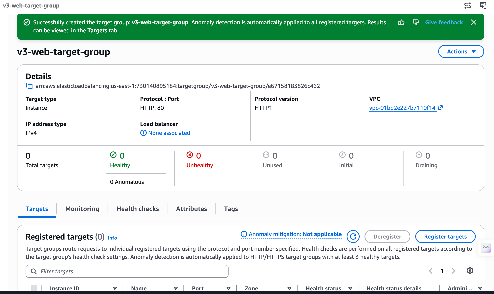

The Auto Scaling Group will automatically register its EC2 instances with this Target Group.

The relationship is:

```text
ALB
 |
 v
Target Group
 |
 v
ASG EC2 Instances
```

---

# 10. Create the Application Load Balancer

Create an Internet-facing Application Load Balancer.

| Configuration       | Setting          |
| ------------------- | ---------------- |
| Name                | v3-web-alb       |
| Scheme              | Internet-facing  |
| IP Address Type     | IPv4             |
| VPC                 | aws-prod-lab-vpc |
| Availability Zone A | public-subnet-a1 |
| Availability Zone B | public-subnet-b1 |
| Security Group      | alb-sg           |

| **Key** | **Value**    |
| ------- | ------------ |
| Project | aws-prod-lab |
| Version | V3           |

Create the listener:

| Protocol | Port | Action                         |
| -------- | ---- | ------------------------------ |
| HTTP     | 80   | Forward to v3-web-target-group |

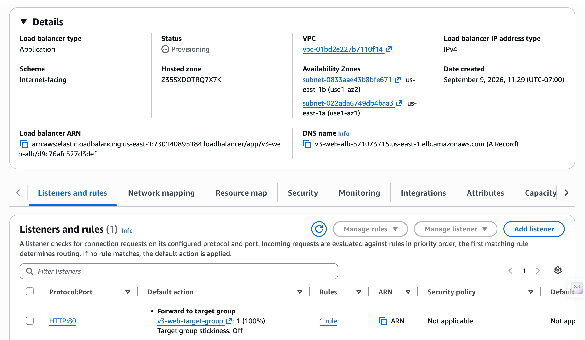

The public application path becomes:

```text
Users
  |
  v
Internet
  |
  v
Application Load Balancer
  |
  v
Target Group
  |
  v
Private EC2 Instances
```

The EC2 instances are no longer directly exposed to the Internet.

---

# 11. Create the V3 Launch Template

The Auto Scaling Group uses a Launch Template to create identical EC2 instances.

Create: v3-web-launch-template

Use the following configuration:

| Configuration        | Setting           |
| -------------------- | ----------------- |
| AMI                  | v3-web-server-ami |
| Instance Type        | t3.micro          |
| IAM Instance Profile | v2-ec2-role       |
| Security Group       | app-sg            |
| Public IPv4          | Disabled          |


| **Key** | **Value**    |
| ------- | ------------ |
| Project | aws-prod-lab |
| Version | V3           |

Do not select a fixed subnet in the Launch Template.

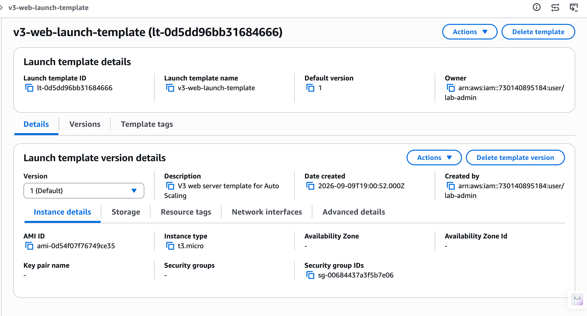

The Auto Scaling Group will determine which private subnet each instance uses.

No SSH Key Pair is required for normal management because the instances use SSM Session Manager.

The IAM path remains:

```text
EC2 Instance
      |
      v
Instance Profile
      |
      v
v2-ec2-role
      |
      +-- SSM
      |
      +-- CloudWatch
      |
      +-- S3
```

---


# 12. Create the Auto Scaling Group

Create an Auto Scaling Group using the V3 Launch Template.

The Auto Scaling Group manages the application EC2 instances across two private subnets and automatically registers them with the existing Target Group.

## Auto Scaling Group Configuration

| Configuration                   | Setting                |
| ------------------------------- | ---------------------- |
| Auto Scaling Group Name         | v3-web-asg             |
| Launch Template                 | v3-web-launch-template |
| Launch Template Version         | Default (1)            |
| VPC                             | aws-prod-lab-vpc       |
| Availability Zone A             | us-east-1a             |
| Subnet A                        | private-app-subnet-a2  |
| Subnet A CIDR                   | 10.0.3.0/24            |
| Availability Zone B             | us-east-1b             |
| Subnet B                        | private-app-subnet-b2  |
| Subnet B CIDR                   | 10.0.4.0/24            |
| Availability Zone Distribution  | Balanced best effort   |
| Capacity Reservation Preference | Default                |

`Balanced best effort` keeps the instances distributed across Availability Zones when possible. If instance launch fails in one Availability Zone, Auto Scaling can launch capacity in another healthy Availability Zone.

## Load Balancing Integration

Attach the Auto Scaling Group to the existing Application Load Balancer Target Group.

| Configuration         | Setting                             |
| --------------------- | ----------------------------------- |
| Load Balancing Option | Attach to an existing load balancer |
| Load Balancer Type    | Application Load Balancer           |
| Load Balancer         | v3-web-alb                          |
| Target Group          | v3-web-target-group                 |
| Target Group Protocol | HTTP                                |
| Target Port           | 80                                  |

The Auto Scaling Group does not directly register itself with the Application Load Balancer.

Instead, the relationship is:

```text
v3-web-alb
     |
     v
v3-web-target-group
     ^
     |
v3-web-asg
     |
     +-- EC2
     +-- EC2
```

The Auto Scaling Group automatically registers newly launched EC2 instances with `v3-web-target-group` and deregisters instances when they are terminated.

## Service Integration Settings

| Configuration            | Setting  |
| ------------------------ | -------- |
| VPC Lattice Service      | None     |
| ARC Zonal Shift          | Disabled |
| Amazon EBS Health Checks | Disabled |

VPC Lattice and ARC zonal shift are not required for the V3 architecture.

## Health Checks

Enable both EC2 and Elastic Load Balancing health checks.

| Configuration                        | Setting        |
| ------------------------------------ | -------------- |
| EC2 Health Checks                    | Always enabled |
| Elastic Load Balancing Health Checks | Enabled        |
| Health Check Grace Period            | 300 seconds    |
| VPC Lattice Health Checks            | Disabled       |
| Amazon EBS Health Checks             | Disabled       |

EC2 health checks monitor the health of the EC2 instance itself.

Elastic Load Balancing health checks use the Target Group health check to verify that the web service is responding correctly.

The Target Group uses:

| Configuration         | Setting      |
| --------------------- | ------------ |
| Health Check Protocol | HTTP         |
| Health Check Port     | Traffic port |
| Health Check Path     | /            |
| Success Code          | 200          |

If either the EC2 health check or the Elastic Load Balancing health check reports an unhealthy instance, the Auto Scaling Group can replace it.

## Group Size

Configure the initial and allowed capacity range.

| Configuration            | Setting                     |
| ------------------------ | --------------------------- |
| Desired Capacity Type    | Units - number of instances |
| Desired Capacity         | 2                           |
| Minimum Desired Capacity | 2                           |
| Maximum Desired Capacity | 4                           |

The Auto Scaling Group maintains at least two EC2 instances and can scale up to four instances.

Under normal conditions, the two initial instances should be distributed across the two Availability Zones.

## Automatic Scaling Policy

Enable a Target Tracking Scaling Policy.

| Configuration       | Setting                 |
| ------------------- | ----------------------- |
| Scaling Policy Type | Target tracking scaling |
| Scaling Policy Name | Target Tracking Policy  |
| Metric Type         | Average CPU utilization |
| Target Value        | 50                      |
| Instance Warmup     | 300 seconds             |
| Scale In            | Enabled                 |

The Auto Scaling Group attempts to maintain average CPU utilization near 50%.

When CPU utilization increases, the group can scale out.

When CPU utilization decreases, the group can scale in, but never below the minimum capacity of two instances.

## Additional Auto Scaling Settings

| Configuration                          | Setting  |
| -------------------------------------- | -------- |
| Instance Scale-In Protection           | Disabled |
| CloudWatch Group Metrics Collection    | Enabled  |
| Default Instance Warmup                | Disabled |
| Auto Scaling Group Deletion Protection | None     |
| Placement Group                        | None     |

CloudWatch group metrics collection is enabled so Auto Scaling Group metrics such as desired, in-service, pending, and terminating instance counts can be monitored.

## Notifications

No Auto Scaling notifications are configured in V3.

| Configuration     | Setting |
| ----------------- | ------- |
| SNS Notifications | None    |

Notification integration can be added in a later version.

## Tags

Configure the following tags and propagate them to newly launched EC2 instances.

| Key     | Value         | Tag New Instances |
| ------- | ------------- | ----------------- |
| Name    | v3-web-server | Yes               |
| Project | aws-prod-lab  | Yes               |
| Version | V3            | Yes               |

These tags allow the Auto Scaling Group instances to be clearly identified in the EC2 console.

## Resulting Architecture

```text
                         v3-web-alb
                              |
                              v
                    v3-web-target-group
                              ^
                              |
                         v3-web-asg
                       /            \
                      /              \
                     v                v
            EC2 in us-east-1a   EC2 in us-east-1b
                     |                |
                     v                v
       private-app-subnet-a2   private-app-subnet-b2
          10.0.3.0/24            10.0.4.0/24
```

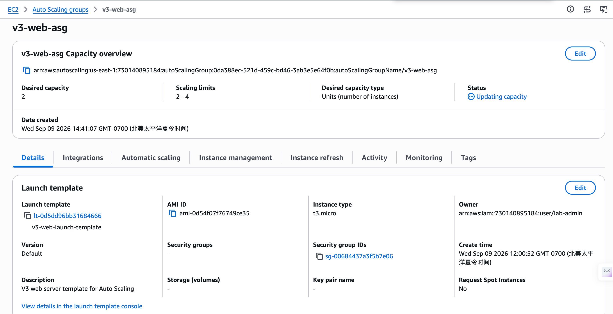

## Verification

After the Auto Scaling Group is created, verify that:

- Two EC2 instances are running.
- One instance is launched in `private-app-subnet-a2`.
- One instance is launched in `private-app-subnet-b2`.
- The instances do not have public IPv4 addresses.
- The instances use `app-sg`.
- The instances use the `v2-ec2-role` instance profile.
- The instances are automatically registered with `v3-web-target-group`.
- Both targets become `Healthy`.
- The Auto Scaling Group shows a desired capacity of 2.
- The minimum capacity is 2.
- The maximum capacity is 4.
- The Target Tracking Policy is configured for 50% average CPU utilization.


---

# 13. Confirm SSM Management for Private EC2 Instances

The new V3 EC2 instances have no public IPv4 addresses and do not accept inbound SSH connections.

They continue to use: **v2-ec2-role**

which contains: **AmazonSSMManagedInstanceCore**

The private instances reach Systems Manager through their NAT Gateways.

Open:

EC2 → Instances → Select a V3 instance → Connect → Session Manager

Connect to one of the private application instances.

| Purpose                      | Command                                       |
| ---------------------------- | --------------------------------------------- |
| Check the current Linux user | whoami                                        |
| Check the instance hostname  | hostname                                      |
| Check the private IP address | hostname -I                                   |
| Check Nginx                  | sudo systemctl status nginx                   |
| Check CloudWatch Agent       | sudo systemctl status amazon-cloudwatch-agent |

The management path is:

```text
Administrator
      |
      v
Systems Manager
      |
      v
Session Manager
      |
      v
Private EC2
```

No inbound management port is required.

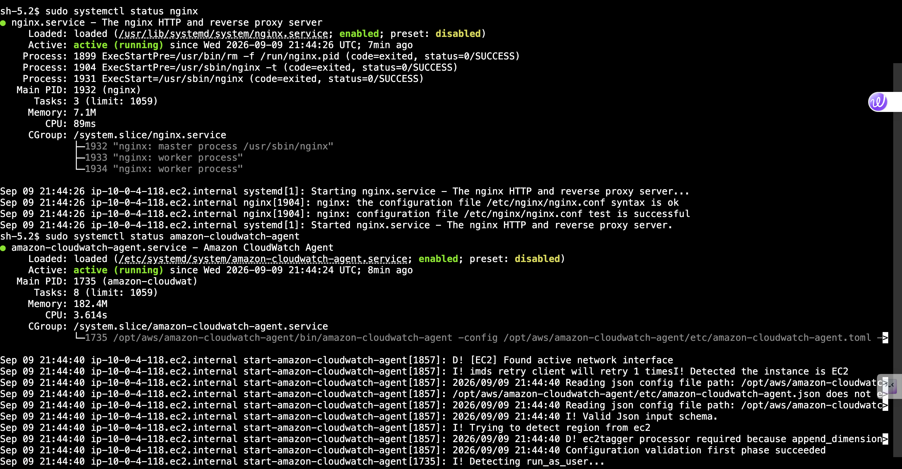

---

# 14. Confirm CloudWatch Monitoring on the New Instances

Because the V3 instances were created from the V2 AMI and use the same IAM Role, the CloudWatch Agent configuration is retained.

The Agent continues to collect:

- mem_used_percent
- disk_used_percent
- Nginx access log
- Nginx error log

Open:

CloudWatch → Metrics → All metrics → CWAgent

Confirm that metrics now appear for the new V3 EC2 Instance IDs.

Open:

CloudWatch → Logs → Log Management

Confirm that the existing Log Groups continue to receive logs:

/aws-prod-lab/v2/nginx/access

/aws-prod-lab/v2/nginx/error

Each V3 EC2 instance creates its own Log Stream because the configuration uses:

{instance_id}

The logging model becomes:

```text
EC2 Instance A ──┐
                 |
EC2 Instance B ──┼── CloudWatch Agent
                 |
Future Instances ┘
                         |
                         v
                  CloudWatch Logs
                         |
                    Log Streams
                  by Instance ID
```

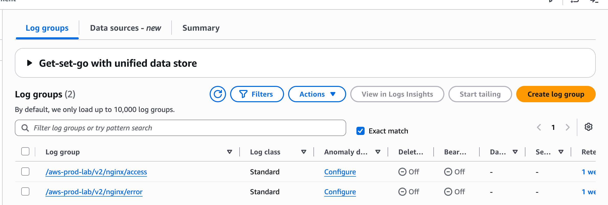

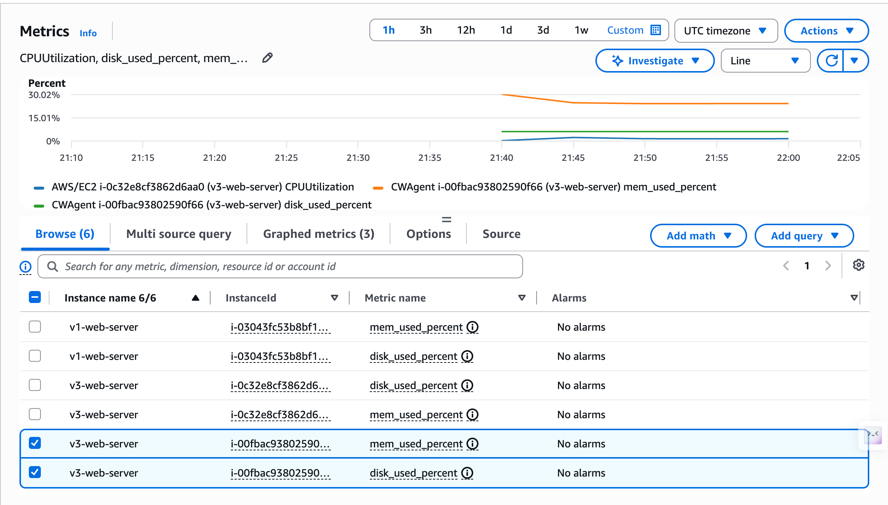

# 15. Access the Application Through the ALB

Open:

EC2 → Load Balancers → v3-web-alb

Copy the ALB DNS name.

Open the DNS name in a browser.

The application request path is now:

```text
User
 |
 v
Internet
 |
 v
Application Load Balancer
 |
 v
v3-web-target-group
 |
 +------------------+
 |                  |
 v                  v
EC2 AZ-A          EC2 AZ-B
Private           Private
```

Users no longer connect directly to an EC2 public IPv4 address.

The Application Load Balancer is now the public entry point for the application.

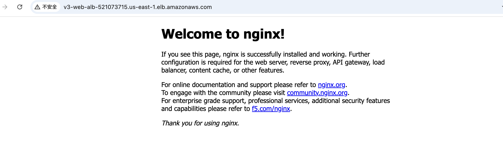


# 16. Clean Up Legacy V2 Resources

After the V3 environment has been successfully tested, the original V2 EC2 instance and its Security Group are no longer required.

Remove the legacy resources in the following order:

1. Terminate the EC2 instance **v1-web-server**.
2. Delete the Security Group **web-sg**.

The EC2 instance must be terminated first because the Security Group cannot be deleted while it is still attached to the instance's network interface.

After cleanup, the application is fully served by the V3 architecture through the Application Load Balancer and Auto Scaling Group.


---

# 17. Final V3 Architecture

```text
                              Users
                                |
                                v
                   Application Load Balancer
                         v3-web-alb
                         /        \
                        /          \
                       v            v
              public-subnet-a1   public-subnet-b1
                 10.0.1.0/24      10.0.2.0/24
                 us-east-1a       us-east-1b
                      |               |
                NAT Gateway A     NAT Gateway B
                      |               |
                      v               v
           private-app-subnet-a2   private-app-subnet-b2
                10.0.3.0/24          10.0.4.0/24
                      \               /
                       \             /
                        v           v
                         v3-web-asg
                        Desired = 2
                        Min = 2
                        Max = 4
                             |
                             v
                    v3-web-target-group
                             |
                      HTTP TCP 80
```

The V3 application architecture now provides:

- Multi-AZ application deployment
- Application Load Balancing
- Auto Scaling
- Private application EC2 instances
- No public IPv4 addresses on application instances
- NAT-based outbound Internet access
- SSM-based instance management
- Existing CloudWatch monitoring and logging
- Existing IAM Role-based AWS service access

V3 High Availability Application Architecture deployment is complete.


